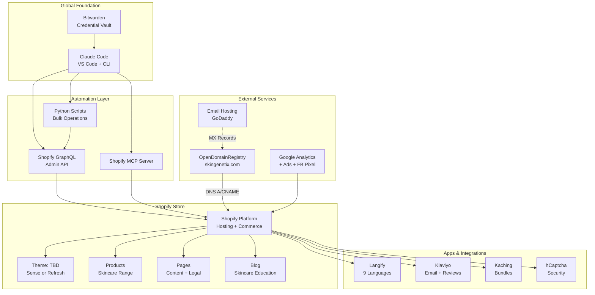

# Architecture — Skingenetix (CLIENT-003)

## System Diagram

## Components

| Component         | What It Is                                | Where It Lives            | Status                                                     |
| ----------------- | ----------------------------------------- | ------------------------- | ---------------------------------------------------------- |
| Shopify Store     | E-commerce platform + hosting             | skingenetix.myshopify.com | ✅ Created                                                 |
| Theme             | Shopify 2.0 free theme (Sense or Refresh) | Shopify                   | 🔜 To install                                              |
| Domain            | Store domain name                         | OpenDomainRegistry.net    | ✅ Registered                                              |
| Email             | Email hosting for store domain            | GoDaddy (TBD)             | 🔜 To configure                                            |
| GraphQL Admin API | Programmatic store management             | Shopify                   | ✅ Custom app created (credentials pending Bitwarden save) |
| Langify           | Translation (9 languages)                 | Shopify App Store         | 🔜 To install                                              |
| Klaviyo           | Email marketing + reviews                 | Shopify App Store         | 🔜 To install                                              |
| Kaching Bundles   | Product bundles                           | Shopify App Store         | 🔜 To install                                              |
| hCaptcha          | Form security                             | Shopify App Store         | 🔜 To install                                              |
| Google Analytics  | Traffic analytics                         | Google                    | 🔜 To connect                                              |
| Google Ads        | Ad conversion tracking                    | Google                    | 🔜 To connect                                              |
| Facebook Pixel    | Social ad tracking                        | Meta                      | 🔜 To connect                                              |
| Bitwarden         | Credential storage                        | Local + cloud             | ✅ Active                                                  |
| Claude Code       | Store builder + manager                   | Local                     | ✅ Active                                                  |

## Connections

| From        | To         | How                              | Status     | Purpose          |
| ----------- | ---------- | -------------------------------- | ---------- | ---------------- |
| Claude Code | Shopify    | GraphQL Admin API (access token) | 🔜 Pending | Store management |
| Domain      | Shopify    | DNS A/CNAME records              | 🔜 Pending | Domain routing   |
| Domain      | Email Host | MX records                       | 🔜 Pending | Email delivery   |
| Shopify     | Langify    | Shopify App OAuth                | 🔜 Pending | Translations     |
| Shopify     | Klaviyo    | Shopify App OAuth                | 🔜 Pending | Email marketing  |
| Shopify     | GA4        | Measurement ID                   | 🔜 Pending | Analytics        |

## Authentication

| Service            | Auth Method                     | Status                               | Storage        |
| ------------------ | ------------------------------- | ------------------------------------ | -------------- |
| Shopify Admin API  | Client ID + Secret (custom app) | ✅ Received — pending Bitwarden save | Bitwarden      |
| OpenDomainRegistry | Username/password               | ✅ Active                            | Bitwarden      |
| GoDaddy            | Username/password               | ✅ Active                            | Bitwarden      |
| Google Analytics   | OAuth                           | 🔜 Pending                           | Google account |
| Klaviyo            | API key                         | 🔜 Pending                           | Bitwarden      |

## Accounts

| Service            | URL                       | Account Holder     | Purpose           |
| ------------------ | ------------------------- | ------------------ | ----------------- |
| Shopify            | skingenetix.myshopify.com | Malcolm Smith      | Store platform    |
| OpenDomainRegistry | opendomainregistry.net    | Malcolm Smith      | Domain registrar  |
| GoDaddy            | godaddy.com               | Malcolm Smith      | Email hosting     |
| Google Analytics   | analytics.google.com      | Malcolm Smith      | Traffic analytics |
| Bitwarden          | bitwarden.com             | msmithnl@gmail.com | Credential vault  |

## Change Log

| Date       | What Changed                                                                   | Who              |
| ---------- | ------------------------------------------------------------------------------ | ---------------- |
| 2026-03-05 | Project created, initial architecture documented                               | Claude Code      |
| 2026-03-05 | Store created (skingenetix.myshopify.com), custom app API credentials received | Malcolm + Claude |
