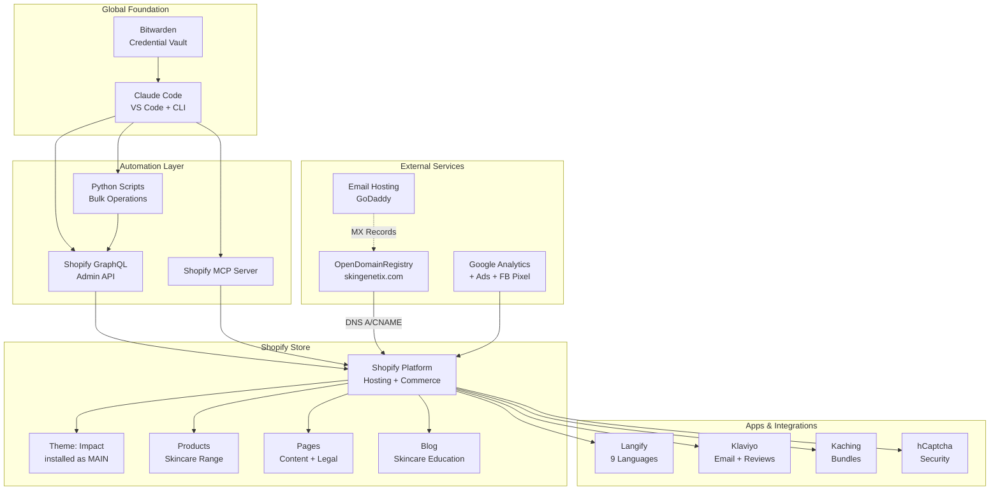

# Architecture — Skingenetix (CLIENT-003)

## System Diagram

```mermaid
graph TB
    subgraph "Global Foundation"
        CC[Claude Code<br/>VS Code + CLI]
        BW[Bitwarden<br/>Credential Vault]
    end

    subgraph "Automation Layer"
        GQLAPI[Shopify GraphQL<br/>Admin API]
        MCP[Shopify MCP Server]
        SCRIPTS[Python Scripts<br/>Bulk Operations]
    end

    subgraph "Shopify Store"
        SHOP[Shopify Platform<br/>Hosting + Commerce]
        THEME[Theme: Impact<br/>installed as MAIN]
        PRODS[Products<br/>Skincare Range]
        PAGES[Pages<br/>Content + Legal]
        BLOG[Blog<br/>Skincare Education]
    end

    subgraph "Apps & Integrations"
        LANG[Langify<br/>9 Languages]
        KLAV[Klaviyo<br/>Email + Reviews]
        KACH[Kaching<br/>Bundles]
        HCAP[hCaptcha<br/>Security]
    end

    subgraph "External Services"
        DOM[OpenDomainRegistry<br/>skingenetix.com]
        EMAIL[Email Hosting<br/>GoDaddy]
        GA[Google Analytics<br/>+ Ads + FB Pixel]
    end

    CC --> GQLAPI
    CC --> MCP
    CC --> SCRIPTS
    BW --> CC
    GQLAPI --> SHOP
    MCP --> SHOP
    SCRIPTS --> GQLAPI
    SHOP --> THEME
    SHOP --> PRODS
    SHOP --> PAGES
    SHOP --> BLOG
    SHOP --> LANG
    SHOP --> KLAV
    SHOP --> KACH
    SHOP --> HCAP
    DOM -->|DNS A/CNAME| SHOP
    EMAIL -.->|MX Records| DOM
    GA --> SHOP
```

## Components

| Component         | What It Is                                                  | Where It Lives                                | Status                                       |
| ----------------- | ----------------------------------------------------------- | --------------------------------------------- | -------------------------------------------- |
| Shopify Store     | E-commerce platform + hosting                               | pnb00c-aq.myshopify.com (www.skingenetix.com) | ✅ Live                                      |
| Theme             | Shopify 2.0 theme: Impact                                   | Shopify                                       | ✅ Installed (MAIN)                          |
| Domain            | Store domain name                                           | OpenDomainRegistry.net                        | ✅ Live on www.skingenetix.com               |
| Email             | Email hosting for store domain                              | GoDaddy (TBD)                                 | 🔜 To configure                              |
| GraphQL Admin API | Programmatic store management                               | Shopify                                       | ✅ Active (Client Credentials, auto-refresh) |
| Products          | 9 active skincare products (serums + creams), all EUR 49,95 | Shopify                                       | ✅ Live (0 inventory - not selling yet)      |
| Langify           | Translation (9 languages)                                   | Shopify App Store                             | 🔜 To install (only EN locale published)     |
| Klaviyo           | Email marketing + reviews                                   | Shopify App Store                             | 🔜 To install                                |
| Kaching Bundles   | Product bundles                                             | Shopify App Store                             | 🔜 To install                                |
| hCaptcha          | Form security                                               | Shopify App Store                             | 🔜 To install                                |
| Google Analytics  | Traffic analytics                                           | Google                                        | 🔜 To connect                                |
| Google Ads        | Ad conversion tracking                                      | Google                                        | 🔜 To connect                                |
| Facebook Pixel    | Social ad tracking                                          | Meta                                          | 🔜 To connect                                |
| Bitwarden         | Credential storage                                          | Local + cloud                                 | ✅ Active                                    |
| Claude Code       | Store builder + manager                                     | Local                                         | ✅ Active                                    |

## Connections

| From               | To         | How                                                  | Status     | Purpose                           |
| ------------------ | ---------- | ---------------------------------------------------- | ---------- | --------------------------------- |
| Claude Code        | Shopify    | GraphQL Admin API (Client Credentials, auto-refresh) | ✅ Active  | Store management                  |
| Business Dashboard | Shopify    | REST Admin API (Client Credentials)                  | ✅ Active  | Sales/forecast reporting (Fly.io) |
| Domain             | Shopify    | DNS A/CNAME records                                  | ✅ Active  | Domain routing                    |
| Domain             | Email Host | MX records                                           | 🔜 Pending | Email delivery                    |
| Shopify            | Langify    | Shopify App OAuth                                    | 🔜 Pending | Translations                      |
| Shopify            | Klaviyo    | Shopify App OAuth                                    | 🔜 Pending | Email marketing                   |
| Shopify            | GA4        | Measurement ID                                       | 🔜 Pending | Analytics                         |

## Authentication

| Service            | Auth Method                     | Status                               | Storage        |
| ------------------ | ------------------------------- | ------------------------------------ | -------------- |
| Shopify Admin API  | Client ID + Secret (custom app) | ✅ Received — pending Bitwarden save | Bitwarden      |
| OpenDomainRegistry | Username/password               | ✅ Active                            | Bitwarden      |
| GoDaddy            | Username/password               | ✅ Active                            | Bitwarden      |
| Google Analytics   | OAuth                           | 🔜 Pending                           | Google account |
| Klaviyo            | API key                         | 🔜 Pending                           | Bitwarden      |

## Accounts

| Service            | URL                       | Account Holder     | Purpose           |
| ------------------ | ------------------------- | ------------------ | ----------------- |
| Shopify            | skingenetix.myshopify.com | Malcolm Smith      | Store platform    |
| OpenDomainRegistry | opendomainregistry.net    | Malcolm Smith      | Domain registrar  |
| GoDaddy            | godaddy.com               | Malcolm Smith      | Email hosting     |
| Google Analytics   | analytics.google.com      | Malcolm Smith      | Traffic analytics |
| Bitwarden          | bitwarden.com             | msmithnl@gmail.com | Credential vault  |

## Change Log

| Date       | What Changed                                                                                                                                                                                                                                                                                     | Who              |
| ---------- | ------------------------------------------------------------------------------------------------------------------------------------------------------------------------------------------------------------------------------------------------------------------------------------------------ | ---------------- |
| 2026-03-05 | Project created, initial architecture documented                                                                                                                                                                                                                                                 | Claude Code      |
| 2026-03-05 | Store created (skingenetix.myshopify.com), custom app API credentials received                                                                                                                                                                                                                   | Malcolm + Claude |
| 2026-05-06 | State discovery: store far ahead of docs (Impact theme live, 5+ products, domain live). See handover-2026-05-06.md                                                                                                                                                                               | Claude Code      |
| 2026-05-18 | Product photography fan-outs: Glutathione (146/190, $5.69), Copper Peptide Advanced Repair (128/190, $6.18), Matrixyl 3000 Pro Collagen (157, $9.80). All 22-shot Max-tier, 5 backends. Awaiting human winner selection — see todo.md PHOTO-\* items                                             | Claude Code      |
| 2026-08-03 | All 9 products: HS-code 3304.99.5000 + country of origin CN set (US import). Shopify taxonomy categories set (5x Face Serums, 4x Face Moisturizers)                                                                                                                                              | Claude Code      |
| 2026-08-13 | Repo sync + asset-path repair: fast-forwarded 10 commits behind origin; repaired 47 asset dirs whose content sat in cloud-sync `" (1)"` twins while the documented bare-named dir was empty; removed 2 byte-identical duplicates; `assets/` gitignored and `scripts/` committed (P6-FU-4 closed) | Claude Code      |
| 2026-08-03 | Business dashboard: fixed expired Skingenetix Shopify client secret (was stale in dashboard .env)                                                                                                                                                                                                | Claude Code      |
