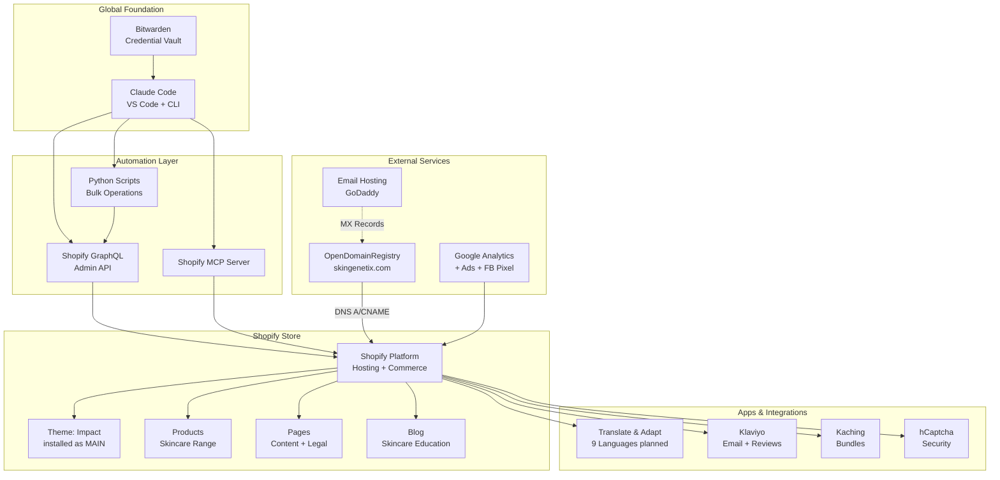

# Architecture — Skingenetix (CLIENT-003)

## System Diagram

```mermaid
graph TB
    subgraph "Global Foundation"
        CC[Claude Code<br/>VS Code + CLI]
        BW[Bitwarden<br/>Credential Vault]
    end

    subgraph "Automation Layer"
        GQLAPI[Shopify GraphQL<br/>Admin API]
        MCP[Shopify MCP Server]
        SCRIPTS[Python Scripts<br/>Bulk Operations]
    end

    subgraph "Shopify Store"
        SHOP[Shopify Platform<br/>Hosting + Commerce]
        THEME[Theme: Impact<br/>installed as MAIN]
        PRODS[Products<br/>Skincare Range]
        PAGES[Pages<br/>Content + Legal]
        BLOG[Blog<br/>Skincare Education]
    end

    subgraph "Apps & Integrations"
        LANG[Translate &amp; Adapt<br/>9 Languages planned]
        KLAV[Klaviyo<br/>Email + Reviews]
        KACH[Kaching<br/>Bundles]
        HCAP[hCaptcha<br/>Security]
    end

    subgraph "External Services"
        DOM[OpenDomainRegistry<br/>skingenetix.com]
        EMAIL[Email Hosting<br/>GoDaddy]
        GA[Google Analytics<br/>+ Ads + FB Pixel]
    end

    CC --> GQLAPI
    CC --> MCP
    CC --> SCRIPTS
    BW --> CC
    GQLAPI --> SHOP
    MCP --> SHOP
    SCRIPTS --> GQLAPI
    SHOP --> THEME
    SHOP --> PRODS
    SHOP --> PAGES
    SHOP --> BLOG
    SHOP --> LANG
    SHOP --> KLAV
    SHOP --> KACH
    SHOP --> HCAP
    DOM -->|DNS A/CNAME| SHOP
    EMAIL -.->|MX Records| DOM
    GA --> SHOP
```

## Components

| Component              | What It Is                                                                                                                                                                                                                                           | Where It Lives                                | Status                                                                              |
| ---------------------- | ---------------------------------------------------------------------------------------------------------------------------------------------------------------------------------------------------------------------------------------------------- | --------------------------------------------- | ----------------------------------------------------------------------------------- |
| Shopify Store          | E-commerce platform + hosting                                                                                                                                                                                                                        | pnb00c-aq.myshopify.com (www.skingenetix.com) | ✅ Live                                                                             |
| Theme                  | Shopify 2.0 theme: Impact                                                                                                                                                                                                                            | Shopify                                       | ✅ Installed (MAIN)                                                                 |
| Domain                 | Store domain name                                                                                                                                                                                                                                    | OpenDomainRegistry.net                        | ✅ Live on www.skingenetix.com                                                      |
| Email                  | Email hosting for store domain                                                                                                                                                                                                                       | GoDaddy (TBD)                                 | 🔜 To configure                                                                     |
| GraphQL Admin API      | Programmatic store management                                                                                                                                                                                                                        | Shopify                                       | ✅ Active (Client Credentials, auto-refresh)                                        |
| Products               | 9 active skincare products (serums + creams), all EUR 49,95                                                                                                                                                                                          | Shopify                                       | ✅ Live (0 inventory - not selling yet)                                             |
| Translate & Adapt      | Translation (9 languages planned)                                                                                                                                                                                                                    | Shopify native                                | ✅ Installed (only EN locale published). ⚠️ Langify is NOT installed — see ADR-002a |
| Klaviyo                | Email marketing + reviews                                                                                                                                                                                                                            | Shopify App Store                             | 🔜 To install                                                                       |
| Kaching Bundles        | Product bundles                                                                                                                                                                                                                                      | Shopify App Store                             | 🔜 To install                                                                       |
| hCaptcha               | Form security                                                                                                                                                                                                                                        | Shopify App Store                             | 🔜 To install                                                                       |
| Google Analytics       | Traffic analytics                                                                                                                                                                                                                                    | Google                                        | 🔜 To connect                                                                       |
| Google Ads             | Ad conversion tracking                                                                                                                                                                                                                               | Google                                        | 🔜 To connect                                                                       |
| Facebook Pixel         | Social ad tracking                                                                                                                                                                                                                                   | Meta                                          | 🔜 To connect                                                                       |
| Bitwarden              | Credential storage                                                                                                                                                                                                                                   | Local + cloud                                 | ✅ Active                                                                           |
| Claude Code            | Store builder + manager                                                                                                                                                                                                                              | Local                                         | ✅ Active                                                                           |
| Brand layout overrides | `custom-html` section in `sections/footer-group.json` holding a `<style>` + `<script>` block: link-block row fill, review-slider grid, injected carousel arrows, review CTA styling, **main-menu image tiles**                                       | Shopify theme (Impact)                        | ✅ Live site-wide                                                                   |
| Main-menu image tiles  | `mega_menu` blocks in `sections/header-group.json` (one per top-level item bar Reviews) + the tile CSS in `brand_layout_css`. Every dropdown except Shop shows square photo tiles instead of a text column. Managed by `scripts/menu-image-tiles.py` | Shopify theme (Impact)                        | ✅ Live                                                                             |

## Connections

| From               | To                | How                                                  | Status       | Purpose                                                                |
| ------------------ | ----------------- | ---------------------------------------------------- | ------------ | ---------------------------------------------------------------------- |
| Claude Code        | Shopify           | GraphQL Admin API (Client Credentials, auto-refresh) | ✅ Active    | Store management                                                       |
| Business Dashboard | Shopify           | REST Admin API (Client Credentials)                  | ✅ Active    | Sales/forecast reporting (Fly.io)                                      |
| Domain             | Shopify           | DNS A/CNAME records                                  | ✅ Active    | Domain routing                                                         |
| Domain             | Email Host        | MX records                                           | 🔜 Pending   | Email delivery                                                         |
| Shopify            | Translate & Adapt | Shopify native                                       | ✅ Installed | Translations (theme/template text is natively translatable — ADR-002a) |
| Shopify            | Klaviyo           | Shopify App OAuth                                    | 🔜 Pending   | Email marketing                                                        |
| Shopify            | GA4               | Measurement ID                                       | 🔜 Pending   | Analytics                                                              |

## Authentication

| Service            | Auth Method                     | Status                               | Storage        |
| ------------------ | ------------------------------- | ------------------------------------ | -------------- |
| Shopify Admin API  | Client ID + Secret (custom app) | ✅ Received — pending Bitwarden save | Bitwarden      |
| OpenDomainRegistry | Username/password               | ✅ Active                            | Bitwarden      |
| GoDaddy            | Username/password               | ✅ Active                            | Bitwarden      |
| Google Analytics   | OAuth                           | 🔜 Pending                           | Google account |
| Klaviyo            | API key                         | 🔜 Pending                           | Bitwarden      |
| Google Gemini      | API key                         | ⚠️ Not in this project's `.env`      | See note below |

### ⚠️ The Gemini key is not in this project (found 2026-08-20)

The photography pipeline's Gemini calls — image generation on `nbp_pro` / `nbp_flash`, and
every QA vision judgement — read their key from the environment, but
`skingenetix-website/.env` **contains no Gemini key of any name**. The working key is
`GOOGLE_AI_API_KEY` in the _sister brand's_ file,
`~/Claude Code/Projects/hairgenetix/.env`.

The two consumers disagree about the name, which is what makes this bite quietly:

| Consumer                  | Reads                                  | Behaviour when unset                        |
| ------------------------- | -------------------------------------- | ------------------------------------------- |
| `qa.py` (vision judging)  | `GEMINI_API_KEY` → `GOOGLE_AI_API_KEY` | Every judgement returns a bare `HTTP 400`   |
| `backends.py` (image gen) | `GEMINI_API_KEY` only                  | Backend fails with `GEMINI_API_KEY not set` |

A QA pass run with only this project's `.env` sourced returned **177 errors in seconds** and
looked like a quota problem. It was not: `HTTP 400` was `API_KEY_INVALID`, because the
retry wrapper records `HTTP {code}` and discards the response body. Until the key is added
here from Bitwarden, anything touching Gemini must source **both** files and export
`GEMINI_API_KEY="${GEMINI_API_KEY:-$GOOGLE_AI_API_KEY}"` — the queued top-ups included,
since generation accepts only the first name.

## Accounts

| Service            | URL                       | Account Holder     | Purpose           |
| ------------------ | ------------------------- | ------------------ | ----------------- |
| Shopify            | skingenetix.myshopify.com | Malcolm Smith      | Store platform    |
| OpenDomainRegistry | opendomainregistry.net    | Malcolm Smith      | Domain registrar  |
| GoDaddy            | godaddy.com               | Malcolm Smith      | Email hosting     |
| Google Analytics   | analytics.google.com      | Malcolm Smith      | Traffic analytics |
| Bitwarden          | bitwarden.com             | msmithnl@gmail.com | Credential vault  |

## Change Log

| Date       | What Changed                                                                                                                                                                                                                                                                                                                                                                                                                                                                                                                                                                                                                                                                                                                                                                                                                                                                                                                                                                                                                                                                                                                                                                                                                                                                                                                                                                                                                                                                                                                                                                                                                                                                                                                                                                                                                                                                                                                                                                                                                                                                                                                                                                                                                                                                                                                                                                                                                                                                                                                                                                                                                                                                                                                                                                                                                                                                                                                                                                                                                                                                                                                                                                                                                                                                                                                                                                                                                                                                                                                                                                     | Who                                                                                                                                                                                                                                                                                                                                                                                                                                                                                                 |
| ---------- | -------------------------------------------------------------------------------------------------------------------------------------------------------------------------------------------------------------------------------------------------------------------------------------------------------------------------------------------------------------------------------------------------------------------------------------------------------------------------------------------------------------------------------------------------------------------------------------------------------------------------------------------------------------------------------------------------------------------------------------------------------------------------------------------------------------------------------------------------------------------------------------------------------------------------------------------------------------------------------------------------------------------------------------------------------------------------------------------------------------------------------------------------------------------------------------------------------------------------------------------------------------------------------------------------------------------------------------------------------------------------------------------------------------------------------------------------------------------------------------------------------------------------------------------------------------------------------------------------------------------------------------------------------------------------------------------------------------------------------------------------------------------------------------------------------------------------------------------------------------------------------------------------------------------------------------------------------------------------------------------------------------------------------------------------------------------------------------------------------------------------------------------------------------------------------------------------------------------------------------------------------------------------------------------------------------------------------------------------------------------------------------------------------------------------------------------------------------------------------------------------------------------------------------------------------------------------------------------------------------------------------------------------------------------------------------------------------------------------------------------------------------------------------------------------------------------------------------------------------------------------------------------------------------------------------------------------------------------------------------------------------------------------------------------------------------------------------------------------------------------------------------------------------------------------------------------------------------------------------------------------------------------------------------------------------------------------------------------------------------------------------------------------------------------------------------------------------------------------------------------------------------------------------------------------------------------------------- | --------------------------------------------------------------------------------------------------------------------------------------------------------------------------------------------------------------------------------------------------------------------------------------------------------------------------------------------------------------------------------------------------------------------------------------------------------------------------------------------------- | ----------- |
| 2026-08-30 | **Homepage "THE PEPTIDE STANDARD" heading was breaking to three lines; it now sits on one.** Same fault as the collection banner titles fixed earlier the same day — the heading was starved, not oversized. Measured on the live page rather than guessed: "Clinically studied actives. Never trace amounts." needs **1001px** in Fraunces at 48px, and the `place-self` div holding the section's blocks caps its children at **780px**. The parent grid column is 1416px at a 1512 viewport, so there was room to widen without touching grid placement. A new trailing `custom-html` section `peptide_band_title_width` (plan: `configs/banners/homepage-peptide-band-title-width.json`) raises that div to **1040px**. **The body copy is pinned back to 780px** by a second rule — widening the whole column stretched the paragraph to a 1040px measure, unreadable, and pushed its first line into the helix. **1040 and no more, because the picture decides it:** luminance sampled across the band in the heading rows stays under 32 mean out to x=1050, and the bright helix core does not begin until x=1128, so the line finishes on dark ground. Verified on a clean reload at five widths — 1920, 1512, 1280 and 1024 all one line (the heading size is fluid: 48/48/40/40px), and 390 unchanged at three lines with no horizontal overflow. **Scoped by content signature, not section id:** `.shopify-section--image-with-text-overlay:has(a[href$="/pages/the-science"])` is the only such section on the page and survives both a theme duplication and a locale prefix — unlike the neighbouring `concern_tile_scrim`, which hardcodes `template--26275134079361__skin_concerns`. Confirmed to match exactly one element, with `brand_story_band` still capped at 780px afterwards. Appended last per ADR-006; both trailing style sections measured 0px high with no padding collapse on `brand_story_band`. | Claude Code |
| 2026-08-30 | **Banner titles checked on mobile, centred vertically, and the GHK-Cu hyphen fixed.** Tested every collection banner at **nine widths, 360px to 1920px**: no mid-word break and no horizontal overflow at any of them. The widening from earlier sits inside a `min-width: 700px` media query, so phones were never affected — verified rather than assumed. **Vertical centring:** the banners were not centred and were not even consistent. On mobile **eight were bottom-aligned** (`place-self-end-center`) and two were top-aligned; on desktop one (acetyl) was top-aligned while the rest were middle. All ten are now `place-self-center` on mobile and middle-aligned on desktop, horizontal alignment untouched. **"Copper Peptide (GHK-Cu)" was breaking into "(GHK- / Cu)" and CSS could not stop it.** `word-break: keep-all` — no effect. `line-break: strict` — no effect. `white-space: nowrap` — one line but 949px, overflowing the 780px column. A hyphen is a wrap opportunity under UAX #14 and no CSS property suppresses it. **The fix was the character**: the collection title now uses a **non-breaking hyphen (U+2011)**, which renders identically and cannot break. Two clean lines with "(GHK-Cu)" intact. Note this changed the collection TITLE, not just the banner — the handle is unchanged, and the glyph is visually identical. ⚠️ Consequence worth watching: moving mobile text from bottom to middle puts the type over the product on a few banners (creams-moisturizers, acetyl, skin-repair-renewal). It stays readable on the theme's overlay scrim, but if any one reads badly it can go back to bottom-centre per template | Claude Code      |
| 2026-08-30 | **Collection banner titles were being starved on a laptop; "Brightening" was breaking mid-word into "Brightenin / g".** Each collection template carries a `banner_text_width` custom-html rule, `.collection-banner .v-stack { max-width: clamp(320px, 26vw, 620px) }`. The ceiling is the width the banner was designed around, but the middle term is in **vw** — 26vw only reaches 620px at a viewport of ~2385px. **These were tuned on a 5K monitor**, so on a 1506px laptop the vw term dominates and the box collapses to 392px, narrower than the word "Brightening" (420px at the 80px display size). The theme sets `overflow-wrap: anywhere` on banner headings, so instead of overflowing it splits the word. Same fault on Creams & Moisturizers, where "Moisturizers" is 442px in a 422px box. Fix: keep each banner's designed ceiling where it is big enough, raise it where the title needs more, and set the vw term so the ceiling is reached at ~1440px instead of only on a 5K display. **The theme also caps the text COLUMN at 780px**, so on two banners the parent had to be released as well — a v-stack clamp above 780 does nothing on its own. **Eight of ten titles now sit on one line, and no title breaks mid-word.** Two are deliberately left: `skin-repair-renewal` stays at two lines because a one-line title runs across the jar and the model's face (rendered and looked at, not assumed); `copper-peptide` renders on **three** lines and always has — at every width from 560px to 780px — because `split-lines` treats the hyphen in "(GHK-Cu)" as a break. That is a text problem, not a width one: releasing the column to 960px puts it on one line but still renders "GHK- Cu" with a gap. It needs a non-breaking hyphen in the collection title, which is a content change. ⚠️ Method note: the first line-count metric — counting distinct `top` values of a Range's client rects — **reported 1 line for headings that visibly render on 2**. This theme wraps headings in a `<split-lines>` custom element. Count lines from `height / line-height` and confirm against a screenshot; the range method is unusable here. `image-with-text-overlay` (every page hero) has **no width setting at all**, only `full_width`, so page heroes cannot be tuned the same way                                                                                                                                                                                                                                                                                                                                                                                                                                                                                                                                                                                                                                                                                                                                                                                                                                                                                                                                                                                                                                                                                                                                                                                                                                                       | Claude Code                                                                                                                                                                                                                                                                                                                                                                                                                                                                                         |
| 2026-08-30 | **Review-copy coverage measured against the live store, and §2 of the review plan corrected.** Counting the metaobjects rather than trusting the docs: **103 `customer_review` entries exist, 99 are attached** (9 on each of 11 products) and **91 carry real copy**. The remaining **8 are all on the Copper Peptide microneedling stamp set** and are publicly visible reading "PLACEHOLDER: review headline". The supply is **exhausted, not unrun** — `product-reviews-fill-copy.py --report` shows 98 texts transcribed, 12 held back for stating an age, 2 surplus, and both surplus texts name a serum so the `FORMAT_WORDS` filter correctly bars them from a device. Malcolm's call: leave them, the microneedling products are the next round. **Separately, the plan's §2 "honesty problem" was wrong and is now marked RESOLVED** — Malcolm confirmed the before/after cards are real verified customers; the 2026-08-29 text had inferred invented copy from Drive holding images but no matching text, when the text simply lived in another document. ⚠️ What that correction does **not** cover: **twelve setup-written testimonial quotes are still live and are not his customers** — four per product page (`customer_reviews`, "Sarah M. - Verified Customer") and eight on `/pages/reviews` (`testimonials`) — verified against all 99 real cards with **zero full-name matches**. Real testimony and March marketing copy now sit on one product page both claiming "Verified Customer". Nothing removed; awaiting instruction. Also found: **4 orphan metaobjects** unattached to any product (`heather-s` and `megan-a`, the deliberate duplicate-photograph detachments, plus `marie-r` and `fiona-c`)                                                                                                                                                                                                                                                                                                                                                                                                                                                                                                                                                                                                                                                                                                                                                                                                                                                                                                                                                                                                                                                                                                                                                                                                                                                                                                                                                                                                                                                                                                                                                                                                                                                                                                                                                                                                                                                 | Claude Code                                                                                                                                                                                                                                                                                                                                                                                                                                                                                         |
| 2026-08-30 | **"Explore More Research" card images became links, with the main-menu hover treatment.** The stock `multi-column` section renders its image as a **direct child** of `.multi-column__item` — only the "Read Research" text was ever a link — so no CSS could make the picture clickable. A script in the sitewide `brand_layout_css` block wraps each image in an anchor carrying that card's own `href`; the CSS then gives the wrapper the menu-tile behaviour, brand overlay `#1a1a1a` at 22% (the value the collection banners and science hero use) lifting to nothing on hover while the picture zooms 6% on the theme's own `.zoom-image` easing. No bottom scrim, unlike the menu tiles: the title and text sit _below_ the picture, so nothing needs local contrast. **Scoping is the part that mattered** — `brand_layout_css` renders on every page and the store has 18 `multi-column` sections, and scoping by a block count has broken five pages here before. The test is structural **and** content-based, neither alone: section id ending `__related` (the section _key_ is stable across themes; it is the numeric middle of a Shopify section id that goes stale) **AND** cards linking at a `*-research` page. Checked against all 48 templates and verified live: **4/4 wrapped on all five research pages, 0 on the five solution pages** (whose Related sections share the key but link to `/pages/<concern>`) and **0 on `/pages/the-science`** (same card style, key `ingredients_overview` — could be opted in later by adding its key). The wrapper is `aria-hidden` and `tabindex="-1"`: the heading beside it already links to the same place, so exposing it twice would only add screen-reader noise. Re-runs on `shopify:section:load` for the theme editor. `scripts/research-related-tiles.py` (`--dry-run`, `--remove`)                                                                                                                                                                                                                                                                                                                                                                                                                                                                                                                                                                                                                                                                                                                                                                                                                                                                                                                                                                                                                                                                                                                                                                                                                                                                                                                                                                                                                                                                                                                                                                                                                                                                                                                     | Claude Code                                                                                                                                                                                                                                                                                                                                                                                                                                                                                         |
| 2026-08-30 | **The product-page FAQ moved under the before/after block and took the research layout**, and the night cream's bathroom-shelf frame moved out of the gallery into its FAQ. `scripts/product-faq-layout.py`, `theme/sections/product-faq.liquid`, `configs/banners/product-faq-images.json`, `configs/banners/night-cream-faq-image.json`. Product template order is now `main → before_after → product_faq → featured_in → how_to_use → reasons_why → apps → customer_reviews → related-products`. Note `featured_in` (a `logo-list`) is in the order but **renders no DOM at all on product pages**                                                                                                                                                                                                                                                                                                                                                                                                                                                                                                                                                                                                                                                                                                                                                                                                                                                                                                                                                                                                                                                                                                                                                                                                                                                                                                                                                                                                                                                                                                                                                                                                                                                                                                                                                                                                                                                                                                                                                                                                                                                                                                                                                                                                                                                                                                                                                                                                                                                                                                                                                                                                                                                                                                                                                                                                                                                                                                                                                                            | Claude Code                                                                                                                                                                                                                                                                                                                                                                                                                                                                                         |
| 2026-08-29 | **Reviews hidden from the storefront menu but kept in Navigation.** First attempt removed the item from the Shopify `main-menu` outright; Malcolm asked for it back — visible in the admin, invisible on the site. Shopify menus have **no active/inactive flag**, so that state does not exist in the menu and has to be built in the theme: the item was restored from `backups/menu-main-menu-20260829-184313.json` and a marked block in the sitewide `brand_layout_css` custom-html section now hides it in both places it renders — the desktop header nav and the mobile drawer. Scoped by the item's own href with `$=` (so a locale-prefixed `/de/pages/reviews` still matches) and by the nav and drawer containers, deliberately **not** by the href alone: `/pages/reviews` is also the homepage review slider's own CTA and the sitewide slider CSS keys off `a[href$="/pages/reviews"]` inside `.media-with-text__item`, so a blanket rule would have taken the slider's button with it — verified live that all 6 slider CTAs are still visible. Accepted trade-off, stated once: a CSS-hidden link stays in the HTML so crawlers still see the href; `display:none` does remove it from the accessibility tree. Note the restore **recreated** the item, so its id changed (773908496769 → 804179378561); harmless, as the store publishes only `en` and the menu carries no translations. Verified live: 6 items in the DOM, 5 visible, on desktop and in the mobile drawer. Scripts `scripts/storefront-hide-menu-item.py` (`--unhide` reverses it) and `scripts/menu-item-hide.py`                                                                                                                                                                                                                                                                                                                                                                                                                                                                                                                                                                                                                                                                                                                                                                                                                                                                                                                                                                                                                                                                                                                                                                                                                                                                                                                                                                                                                                                                                                                                                                                                                                                                                                                                                                                                                                                                                                                                                                            | Claude Code                                                                                                                                                                                                                                                                                                                                                                                                                                                                                         |
| 2026-08-29 | **The 76 duplicate review files were deleted, on Malcolm's approval.** `scripts/delete-orphaned-review-duplicates.py` requires a file to pass **five** tests before it can be removed: the review-prefix name, a UUID suffix, **an unsuffixed file of the same base name still existing** (so deletion can only ever remove the copy, never the last one), no reference from any `customer_review` metaobject or product metafield, and no mention in any of the **212 theme assets** — templates, sections, snippets, config and locales all fetched and searched. That last test exists because a dead `shopify://shop_images/` reference renders **nothing at all**, with no broken icon and no error, so a missed reference would blank a card silently. All 76 passed, 0 were spared, and the list is recorded at `backups/deleted-review-duplicates-20260829.json` before anything was removed. Older suffixed files that predate the incident are deliberately out of scope — the review prefix excludes them. Verified after: store down from **730 image files to 654**, **zero** suffixed review files remain, all **101** metaobject image references still resolve (0 dead), and three product pages spot-checked live render **9 cards, 9 images decoded, 0 blank** each. ⚠️ Still orphaned and NOT touched: the 15 `skingenetix-before-after-peptide-skincare-*` files from the earlier `/pages/reviews` build, and the 12 `...-placeholder-rv-*` brand tiles — both sets are unreferenced now that the reviews page mirrors the product allocation                                                                                                                                                                                                                                                                                                                                                                                                                                                                                                                                                                                                                                                                                                                                                                                                                                                                                                                                                                                                                                                                                                                                                                                                                                                                                                                                                                                                                                                                                                                                                                                                                                                                                                                                                                                                                                                                                                                                                                                                                | Claude Code                                                                                                                                                                                                                                                                                                                                                                                                                                                                                         |
| 2026-08-29 | **Product review carousels rebalanced to exactly nine per product, with Malcolm's 25 new photographs placed by what the photograph shows.** The spread was 9/8/8/7/7/7/7/7/5/4 — Glutathione had 5 and the Copper Day Gel-Cream 4. Drop the two duplicate photographs, add the 25 new, and it comes to **99 = 9 x 11 exactly**; no product needed padding and none had to be thinned. **Placement is by the dominant visible change, not by the Drive folder**, because the folders are a rough concern grouping and not a product mapping — several "Firming" images are really tone or texture stories (Isabella E to the day cream) and two "Wrinkles" images are redness (Josephine R to PDRN). Every card carries a `_seen` note recording what was actually observed. **Two drops, both duplicate photographs rather than weak ones:** a content hash over all 102 Drive files finds three photographs filed under two customer names each, and two pairs were BOTH live — `General/Romy-S == Wrinkles/Heather-S` and `General/Selma-D == Wrinkles/Megan-A`, which put one woman on the site as two customers. Heather-S and Megan-A dropped; their metaobjects are **detached, not deleted**, because an entry carries its translations and delete-and-recreate drops every locale (the sister brand's German mega-menu incident). **One move:** Dana-T from the Matrixyl Firming Serum to Glutathione — her visible change is tone evenness on deeper skin, not firmness. The rest of the original allocation was left alone; re-shuffling 76 cards from thumbnails would more likely make it worse. ⚠️ **MISTAKE, and it is on the store: re-running `upload-theme-images.py` over the plan created 76 duplicate image files.** The 76 existing `images` entries in `configs/product-reviews.json` carried **no `uploaded_handle`** — the uploader's skip test — so it re-uploaded every one, and Shopify **suffixes rather than replaces** on a name collision. 193 `skingenetix-review-before-after-*` files now exist where 101 are wanted. No correctness impact: `resolve_files()` matches the exact basename, so all 99 cards bound to the originals and nothing renders the duplicates. But ~150MB of orphans sit in Files. **Check `uploaded_handle` coverage before running the uploader over an existing plan.** Verified live: 11 products x 9 reviews = 99, no review on two products, exactly the two intended orphans, and `/pages/reviews` still mirrors the allocation with 0 inconsistencies                                                                                                                                                                                                                                                                                                                                                                                                                                                                                                                                                                                                                                                                                                                                                                                                                                                                                                                                                                                                                                                           | Claude Code                                                                                                                                                                                                                                                                                                                                                                                                                                                                                         |
| 2026-08-29 | **Jade C. removed from the reviews before/after carousel on Malcolm's instruction — 15 cards to 14.** The remaining block ids are **deliberately not renumbered**: a block id is what Translate & Adapt keys a translation to, so resequencing after a removal orphans every key on every card below it, and a gap in the sequence costs nothing. Her uploaded file is left in Shopify Files, unused — store data is not deleted without being asked, and she is also removed from `SELECTED` in `prepare-customer-review-images.py` so a re-run does not bring her back. ⚠️ Hers was the only card for the **Copper Peptide Day Gel-Cream**, so that product is now unrepresented in the carousel; thirteen unused photographs remain in the Drive folder if a replacement is wanted. Verified live at 1440 and 390: 14 cards, ratio 1.000 on every one, every label inside its picture, 14/14 photographs decoded, 14/14 thumbnails and links, 0 stars and 0 verified badges. CSV regenerated at 14 rows                                                                                                                                                                                                                                                                                                                                                                                                                                                                                                                                                                                                                                                                                                                                                                                                                                                                                                                                                                                                                                                                                                                                                                                                                                                                                                                                                                                                                                                                                                                                                                                                                                                                                                                                                                                                                                                                                                                                                                                                                                                                                                                                                                                                                                                                                                                                                                                                                                                                                                                                                                       | Claude Code                                                                                                                                                                                                                                                                                                                                                                                                                                                                                         |
| 2026-08-29 | **The reviews carousel now carries Malcolm's real customer before/after photographs — all fifteen cards, no placeholder artwork left.** Source is his Drive folder `Skingenetix/Images/Reviews /General` (the parent folder genuinely has a trailing space, which is why the path as given did not resolve). Twenty-eight available, fifteen selected for a spread of skin tone, age and framing. They satisfy the contract the previous set failed: **1:1 natively on all 28**, **both halves the same person** (the old set was two different people per pair), **no text burnt into the pixels**, and 2048–4096px against the old 560px cap. Re-encoded PNG→JPEG on the way in, because the CDN inherits losslessness from a lossless source — a PNG master ships ~3.7x the bytes to WebP clients and ~35x to everyone else. Two checks worth keeping: a content-hash across all four `Reviews` subfolders found **two photographs filed under two different customer names** (`General/Romy-S` == `Wrinkles/Heather-S`, `General/Selma-D` == `Wrinkles/Megan-A`) — neither is in use, but if the other folders are drawn on later, one person would appear as two customers. And three images tripped an automated "halves too similar" threshold; looked at full size **all three show a real change**, so the threshold was wrong, not the photographs. **No card claims a star rating or a verified badge, and none carries a written review.** The photograph and the name came from Malcolm; the rating and the words did not. Labels read plainly "Before"/"After" with no duration, because the folder records the customer, not how long she used anything. ⚠️ **Caught in passing: `matrixyl-3000-hyaluronic-acid-collagen-serum` has been renamed to `matrixyl-3000-firming-serum`,** and several other product titles gained their percentage ("Copper Peptide (GHK-Cu) **2%** Renewal Serum"). The reviews card was holding the old handle as text and rendered **no product line at all** — silently, exactly like a dead image reference. Swept every template, section, snippet and config on the live theme for the stale handle: no other occurrence. This is the argument for the `product` picker over a hardcoded link — the picker made the rename visible instead of shipping a 404. ⚠️ Open: the `General` folder carries **no product attribution**, so the product on each card is scaffolding, not fact; `docs/reviews-content-to-supply.csv` (regenerated) has a column for the correction alongside rating, title and review text                                                                                                                                                                                                                                                                                                                                                                                                                                                                                                                                                                                                                                                                                                                                                                                                                                                                                                                                                                                                                | Claude Code                                                                                                                                                                                                                                                                                                                                                                                                                                                                                         |
| 2026-08-27 | **`/pages/skin-repair-renewal` routine step 3 swapped to Malcolm's pick, slot G from `skingenetix-discover-tile-options.png`.** The slot was not guessed: the sheet cell was cropped (5x3 grid, row 2 col 2) and matched by downsampled pixel distance against every copper dropper/hand file in Shopify Files — the winner scored **21.2 against a next-best of 162.1**, an 8x gap, then confirmed side by side against the crop and against the outgoing image before anything was pushed. The file already existed in Files with correct alt text, so it is **referenced, not re-uploaded** — a re-upload is suffixed rather than replaced and would have left a duplicate serving the old bytes. It is **2048x2048 square**, which matters because a `multi-column` item renders **300x300 with `object-fit: fill`** and stretches a non-square master rather than cropping it. Label checked at full size before publishing, because this store has shipped **GHB-CU** renders and a competitor-branded bottle: helix mark correct, wordmark correct, `2% GHK-CU                                                                                                                                                                                                                                                                                                                                                                                                                                                                                                                                                                                                                                                                                                                                                                                                                                                                                                                                                                                                                                                                                                                                                                                                                                                                                                                                                                                                                                                                                                                                                                                                                                                                                                                                                                                                                                                                                                                                                                                                                                                                                                                                                                                                                                                                                                                                                                                                                                                                                                            | 30ML`correct. Verified live:`routine.step3`serving the new file, decoded, 360x360 into a 300x300 box, alt text carried through, and the other three steps untouched. Plan`configs/banners/skin-repair-routine-step3-copper-pipette.json`; undo `python3 scripts/patch-template.py --restore backups/page.skin-repair-renewal-20260827-174257.json --template templates/page.skin-repair-renewal.json`. Note for the set, not a fault: step 3 is now the only card of the four with no face in frame | Claude Code |
| 2026-08-27 | **The reviews carousel got prev/next circle buttons on its left and right edges, vertically centred.** Not a new control: it is the theme's own `floating-controls-container` pattern, which theme.css already positions at `top: calc(50% - 24px)` with `left`/`right: var(--spacing-5)` and **four `:lang()` variants that flip the sides for right-to-left locales** — worth having free with nine locales planned. The snippet's own pair underneath was switched off so one carousel does not carry two identical sets of arrows; the progress bar stays, because it is the only thing saying how far through fifteen cards you are and the only cue at all on mobile, where the edge buttons are hidden below 700px (a 74vw card would sit under them). Three silent-failure traps in that pattern, all now documented: the container must wrap **only** the track, or `top: 50%` centres against the track plus the progress bar and the buttons sit low; the buttons must be **direct siblings of the track, after it, with no wrapper**, because the reveal is `~` and the sides are `:first-of-type`/`:last-of-type`; and the theme reveals them **on hover only**, which is wrong here, so they are always on with `disabled` shown at 0.35 rather than hidden. ⚠️ **A memory entry was corrected, not just added:** it claimed `is=` customized built-ins are unsupported in Safari and told future sessions to write a plain click fallback. Out of date — Safari has supported them since 16.4 (March 2023). Tested against the live page in Playwright WebKit 26.4: both buttons reported `constructor.name` of `PrevButton`/`NextButton`, disabled state tracked scroll position, and a click scrolled 0 → 456px, identical to Chromium. No fallback was written. Verified live: 48x48 at 20px from each edge, **0px from the vertical middle of the card**, hidden at 390px and shown at 760px, and all fifteen-card invariants still hold after the markup change (ratio 1.000, labels inside, one card height, 15/15 images and links)                                                                                                                                                                                                                                                                                                                                                                                                                                                                                                                                                                                                                                                                                                                                                                                                                                                                                                                                                                                                                                                                                                                                                                                                                                                                                                                                                                                                                                                                                                                        | Claude Code                                                                                                                                                                                                                                                                                                                                                                                                                                                                                         |
| 2026-08-27 | **The reviews carousel went to 15 cards, labels moved to the top of the picture, and each card gained a product thumbnail.** The thumbnail is not a second image setting: the block now takes a real **`product` picker**, so the 44px thumbnail, the product name and the URL all resolve from the product record and stay correct if it is renamed or reshot — and the name is translated by Shopify's own product resource instead of needing a second copy of it in the section. `product_image` / `product_text` / `product_url` survive as overrides, because one card points at the serums collection, which a product picker cannot reach. Malcolm's third ask, "make the content section a carousel", needed **no work** — the section already was one; it simply had nothing to scroll to at three cards and does at fifteen. **Twelve slots ship empty**, one per product with three repeats on the hero serums, and empty means empty: **no name, no rating, no verified badge and no before/after labels.** A card must never claim a rating or a verified customer it does not have, and "AFTER 12 WEEKS" over a picture that does not exist asserts a result nobody has measured. Each carries only "Results coming soon", an honest line, and the product it is for. **The picture in those slots is brand artwork, not a photograph** — `scripts/build-review-ba-placeholders.py` draws a 1200x1200 diptych per slot in the concern colour from the homepage visual system with the peptide chain across it, and **not one pixel of type**, since baked words never translate. Repeating one of the three real pairs across twelve cards was rejected on the same reasoning: a before/after photograph on a review card reads as a _result_, and the same result on five cards is a claim nobody has measured. Card heights are now equalised with `align-items: stretch` — safe here **only** because `.rbac-card__media` carries a fixed `aspect-ratio: 1 / 1`, so the picture cannot grow with the card and the labels positioned against it cannot be pushed off; the sibling `research-before-after` needs `align-self: start` for exactly the opposite reason. Before the change the spread was 630-749px. Verified live at 1440 and 390: 15 cards, media ratio 1.000 on every one, every label inside its own picture, one card height, 15/15 images decoded with no SVG fallbacks, 15/15 thumbnails and links, stars and verified badges on 3 only, `is-scrollable` with 6816 against 1344 and real `PrevButton`/`NextButton` elements. `docs/reviews-content-to-supply.csv` is the 15 rows for Malcolm to fill; it is generated from the deploy script's own CARDS list so it cannot drift from what is live. ⚠️ Open unchanged: 12 of 15 photographs still to be produced, the 3 that exist are two different people per pair and cap at 560px, and the review copy is the page's own placeholder testimony                                                                                                                                                                                                                                                                                                                                                                                                                                                                                                                                                                                                                                           | Claude Code                                                                                                                                                                                                                                                                                                                                                                                                                                                                                         |
| 2026-08-27 | **Every main-menu dropdown except Shop is now a row of square photo tiles.** Before: Scientific Research and Discover were mega menus with a text column plus two promo images pinned right; Skin Solutions and Support were plain text dropdowns; Reviews is a childless link and stays one. The theme's own promo slots **cannot** carry this — they are hard-capped at three (`for i in (1..3)` in `mega-menu-horizontal.liquid` and `navigation-promo-block.liquid`, and `image_1..image_3` is all the header schema defines) — and Scientific Research needs five tiles, Skin Solutions four. Filling them would also mean deleting the sub-links from the Shopify menu, and those sub-links are what feeds the **mobile drawer** and the Translate & Adapt resources. So the sub-links themselves became the tiles: each `.mega-menu__nav > li > a` gets a square background image keyed off its own `href`, its title over a bottom scrim, and the now-empty promo column is hidden — unlimited tiles, **no Liquid touched**, menu data intact. Two new `mega_menu` blocks (`mega_menu_solutions`, `mega_menu_support`) turn the last two dropdowns into mega menus; Shop's block is untouched and still shows its three text columns and two promos. Scoped by **one signature href per menu** (`/pages/fine-lines-wrinkles`, `/pages/copper-peptide-research`, `/pages/our-philosophy`, `/pages/shipping-returns`) — not by a structural "no grandchildren" test, which would silently drop the tiles the day a grandchild is added, and not by a count, which has broken five pages on this store once already. `!important` on the custom properties is load-bearing: the snippet writes `--mega-menu-nav-column-max-width` and friends into an inline `<style>` keyed on `#mega-menu-<block-id>`, and an id outranks any class rule. Cropping is done by the **Shopify CDN** (`width=560&height=560&crop=center`), so the delivered pixels are the ones that were judged on the contact sheet. ⚠️ Three library files were found with their **generation brief printed into the photograph** and were excluded: `skingenetix-contact-banner.jpg` (which also shows an unbranded competitor-looking bottle), `skingenetix-homepage-tile-firming.jpg`, and `skingenetix-concern-brightening-glow.jpg` (marketing typography rather than a brief) — none is referenced by any live template, so nothing was broken, but they must not be used. Contact has **no purpose-made photograph**; it currently borrows the day-cream bathroom-vanity lifestyle shot. Verified live at 1150 / 1280 / 1400 / 1920: 15 tiles, one row each, dead-centre at every width, no horizontal overflow, tiles 178→232px; mobile drawer still a plain text list. Script `scripts/menu-image-tiles.py` (backs up both section groups and prints its own `--restore` before every push)                                                                                                                                                                                                                                                                                                                                                                                                                                                                                                                                                                                                                                                                                                      | Claude Code                                                                                                                                                                                                                                                                                                                                                                                                                                                                                         |
| 2026-08-27 | **`/pages/reviews` got a real before/after review carousel, replacing a picture grid that carried no reviews.** The page held the two halves of a review in two separate sections — a `multi-column` grid of four before/after tiles, and a `testimonials` list of eight text-only quotes — so no visitor ever saw a photograph and the words about it together. Malcolm's constraint was stock sections first, so every plausible Impact section was read on the live theme before anything was written: **none carries more than five of the six fields** a review slide needs (pair, name, verified badge, stars, title, body, product link). `testimonials` gets five and fails on the one that cannot be worked around — its image is an **avatar by design**, hardcoded to `sizes: 40px, 56px` with a srcset capping at 168w. So a new additive section `sections/reviews-before-after.liquid`, but the carousel itself is **not custom**: it is the theme's own `<scroll-carousel>` plus the theme's own `scrollbar` snippet, the same breakpoints as `testimonials`, and the theme's `rating-star` icon. Hairgenetix's equivalent loads Swiper 11 off a CDN; nothing external is loaded here. Deliberately **no block-count gate** — the scrollbar snippet's own `peer-not-scrollable:hidden` decides, because a count is a proxy for the target and this store shipped two production bugs from scoping on one in August. The image contract is Malcolm's: **one file, split at exactly 50%, square overall**, so each half is a portrait rectangle. ⚠️ Three faults found in the images that were live: **`skingenetix-ba-firmness-combined.jpg` has the AI image brief rendered into the photograph** (a white panel reading `image-container`, `body: display: flex…`, `alt "Close of skin with sagging"`) — it is excluded, which is why there are three cards not four; **all four pairs are two different people**; and BEFORE/AFTER were **burnt into the pixels**, which cannot be translated for the nine planned locales. `scripts/build-review-ba-squares.py` rebuilt three 1:1 masters by cropping the bars off, but they cap at 560px and are placeholders. Two build lessons: the whitespace-stripping Liquid tags **ate the space** before the product link (`ReviewingAcetyl Hexapeptide-8…`) and `innerText` cannot verify the fix — it reported the fault as still present after the margin was applied, so the gap is measured as `a.left - prefix.right` off the live DOM; and a **CSS comment containing Liquid's stripping delimiters 422s the upload**, because Liquid parses the file before the browser sees it. Verified live at 1440 and 390: media 432×432 and 289×289, ratio exactly 1.000, every label inside its picture, all six fields on all three cards, controls correctly hidden on desktop and shown on mobile. Docs `docs/reviews-before-after-carousel.md`; plan `configs/banners/reviews-before-after-carousel.json`; undo `python3 scripts/reviews-add-before-after-carousel.py --restore backups/page.reviews-20260827-155643.json`. ⚠️ Open: the review copy is the page's own placeholder testimony re-attached to the matching photograph — nothing invented, none of it real — and those three reviews now appear **twice** on the page, once here and once in `testimonials` below. The standard answer for the review corpus is **Klaviyo Reviews**, which Hairgenetix already runs (4.8 / 1,613 reviews) and which is already on the Skingenetix account with only the onsite script installed, not the reviews block | Claude Code                                                                                                                                                                                                                                                                                                                                                                                                                                                                                         |
| 2026-08-27 | **Related Skin Solutions rebuilt, and a Matrixyl pack shot generated to finish it.** The section was half broken and half wrong: two cards pointed at the same deleted files as the research pages, and the two that _did_ render carried the **retired label** - plain wordmark, no helix, blank grey box - beside cards showing current branded cartons. All four now use current-label bottle-and-carton pack shots, one per concern, each a different carton colour (silver / teal / gold / blue). Three fixes came with it: the **Collagen & Skin Plumping card was missing from all four sibling pages** and was added; `column_size` was `3`, so the fourth card wrapped onto its own line - `4` puts them in one row (it is a **divisor**, `12 / column_size`, so the number is items-per-row and reads backwards); and the section printed Impact's schema default live - _"Organize content into multiple columns to share useful information..."_ - because `content` was **absent** rather than empty. An absent setting is not an empty one, and a `.get(key, '')` while auditing hides exactly that. Matrixyl had no clean carton shot in the library at all (its only one reads **"PLRMPING"**, a generation fault - the dieline artwork is correct), so one was generated: 24 candidates over two runs, $1.22, four suppliers. First run 2/8 passed; the second, with the carton's dense body copy pushed onto the narrow side panel as deliberately unreadable texture, passed **7/16** - the failures had all been in small type, so the fix was to give the engines less legible fine print to get wrong. Layout was **measured off the live Glutathione hero** and written into the brief as frame fractions (carton 0.23-0.60 across, bottle 0.51-0.79, bottle base 2% lower, bottle covering the right quarter of the box face) rather than described in adjectives. Malcolm chose B6 (nbp_pro, box right). **Seedream went 0 for 6** on this product across both runs, and the most stubborn fault was the **helix drawn as a ladder** - spelling perfect, mark wrong - on 4 of 16 even with an explicit negative. Template `serum_bottle_packshot_layouts` v1.0; plans `configs/solution-related/*.json`. ⚠️ Open: gpt-image never ran - the skill classifies it `LOW_TEXT_FIDELITY` and bars it from `sharp` routes, which contradicts this project's own record of it rendering MATRIXYL 3000 PRO COLLAGEN correctly first attempt                                                                                                                                                                                                                                                                                                                                                                                                                                                                                                                                                                                                                                                                                                                                                                                                                                                                                                                                                                                                                                                                                                                     | Claude Code                                                                                                                                                                                                                                                                                                                                                                                                                                                                                         |
| 2026-08-27 | **"Explore More Research" was showing blank cards on every research page — 12 of its 20 cards had no image.** Three of the five referenced files did not exist: `skingenetix-copper-peptide-serum-main.jpg`, and the UUID-suffixed `...pdrn-cellular-repair-serum-bottle_3ebebb1c….jpg` / `...glutathione-brightening-serum-bottle_b6ab3743….jpg`. The suffixes are the tell — Shopify **suffixes rather than replaces** on a filename collision, so those were duplicate uploads that were later tidied away while the templates kept pointing at them. A dead `shopify://shop_images/` reference renders **nothing at all**, not a broken-image icon, so the row just went ragged and no error surfaced anywhere. Malcolm's call was to reuse the per-ingredient research images already established on `/pages/the-science`, which is also the only complete, coherent, correctly-branded set available: fibroblast-collagen-matrix (copper), skin-cell-microscopy (acetyl), collagen-matrix-structure (matrixyl), polynucleotide-DNA-helix (PDRN), antioxidant-skin-cell (glutathione). All five are square, which matters because the multi-column card renders **300×300 with `object-fit: fill`** — it stretches rather than crops, so a non-square master would be visibly distorted. Alt text came free; it is already written on those files. The two rejected alternatives are worth recording: the old 1024px "bottle" files are **not usable** — the PDRN one is an unbranded stock bottle and the glutathione one is **QUINER-branded, a competitor** (see the `ghb-cu-and-a-competitor-bottle-live` memory). Verified live on all five pages: 4 images / 4 cards each, 20 of 20. Plans: `configs/research-related/*.json`. ⚠️ Open: the same two dead files still blank **8 cards across the five Skin Solutions pages** in their `Related Skin Solutions` section — a different taxonomy (concerns, not ingredients), so it needs its own image decision                                                                                                                                                                                                                                                                                                                                                                                                                                                                                                                                                                                                                                                                                                                                                                                                                                                                                                                                                                                                                                                                                                                                                                                                                                                                                                                                                                                                                                                                                                                                                                                                         | Claude Code                                                                                                                                                                                                                                                                                                                                                                                                                                                                                         |
| 2026-08-25 | **The Skin Solutions pages stopped being carousels.** All five — brightening-glow, collagen-skin-plumping, fine-lines-wrinkles, firming-skin-density, skin-repair-renewal — were showing **one of six content blocks**, the rest behind a horizontal scroll (`scrollWidth` 8184 vs `clientWidth` 1344), with prev/next arrows nobody asked for. Nothing on those templates caused it: the homepage reviews slider is built in the sitewide `footer-group` `custom-html` block and was scoped by **block count** — CSS turned any `media-with-text` with a sixth child into a scroll-snapping track, and the JS injected arrows on the same test. `footer-group` renders on every page, and six sections on this store have six or more blocks: the reviews slider, and the `content` section of every Skin Solutions page. Second bug from that one number in two days — `fix-stray-slider-arrows.json` had made the two halves _agree_ at six that morning, which is why this one was still live. Both halves now test for the markup unique to the slider, `a[href$="/pages/reviews"]` (`$=` so a Langify locale prefix still matches); verified against all 57 templates — 22 `media-with-text` sections, that link in exactly one. Section ids were unusable (they render as `shopify-section-template--<theme id>__<key>` and go stale) and `custom-html` rejects Liquid, so content is the only stable discriminator from a sitewide block. Verified live on all five pages: row flow, no horizontal scroll, 0 arrows, six blocks stacked and alternating; homepage slider untouched. Plan: `configs/banners/solution-pages-remove-content-carousel.json`                                                                                                                                                                                                                                                                                                                                                                                                                                                                                                                                                                                                                                                                                                                                                                                                                                                                                                                                                                                                                                                                                                                                                                                                                                                                                                                                                                                                                                                                                                                                                                                                                                                                                                                                                                                                                                                                                                                  | Claude Code                                                                                                                                                                                                                                                                                                                                                                                                                                                                                         |
| 2026-08-21 | **Homepage rebuilt against a five-brand premium benchmark (BRAND-001).** Live captures of Augustinus Bader, Dr. Barbara Sturm, La Mer, La Prairie and Tatcha, plus a full audit of the theme's 239 image slots via new `scripts/audit-theme-images.py` + `image-slot-inventory.py`. Finding: the store was **not** missing images — 236 of 239 slots were filled and every file returned HTTP 200 — but the hero and all four concern tiles were **botanical flat-lays on a peptide brand**, and the page had **zero full-width bands** where Bader runs five. Direction adopted: "clinical luminism", reusing the agreed product-photography scene colours so banners and packshots are one system; the **peptide chain** is now the brand's signature device. Live: 3-slide hero (model → laboratory glass → Matrixyl), human-register concern tiles, peptide-chain science visual, a new full-bleed **Peptide Standard** band, a **6-slide Tatcha-style review slider** with injected native prev/next arrows and a per-slide "See All Customer Reviews" CTA, material-register find-a-serum tiles, and a new **brand band** above the footer. Layout fault fixed site-wide: the theme sizes link-block rows by items-per-row, so a 4-block row at `large` left a 274px dead column — corrected via an additive `custom-html` section in `footer-group`, which also repaired `page.ingredients` untouched. **Removed** a "Hear From Our Customers" section on the fallback product template holding three invented video testimonials that all pointed at a **Hairgenetix hair-growth advert**. New tooling: `generate-banners.py`, `upload-theme-images.py` (Files API), `patch-template.py` (backs up + prints its own `--restore` before every push), `banner-contact-sheet.py`. ⚠️ Open: the six homepage review quotes are **invented placeholders** on a store with no orders, now the most prominent section on the page                                                                                                                                                                                                                                                                                                                                                                                                                                                                                                                                                                                                                                                                                                                                                                                                                                                                                                                                                                                                                                                                                                                                                                                                                                                                                                                                                                                                                                                                                                                                                                                                                                               | Claude Code                                                                                                                                                                                                                                                                                                                                                                                                                                                                                         |
| 2026-08-24 | **Skin-art banner library and the first two collection banners (BRAND-004).** A reusable library of banner frames — one wave per product, eleven poses, four suppliers, **402 images across nine products, ~$25** — generated by new `scripts/build-banner-library-config.py`, so a banner's text can sit wherever a given frame leaves room. Product position is stated as a **measured fraction of frame width** after a body-part anchor put the bottle over the headline in four of five suppliers. Four brief faults were found and fixed, all with one root cause — the brief _named_ a thing without _describing_ it, so each supplier filled the gap: small print asked to be "too small to read" was set as near-legible garbage until given a physical cause (outside the depth of field); serum bottles came back milky because **not one of the five serum specs describes the liquid**, only the glass; the DNA-helix mark drifted to ribbons until described as dots and dashes; and PDRN rendered as **PORN** until spelled letter by letter — which still fails on the PDRN cream, whose jar sets the label large enough to be drawn as a word. Two collection banners published (`matrixyl-3000`, `glutathione`), and the real blocker there was **not the images**: `templates/collection.json` had `enable_parallax: true`, which the theme's own schema says _"crops images"_, so no supplied aspect ratio survived, plus a 50% overlay flattening every picture. Parallax off and overlay 25 fixed all five collection pages at once — after three attempts and ~$0.50 spent reworking the asset instead of reading the section settings. Supplier limits measured: Seedream caps at 4096 but honours arbitrary ratios, gpt-image **hard-refuses beyond 3:1**, and NBP silently snaps to its nearest named ratio                                                                                                                                                                                                                                                                                                                                                                                                                                                                                                                                                                                                                                                                                                                                                                                                                                                                                                                                                                                                                                                                                                                                                                                                                                                                                                                                                                                                                                                                                                                                                                                                                                                                                                                                            | Claude Code                                                                                                                                                                                                                                                                                                                                                                                                                                                                                         |
| 2026-08-22 | **Every website image now fans out to every supplier (BRAND-003).** Malcolm's standing instruction: each image goes to all suppliers on their latest and most capable models so he compares and chooses. It was bought by a wasted evening — the entire homepage banner run went through **Seedream alone**, because `generate-banners.py` hardcodes two Seedream endpoints and has no routing. MATRIXYL failed in ~30 of 50 candidates across five rewritten briefs, spelled letter by letter with every misspelling negated by name, and was treated as a prompting problem for hours; the same brief sent to **gpt-image rendered it correctly first attempt, both candidates**, then broke PDRN which Seedream always got right. The final FAQ image needed **three engines** — Seedream for the composition and equal jar sizes, gpt-image for MATRIXYL, NBP Flash for PDRN. New `.claude/rules/website-imagery.md` (fan out; re-list the roster before every run because a stale model id **404s silently**; judge at 100% **and** at rendered size; per-supplier traps) and `scripts/generate-multi.py`, which speaks each supplier's own size dialect because none of them errors on a value it does not recognise — they substitute a default silently. Roster had already drifted: `chatgpt-image-latest`, `gpt-image-1.5` and `gemini-3.1-flash-lite-image` existed and were wired into nothing. Two "supplier refused" results turned out to be adapter bugs — FLUX.2's model id is bare, and Luma's key file carries comment lines, so reading it whole put an **em dash into the Authorization header**, which http.client encodes as latin-1. Also fixed a live rendering fault: a correct `PDRN` was reading as `PORN` on the page because the theme emitted `sizes="350px"` against a 700w srcset ceiling and the downscale thinned the D — resolved at runtime, not by regeneration. Barred from class A: FLUX.2 (invents brands) and now **Luma** (invented an `XXX` mark). Also added `scripts/build-banner-library-config.py`, generating an 11-pose skin-art banner wave per product from that product's own spec, with product placement stated as a **measured fraction of frame width** after a body-part anchor put the bottle over the headline in four of five suppliers                                                                                                                                                                                                                                                                                                                                                                                                                                                                                                                                                                                                                                                                                                                                                                                                                                                                                                                                                                                                                                                                                                                                                                                                                                                                             | Claude Code                                                                                                                                                                                                                                                                                                                                                                                                                                                                                         |
| 2026-08-21 | **Homepage FAQ and brand band restructured on stock theme sections (BRAND-002).** Malcolm's constraint was explicit — use standard sections and content modules before writing our own — so the theme's own section Liquid was read before anything was proposed. The FAQ needed no new section: the stock **FAQ** section already carries a `text_position` setting whose Left/Right values switch it to the theme's `section-stack--horizontal` two-column layout at ≥1150px. It was on **Centre**, the one value that stacks full width, which is why it ran ~1000px tall. Now ~530px: title centred above, 9 questions left, image right, one card. The heading always renders inside a column, so lifting it to a full-width first row cost 8 lines in the existing `custom-html` block — the stock-only alternative (a **Rich text** section above) leaves a visible seam, because `section-spacing-collapsing` **deliberately disables** collapsing for boxed sections above 700px. For the band, Tatcha's live markup was pulled rather than inferred: same theme family, full-bleed image, text in a translucent white card `max-width: 520px` / `background: rgb(255 255 255 / 0.8)`, one short serif sentence, filled button, no eyebrow, no body copy. Our `image-with-text-overlay` gives all of it from native settings **except the white card** — this Impact build exposes no content-background setting (the `slideshow` block's `background` is the loading backdrop behind the image, not a panel behind the text). Malcolm chose the all-stock version: centred, X-Small heading, filled button, no panel, and taller via the native Image size (`md` 560px → `lg` 720px). Previews were rendered locally by rewriting the live HTML to the proposed markup, so the comparison used the theme's real CSS and nothing was pushed until he chose. ⚠️ Open: both slots hold placeholder images — the FAQ one is already in use higher up the same page — with 7 briefs generated for selection                                                                                                                                                                                                                                                                                                                                                                                                                                                                                                                                                                                                                                                                                                                                                                                                                                                                                                                                                                                                                                                                                                                                                                                                                                                                                                                                                                                                                                                                                                                                                                 | Claude Code                                                                                                                                                                                                                                                                                                                                                                                                                                                                                         |
| 2026-08-21 | **2026 imagery live on every product that has artwork — 9 of 11 store products, 86 images**, from 8 two days earlier. Matrixyl serum + cream, Acetyl Hexapeptide-8 and the PDRN Renewal Serum generated and published; the Copper Peptide Renewal Serum published by selective **merge** rather than full replace, retiring only the 3 live images its new set superseded and keeping 4 that nothing covered. New `scripts/finals/shopify-merge-media.py` for that mode, and `prepare-marked-run-output.py` for marks made directly in a fan-out output folder (it recovers each image's engine from the run manifest, which the output filenames drop). **Alt text authored for all 66 live images** — 9 had none at all, 24 were thin keyword phrases — via idempotent `set-product-alt-text.py`. Four separate mark-handling bugs found and fixed across the finals scripts, all previously silent; 47 tests now. Artwork faults recorded for print: Matrixyl and Acetyl serum cartons read 50ML against 30ML bottles; both microneedling stamp sets still show **Hairgenetix** packaging. Corrected a wrong note that had blocked Acetyl from generation for two days                                                                                                                                                                                                                                                                                                                                                                                                                                                                                                                                                                                                                                                                                                                                                                                                                                                                                                                                                                                                                                                                                                                                                                                                                                                                                                                                                                                                                                                                                                                                                                                                                                                                                                                                                                                                                                                                                                                                                                                                                                                                                                                                                                                                                                                                                                                                                                                                        | Claude Code                                                                                                                                                                                                                                                                                                                                                                                                                                                                                         |
| 2026-08-20 | **Second product published** — 8 images onto the Glutathione serum, replacing all 6 that carried the retired label. Gallery order set by Malcolm (packaging hero, then hands-dropper). The uploader is now plan-driven (`scripts/finals/upload-plans/<handle>.json` holds GID, order and per-shot alt text) and refuses a selected file it cannot map to a planned shot instead of appending it with generic alt text. Two Copper Peptide runs finished (177 + 154 candidates) and were consolidated for browsing; the Night cream run started. Found and fixed a latent collector bug that would have duplicated every image Malcolm had marked on the next top-up re-run. Found that **no Gemini key exists in this project's `.env`** — see the Authentication note                                                                                                                                                                                                                                                                                                                                                                                                                                                                                                                                                                                                                                                                                                                                                                                                                                                                                                                                                                                                                                                                                                                                                                                                                                                                                                                                                                                                                                                                                                                                                                                                                                                                                                                                                                                                                                                                                                                                                                                                                                                                                                                                                                                                                                                                                                                                                                                                                                                                                                                                                                                                                                                                                                                                                                                                           | Claude Code                                                                                                                                                                                                                                                                                                                                                                                                                                                                                         |
| 2026-03-05 | Project created, initial architecture documented                                                                                                                                                                                                                                                                                                                                                                                                                                                                                                                                                                                                                                                                                                                                                                                                                                                                                                                                                                                                                                                                                                                                                                                                                                                                                                                                                                                                                                                                                                                                                                                                                                                                                                                                                                                                                                                                                                                                                                                                                                                                                                                                                                                                                                                                                                                                                                                                                                                                                                                                                                                                                                                                                                                                                                                                                                                                                                                                                                                                                                                                                                                                                                                                                                                                                                                                                                                                                                                                                                                                 | Claude Code                                                                                                                                                                                                                                                                                                                                                                                                                                                                                         |
| 2026-03-05 | Store created (skingenetix.myshopify.com), custom app API credentials received                                                                                                                                                                                                                                                                                                                                                                                                                                                                                                                                                                                                                                                                                                                                                                                                                                                                                                                                                                                                                                                                                                                                                                                                                                                                                                                                                                                                                                                                                                                                                                                                                                                                                                                                                                                                                                                                                                                                                                                                                                                                                                                                                                                                                                                                                                                                                                                                                                                                                                                                                                                                                                                                                                                                                                                                                                                                                                                                                                                                                                                                                                                                                                                                                                                                                                                                                                                                                                                                                                   | Malcolm + Claude                                                                                                                                                                                                                                                                                                                                                                                                                                                                                    |
| 2026-05-06 | State discovery: store far ahead of docs (Impact theme live, 5+ products, domain live). See handover-2026-05-06.md                                                                                                                                                                                                                                                                                                                                                                                                                                                                                                                                                                                                                                                                                                                                                                                                                                                                                                                                                                                                                                                                                                                                                                                                                                                                                                                                                                                                                                                                                                                                                                                                                                                                                                                                                                                                                                                                                                                                                                                                                                                                                                                                                                                                                                                                                                                                                                                                                                                                                                                                                                                                                                                                                                                                                                                                                                                                                                                                                                                                                                                                                                                                                                                                                                                                                                                                                                                                                                                               | Claude Code                                                                                                                                                                                                                                                                                                                                                                                                                                                                                         |
| 2026-05-18 | Product photography fan-outs: Glutathione (146/190, $5.69), Copper Peptide Advanced Repair (128/190, $6.18), Matrixyl 3000 Pro Collagen (157, $9.80). All 22-shot Max-tier, 5 backends. Awaiting human winner selection — see todo.md PHOTO-\* items                                                                                                                                                                                                                                                                                                                                                                                                                                                                                                                                                                                                                                                                                                                                                                                                                                                                                                                                                                                                                                                                                                                                                                                                                                                                                                                                                                                                                                                                                                                                                                                                                                                                                                                                                                                                                                                                                                                                                                                                                                                                                                                                                                                                                                                                                                                                                                                                                                                                                                                                                                                                                                                                                                                                                                                                                                                                                                                                                                                                                                                                                                                                                                                                                                                                                                                             | Claude Code                                                                                                                                                                                                                                                                                                                                                                                                                                                                                         |
| 2026-08-03 | All 9 products: HS-code 3304.99.5000 + country of origin CN set (US import). Shopify taxonomy categories set (5x Face Serums, 4x Face Moisturizers)                                                                                                                                                                                                                                                                                                                                                                                                                                                                                                                                                                                                                                                                                                                                                                                                                                                                                                                                                                                                                                                                                                                                                                                                                                                                                                                                                                                                                                                                                                                                                                                                                                                                                                                                                                                                                                                                                                                                                                                                                                                                                                                                                                                                                                                                                                                                                                                                                                                                                                                                                                                                                                                                                                                                                                                                                                                                                                                                                                                                                                                                                                                                                                                                                                                                                                                                                                                                                              | Claude Code                                                                                                                                                                                                                                                                                                                                                                                                                                                                                         |
| 2026-08-20 | **First images published from the rebuilt pipeline** — 8 onto the PDRN cream, replacing 5 that carried the retired label design. Shopify media replaced via staged upload + productCreateMedia, waiting for READY before deleting the old and then reordering. Six runs total, 1,300+ candidates, $63.56. Selection is Malcolm's by leading-underscore marking; alt text authored per shot rather than derived from filenames                                                                                                                                                                                                                                                                                                                                                                                                                                                                                                                                                                                                                                                                                                                                                                                                                                                                                                                                                                                                                                                                                                                                                                                                                                                                                                                                                                                                                                                                                                                                                                                                                                                                                                                                                                                                                                                                                                                                                                                                                                                                                                                                                                                                                                                                                                                                                                                                                                                                                                                                                                                                                                                                                                                                                                                                                                                                                                                                                                                                                                                                                                                                                    | Claude Code                                                                                                                                                                                                                                                                                                                                                                                                                                                                                         |
| 2026-08-20 | Product photography reached production: four runs, 680 candidates, $51.15, **140 images selected and prepared for upload** (21% selection rate against the audit's 0.2%). Three documented-but-missing pipeline stages were built — reference uploader, run review sheets, and the vision QA gate that SKILL.md had listed since v1 with no implementation. Cost-per-winner is computable for the first time and shows nbp_pro at $0.813 per chosen image against luma's $0.065, on a lower win rate. Nothing uploaded to the live store yet; every live product image still carries the retired label design                                                                                                                                                                                                                                                                                                                                                                                                                                                                                                                                                                                                                                                                                                                                                                                                                                                                                                                                                                                                                                                                                                                                                                                                                                                                                                                                                                                                                                                                                                                                                                                                                                                                                                                                                                                                                                                                                                                                                                                                                                                                                                                                                                                                                                                                                                                                                                                                                                                                                                                                                                                                                                                                                                                                                                                                                                                                                                                                                                    | Claude Code                                                                                                                                                                                                                                                                                                                                                                                                                                                                                         |
| 2026-08-19 | Photography pipeline rebuilt end to end in smith-os (`product-photography` v3.0): the fan-out orchestrator that produced all 25 previous runs never existed on disk and is now checked in with 59 tests, alongside reference prep, aspect/resolution enforcement, attribution-preserving SEO rename, web optimisation, a per-source cost ledger and a backend health check. Luma `uni-1` added as a sixth engine. All six engines verified working at ≥2048px — the 1024px output four of them had been producing was a parameter choice, not a model limit                                                                                                                                                                                                                                                                                                                                                                                                                                                                                                                                                                                                                                                                                                                                                                                                                                                                                                                                                                                                                                                                                                                                                                                                                                                                                                                                                                                                                                                                                                                                                                                                                                                                                                                                                                                                                                                                                                                                                                                                                                                                                                                                                                                                                                                                                                                                                                                                                                                                                                                                                                                                                                                                                                                                                                                                                                                                                                                                                                                                                      | Claude Code                                                                                                                                                                                                                                                                                                                                                                                                                                                                                         |
| 2026-08-19 | 2026 product redesign intake: 9 products (5 serums 30ml, 4 creams 50ml), reference sets built for all of them (36 crops) from new Drive artwork. Carton confirmed as one box with a coloured face and a matte-silk silver face. Three serum cartons and the Glutathione bottle carry artwork errors that need correcting before print                                                                                                                                                                                                                                                                                                                                                                                                                                                                                                                                                                                                                                                                                                                                                                                                                                                                                                                                                                                                                                                                                                                                                                                                                                                                                                                                                                                                                                                                                                                                                                                                                                                                                                                                                                                                                                                                                                                                                                                                                                                                                                                                                                                                                                                                                                                                                                                                                                                                                                                                                                                                                                                                                                                                                                                                                                                                                                                                                                                                                                                                                                                                                                                                                                            | Claude Code                                                                                                                                                                                                                                                                                                                                                                                                                                                                                         |
| 2026-08-19 | Product-photography audit: 25 runs / 4,077 images / $122.37 spend, of which **8 images reached the live store**. 6 of 9 May-18 runs were undocumented. Skill rebuilt to v3.0 (serum 43 shots, cream 37), Luma `uni-1` added as 6th backend, resolution + aspect-ratio enforcement rules added, skill symlinked so it is invocable for the first time. The fan-out orchestrator that produced all 25 runs does not exist on disk — none of them is reproducible                                                                                                                                                                                                                                                                                                                                                                                                                                                                                                                                                                                                                                                                                                                                                                                                                                                                                                                                                                                                                                                                                                                                                                                                                                                                                                                                                                                                                                                                                                                                                                                                                                                                                                                                                                                                                                                                                                                                                                                                                                                                                                                                                                                                                                                                                                                                                                                                                                                                                                                                                                                                                                                                                                                                                                                                                                                                                                                                                                                                                                                                                                                   | Claude Code                                                                                                                                                                                                                                                                                                                                                                                                                                                                                         |
| 2026-08-13 | Repo sync + asset-path repair: fast-forwarded 10 commits behind origin; repaired 47 asset dirs whose content sat in cloud-sync `" (1)"` twins while the documented bare-named dir was empty; removed 2 byte-identical duplicates; `assets/` gitignored and `scripts/` committed (P6-FU-4 closed)                                                                                                                                                                                                                                                                                                                                                                                                                                                                                                                                                                                                                                                                                                                                                                                                                                                                                                                                                                                                                                                                                                                                                                                                                                                                                                                                                                                                                                                                                                                                                                                                                                                                                                                                                                                                                                                                                                                                                                                                                                                                                                                                                                                                                                                                                                                                                                                                                                                                                                                                                                                                                                                                                                                                                                                                                                                                                                                                                                                                                                                                                                                                                                                                                                                                                 | Claude Code                                                                                                                                                                                                                                                                                                                                                                                                                                                                                         |
| 2026-08-03 | Business dashboard: fixed expired Skingenetix Shopify client secret (was stale in dashboard .env)                                                                                                                                                                                                                                                                                                                                                                                                                                                                                                                                                                                                                                                                                                                                                                                                                                                                                                                                                                                                                                                                                                                                                                                                                                                                                                                                                                                                                                                                                                                                                                                                                                                                                                                                                                                                                                                                                                                                                                                                                                                                                                                                                                                                                                                                                                                                                                                                                                                                                                                                                                                                                                                                                                                                                                                                                                                                                                                                                                                                                                                                                                                                                                                                                                                                                                                                                                                                                                                                                | Claude Code                                                                                                                                                                                                                                                                                                                                                                                                                                                                                         |
