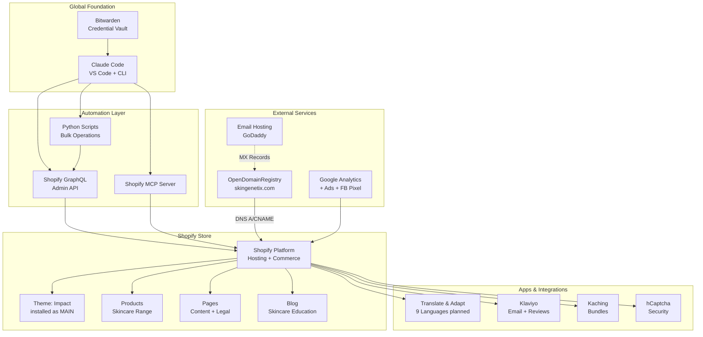

# Architecture — Skingenetix (CLIENT-003)

## System Diagram

```mermaid
graph TB
    subgraph "Global Foundation"
        CC[Claude Code<br/>VS Code + CLI]
        BW[Bitwarden<br/>Credential Vault]
    end

    subgraph "Automation Layer"
        GQLAPI[Shopify GraphQL<br/>Admin API]
        MCP[Shopify MCP Server]
        SCRIPTS[Python Scripts<br/>Bulk Operations]
    end

    subgraph "Shopify Store"
        SHOP[Shopify Platform<br/>Hosting + Commerce]
        THEME[Theme: Impact<br/>installed as MAIN]
        PRODS[Products<br/>Skincare Range]
        PAGES[Pages<br/>Content + Legal]
        BLOG[Blog<br/>Skincare Education]
    end

    subgraph "Apps & Integrations"
        LANG[Translate &amp; Adapt<br/>9 Languages planned]
        KLAV[Klaviyo<br/>Email + Reviews]
        KACH[Kaching<br/>Bundles]
        HCAP[hCaptcha<br/>Security]
    end

    subgraph "External Services"
        DOM[OpenDomainRegistry<br/>skingenetix.com]
        EMAIL[Email Hosting<br/>GoDaddy]
        GA[Google Analytics<br/>+ Ads + FB Pixel]
    end

    CC --> GQLAPI
    CC --> MCP
    CC --> SCRIPTS
    BW --> CC
    GQLAPI --> SHOP
    MCP --> SHOP
    SCRIPTS --> GQLAPI
    SHOP --> THEME
    SHOP --> PRODS
    SHOP --> PAGES
    SHOP --> BLOG
    SHOP --> LANG
    SHOP --> KLAV
    SHOP --> KACH
    SHOP --> HCAP
    DOM -->|DNS A/CNAME| SHOP
    EMAIL -.->|MX Records| DOM
    GA --> SHOP
```

## Components

| Component         | What It Is                                                  | Where It Lives                                | Status                                       |
| ----------------- | ----------------------------------------------------------- | --------------------------------------------- | -------------------------------------------- |
| Shopify Store     | E-commerce platform + hosting                               | pnb00c-aq.myshopify.com (www.skingenetix.com) | ✅ Live                                      |
| Theme             | Shopify 2.0 theme: Impact                                   | Shopify                                       | ✅ Installed (MAIN)                          |
| Domain            | Store domain name                                           | OpenDomainRegistry.net                        | ✅ Live on www.skingenetix.com               |
| Email             | Email hosting for store domain                              | GoDaddy (TBD)                                 | 🔜 To configure                              |
| GraphQL Admin API | Programmatic store management                               | Shopify                                       | ✅ Active (Client Credentials, auto-refresh) |
| Products          | 9 active skincare products (serums + creams), all EUR 49,95 | Shopify                                       | ✅ Live (0 inventory - not selling yet)      |
| Translate & Adapt | Translation (9 languages planned)                           | Shopify native                                | ✅ Installed (only EN locale published). ⚠️ Langify is NOT installed — see ADR-002a |
| Klaviyo           | Email marketing + reviews                                   | Shopify App Store                             | 🔜 To install                                |
| Kaching Bundles   | Product bundles                                             | Shopify App Store                             | 🔜 To install                                |
| hCaptcha          | Form security                                               | Shopify App Store                             | 🔜 To install                                |
| Google Analytics  | Traffic analytics                                           | Google                                        | 🔜 To connect                                |
| Google Ads        | Ad conversion tracking                                      | Google                                        | 🔜 To connect                                |
| Facebook Pixel    | Social ad tracking                                          | Meta                                          | 🔜 To connect                                |
| Bitwarden         | Credential storage                                          | Local + cloud                                 | ✅ Active                                    |
| Claude Code       | Store builder + manager                                     | Local                                         | ✅ Active                                    |
| Brand layout overrides | `custom-html` section in `sections/footer-group.json` holding a `<style>` + `<script>` block: link-block row fill, review-slider grid, injected carousel arrows, review CTA styling | Shopify theme (Impact) | ✅ Live site-wide |

## Connections

| From               | To         | How                                                  | Status     | Purpose                           |
| ------------------ | ---------- | ---------------------------------------------------- | ---------- | --------------------------------- |
| Claude Code        | Shopify    | GraphQL Admin API (Client Credentials, auto-refresh) | ✅ Active  | Store management                  |
| Business Dashboard | Shopify    | REST Admin API (Client Credentials)                  | ✅ Active  | Sales/forecast reporting (Fly.io) |
| Domain             | Shopify    | DNS A/CNAME records                                  | ✅ Active  | Domain routing                    |
| Domain             | Email Host | MX records                                           | 🔜 Pending | Email delivery                    |
| Shopify            | Translate & Adapt | Shopify native                                | ✅ Installed | Translations (theme/template text is natively translatable — ADR-002a) |
| Shopify            | Klaviyo    | Shopify App OAuth                                    | 🔜 Pending | Email marketing                   |
| Shopify            | GA4        | Measurement ID                                       | 🔜 Pending | Analytics                         |

## Authentication

| Service            | Auth Method                     | Status                               | Storage        |
| ------------------ | ------------------------------- | ------------------------------------ | -------------- |
| Shopify Admin API  | Client ID + Secret (custom app) | ✅ Received — pending Bitwarden save | Bitwarden      |
| OpenDomainRegistry | Username/password               | ✅ Active                            | Bitwarden      |
| GoDaddy            | Username/password               | ✅ Active                            | Bitwarden      |
| Google Analytics   | OAuth                           | 🔜 Pending                           | Google account |
| Klaviyo            | API key                         | 🔜 Pending                           | Bitwarden      |
| Google Gemini      | API key                         | ⚠️ Not in this project's `.env`      | See note below |

### ⚠️ The Gemini key is not in this project (found 2026-08-20)

The photography pipeline's Gemini calls — image generation on `nbp_pro` / `nbp_flash`, and
every QA vision judgement — read their key from the environment, but
`skingenetix-website/.env` **contains no Gemini key of any name**. The working key is
`GOOGLE_AI_API_KEY` in the _sister brand's_ file,
`~/Claude Code/Projects/hairgenetix/.env`.

The two consumers disagree about the name, which is what makes this bite quietly:

| Consumer                  | Reads                                  | Behaviour when unset                        |
| ------------------------- | -------------------------------------- | ------------------------------------------- |
| `qa.py` (vision judging)  | `GEMINI_API_KEY` → `GOOGLE_AI_API_KEY` | Every judgement returns a bare `HTTP 400`   |
| `backends.py` (image gen) | `GEMINI_API_KEY` only                  | Backend fails with `GEMINI_API_KEY not set` |

A QA pass run with only this project's `.env` sourced returned **177 errors in seconds** and
looked like a quota problem. It was not: `HTTP 400` was `API_KEY_INVALID`, because the
retry wrapper records `HTTP {code}` and discards the response body. Until the key is added
here from Bitwarden, anything touching Gemini must source **both** files and export
`GEMINI_API_KEY="${GEMINI_API_KEY:-$GOOGLE_AI_API_KEY}"` — the queued top-ups included,
since generation accepts only the first name.

## Accounts

| Service            | URL                       | Account Holder     | Purpose           |
| ------------------ | ------------------------- | ------------------ | ----------------- |
| Shopify            | skingenetix.myshopify.com | Malcolm Smith      | Store platform    |
| OpenDomainRegistry | opendomainregistry.net    | Malcolm Smith      | Domain registrar  |
| GoDaddy            | godaddy.com               | Malcolm Smith      | Email hosting     |
| Google Analytics   | analytics.google.com      | Malcolm Smith      | Traffic analytics |
| Bitwarden          | bitwarden.com             | msmithnl@gmail.com | Credential vault  |

## Change Log

| Date       | What Changed                                                                                                                                                                                                                                                                                                                                                                                                                                                                                                                                                                                                                                                                                                                                                                                                                                                                                                                                                                                                                                                                                                                                                              | Who              |
| ---------- | ------------------------------------------------------------------------------------------------------------------------------------------------------------------------------------------------------------------------------------------------------------------------------------------------------------------------------------------------------------------------------------------------------------------------------------------------------------------------------------------------------------------------------------------------------------------------------------------------------------------------------------------------------------------------------------------------------------------------------------------------------------------------------------------------------------------------------------------------------------------------------------------------------------------------------------------------------------------------------------------------------------------------------------------------------------------------------------------------------------------------------------------------------------------- | ---------------- |
| 2026-08-27 | **`/pages/reviews` got a real before/after review carousel, replacing a picture grid that carried no reviews.** The page held the two halves of a review in two separate sections — a `multi-column` grid of four before/after tiles, and a `testimonials` list of eight text-only quotes — so no visitor ever saw a photograph and the words about it together. Malcolm's constraint was stock sections first, so every plausible Impact section was read on the live theme before anything was written: **none carries more than five of the six fields** a review slide needs (pair, name, verified badge, stars, title, body, product link). `testimonials` gets five and fails on the one that cannot be worked around — its image is an **avatar by design**, hardcoded to `sizes: 40px, 56px` with a srcset capping at 168w. So a new additive section `sections/reviews-before-after.liquid`, but the carousel itself is **not custom**: it is the theme's own `<scroll-carousel>` plus the theme's own `scrollbar` snippet, the same breakpoints as `testimonials`, and the theme's `rating-star` icon. Hairgenetix's equivalent loads Swiper 11 off a CDN; nothing external is loaded here. Deliberately **no block-count gate** — the scrollbar snippet's own `peer-not-scrollable:hidden` decides, because a count is a proxy for the target and this store shipped two production bugs from scoping on one in August. The image contract is Malcolm's: **one file, split at exactly 50%, square overall**, so each half is a portrait rectangle. ⚠️ Three faults found in the images that were live: **`skingenetix-ba-firmness-combined.jpg` has the AI image brief rendered into the photograph** (a white panel reading `image-container`, `body: display: flex…`, `alt "Close of skin with sagging"`) — it is excluded, which is why there are three cards not four; **all four pairs are two different people**; and BEFORE/AFTER were **burnt into the pixels**, which cannot be translated for the nine planned locales. `scripts/build-review-ba-squares.py` rebuilt three 1:1 masters by cropping the bars off, but they cap at 560px and are placeholders. Two build lessons: the whitespace-stripping Liquid tags **ate the space** before the product link (`ReviewingAcetyl Hexapeptide-8…`) and `innerText` cannot verify the fix — it reported the fault as still present after the margin was applied, so the gap is measured as `a.left - prefix.right` off the live DOM; and a **CSS comment containing Liquid's stripping delimiters 422s the upload**, because Liquid parses the file before the browser sees it. Verified live at 1440 and 390: media 432×432 and 289×289, ratio exactly 1.000, every label inside its picture, all six fields on all three cards, controls correctly hidden on desktop and shown on mobile. Docs `docs/reviews-before-after-carousel.md`; plan `configs/banners/reviews-before-after-carousel.json`; undo `python3 scripts/reviews-add-before-after-carousel.py --restore backups/page.reviews-20260827-155643.json`. ⚠️ Open: the review copy is the page's own placeholder testimony re-attached to the matching photograph — nothing invented, none of it real — and those three reviews now appear **twice** on the page, once here and once in `testimonials` below. The standard answer for the review corpus is **Klaviyo Reviews**, which Hairgenetix already runs (4.8 / 1,613 reviews) and which is already on the Skingenetix account with only the onsite script installed, not the reviews block | Claude Code      |
| 2026-08-27 | **Related Skin Solutions rebuilt, and a Matrixyl pack shot generated to finish it.** The section was half broken and half wrong: two cards pointed at the same deleted files as the research pages, and the two that *did* render carried the **retired label** - plain wordmark, no helix, blank grey box - beside cards showing current branded cartons. All four now use current-label bottle-and-carton pack shots, one per concern, each a different carton colour (silver / teal / gold / blue). Three fixes came with it: the **Collagen & Skin Plumping card was missing from all four sibling pages** and was added; `column_size` was `3`, so the fourth card wrapped onto its own line - `4` puts them in one row (it is a **divisor**, `12 / column_size`, so the number is items-per-row and reads backwards); and the section printed Impact's schema default live - *"Organize content into multiple columns to share useful information..."* - because `content` was **absent** rather than empty. An absent setting is not an empty one, and a `.get(key, '')` while auditing hides exactly that. Matrixyl had no clean carton shot in the library at all (its only one reads **"PLRMPING"**, a generation fault - the dieline artwork is correct), so one was generated: 24 candidates over two runs, $1.22, four suppliers. First run 2/8 passed; the second, with the carton's dense body copy pushed onto the narrow side panel as deliberately unreadable texture, passed **7/16** - the failures had all been in small type, so the fix was to give the engines less legible fine print to get wrong. Layout was **measured off the live Glutathione hero** and written into the brief as frame fractions (carton 0.23-0.60 across, bottle 0.51-0.79, bottle base 2% lower, bottle covering the right quarter of the box face) rather than described in adjectives. Malcolm chose B6 (nbp_pro, box right). **Seedream went 0 for 6** on this product across both runs, and the most stubborn fault was the **helix drawn as a ladder** - spelling perfect, mark wrong - on 4 of 16 even with an explicit negative. Template `serum_bottle_packshot_layouts` v1.0; plans `configs/solution-related/*.json`. ⚠️ Open: gpt-image never ran - the skill classifies it `LOW_TEXT_FIDELITY` and bars it from `sharp` routes, which contradicts this project's own record of it rendering MATRIXYL 3000 PRO COLLAGEN correctly first attempt | Claude Code      |
| 2026-08-27 | **"Explore More Research" was showing blank cards on every research page — 12 of its 20 cards had no image.** Three of the five referenced files did not exist: `skingenetix-copper-peptide-serum-main.jpg`, and the UUID-suffixed `...pdrn-cellular-repair-serum-bottle_3ebebb1c….jpg` / `...glutathione-brightening-serum-bottle_b6ab3743….jpg`. The suffixes are the tell — Shopify **suffixes rather than replaces** on a filename collision, so those were duplicate uploads that were later tidied away while the templates kept pointing at them. A dead `shopify://shop_images/` reference renders **nothing at all**, not a broken-image icon, so the row just went ragged and no error surfaced anywhere. Malcolm's call was to reuse the per-ingredient research images already established on `/pages/the-science`, which is also the only complete, coherent, correctly-branded set available: fibroblast-collagen-matrix (copper), skin-cell-microscopy (acetyl), collagen-matrix-structure (matrixyl), polynucleotide-DNA-helix (PDRN), antioxidant-skin-cell (glutathione). All five are square, which matters because the multi-column card renders **300×300 with `object-fit: fill`** — it stretches rather than crops, so a non-square master would be visibly distorted. Alt text came free; it is already written on those files. The two rejected alternatives are worth recording: the old 1024px "bottle" files are **not usable** — the PDRN one is an unbranded stock bottle and the glutathione one is **QUINER-branded, a competitor** (see the `ghb-cu-and-a-competitor-bottle-live` memory). Verified live on all five pages: 4 images / 4 cards each, 20 of 20. Plans: `configs/research-related/*.json`. ⚠️ Open: the same two dead files still blank **8 cards across the five Skin Solutions pages** in their `Related Skin Solutions` section — a different taxonomy (concerns, not ingredients), so it needs its own image decision | Claude Code      |
| 2026-08-25 | **The Skin Solutions pages stopped being carousels.** All five — brightening-glow, collagen-skin-plumping, fine-lines-wrinkles, firming-skin-density, skin-repair-renewal — were showing **one of six content blocks**, the rest behind a horizontal scroll (`scrollWidth` 8184 vs `clientWidth` 1344), with prev/next arrows nobody asked for. Nothing on those templates caused it: the homepage reviews slider is built in the sitewide `footer-group` `custom-html` block and was scoped by **block count** — CSS turned any `media-with-text` with a sixth child into a scroll-snapping track, and the JS injected arrows on the same test. `footer-group` renders on every page, and six sections on this store have six or more blocks: the reviews slider, and the `content` section of every Skin Solutions page. Second bug from that one number in two days — `fix-stray-slider-arrows.json` had made the two halves *agree* at six that morning, which is why this one was still live. Both halves now test for the markup unique to the slider, `a[href$="/pages/reviews"]` (`$=` so a Langify locale prefix still matches); verified against all 57 templates — 22 `media-with-text` sections, that link in exactly one. Section ids were unusable (they render as `shopify-section-template--<theme id>__<key>` and go stale) and `custom-html` rejects Liquid, so content is the only stable discriminator from a sitewide block. Verified live on all five pages: row flow, no horizontal scroll, 0 arrows, six blocks stacked and alternating; homepage slider untouched. Plan: `configs/banners/solution-pages-remove-content-carousel.json` | Claude Code      |
| 2026-08-21 | **Homepage rebuilt against a five-brand premium benchmark (BRAND-001).** Live captures of Augustinus Bader, Dr. Barbara Sturm, La Mer, La Prairie and Tatcha, plus a full audit of the theme's 239 image slots via new `scripts/audit-theme-images.py` + `image-slot-inventory.py`. Finding: the store was **not** missing images — 236 of 239 slots were filled and every file returned HTTP 200 — but the hero and all four concern tiles were **botanical flat-lays on a peptide brand**, and the page had **zero full-width bands** where Bader runs five. Direction adopted: "clinical luminism", reusing the agreed product-photography scene colours so banners and packshots are one system; the **peptide chain** is now the brand's signature device. Live: 3-slide hero (model → laboratory glass → Matrixyl), human-register concern tiles, peptide-chain science visual, a new full-bleed **Peptide Standard** band, a **6-slide Tatcha-style review slider** with injected native prev/next arrows and a per-slide "See All Customer Reviews" CTA, material-register find-a-serum tiles, and a new **brand band** above the footer. Layout fault fixed site-wide: the theme sizes link-block rows by items-per-row, so a 4-block row at `large` left a 274px dead column — corrected via an additive `custom-html` section in `footer-group`, which also repaired `page.ingredients` untouched. **Removed** a "Hear From Our Customers" section on the fallback product template holding three invented video testimonials that all pointed at a **Hairgenetix hair-growth advert**. New tooling: `generate-banners.py`, `upload-theme-images.py` (Files API), `patch-template.py` (backs up + prints its own `--restore` before every push), `banner-contact-sheet.py`. ⚠️ Open: the six homepage review quotes are **invented placeholders** on a store with no orders, now the most prominent section on the page | Claude Code      |
| 2026-08-24 | **Skin-art banner library and the first two collection banners (BRAND-004).** A reusable library of banner frames — one wave per product, eleven poses, four suppliers, **402 images across nine products, ~$25** — generated by new `scripts/build-banner-library-config.py`, so a banner's text can sit wherever a given frame leaves room. Product position is stated as a **measured fraction of frame width** after a body-part anchor put the bottle over the headline in four of five suppliers. Four brief faults were found and fixed, all with one root cause — the brief *named* a thing without *describing* it, so each supplier filled the gap: small print asked to be "too small to read" was set as near-legible garbage until given a physical cause (outside the depth of field); serum bottles came back milky because **not one of the five serum specs describes the liquid**, only the glass; the DNA-helix mark drifted to ribbons until described as dots and dashes; and PDRN rendered as **PORN** until spelled letter by letter — which still fails on the PDRN cream, whose jar sets the label large enough to be drawn as a word. Two collection banners published (`matrixyl-3000`, `glutathione`), and the real blocker there was **not the images**: `templates/collection.json` had `enable_parallax: true`, which the theme's own schema says *"crops images"*, so no supplied aspect ratio survived, plus a 50% overlay flattening every picture. Parallax off and overlay 25 fixed all five collection pages at once — after three attempts and ~$0.50 spent reworking the asset instead of reading the section settings. Supplier limits measured: Seedream caps at 4096 but honours arbitrary ratios, gpt-image **hard-refuses beyond 3:1**, and NBP silently snaps to its nearest named ratio | Claude Code      |
| 2026-08-22 | **Every website image now fans out to every supplier (BRAND-003).** Malcolm's standing instruction: each image goes to all suppliers on their latest and most capable models so he compares and chooses. It was bought by a wasted evening — the entire homepage banner run went through **Seedream alone**, because `generate-banners.py` hardcodes two Seedream endpoints and has no routing. MATRIXYL failed in ~30 of 50 candidates across five rewritten briefs, spelled letter by letter with every misspelling negated by name, and was treated as a prompting problem for hours; the same brief sent to **gpt-image rendered it correctly first attempt, both candidates**, then broke PDRN which Seedream always got right. The final FAQ image needed **three engines** — Seedream for the composition and equal jar sizes, gpt-image for MATRIXYL, NBP Flash for PDRN. New `.claude/rules/website-imagery.md` (fan out; re-list the roster before every run because a stale model id **404s silently**; judge at 100% **and** at rendered size; per-supplier traps) and `scripts/generate-multi.py`, which speaks each supplier's own size dialect because none of them errors on a value it does not recognise — they substitute a default silently. Roster had already drifted: `chatgpt-image-latest`, `gpt-image-1.5` and `gemini-3.1-flash-lite-image` existed and were wired into nothing. Two "supplier refused" results turned out to be adapter bugs — FLUX.2's model id is bare, and Luma's key file carries comment lines, so reading it whole put an **em dash into the Authorization header**, which http.client encodes as latin-1. Also fixed a live rendering fault: a correct `PDRN` was reading as `PORN` on the page because the theme emitted `sizes="350px"` against a 700w srcset ceiling and the downscale thinned the D — resolved at runtime, not by regeneration. Barred from class A: FLUX.2 (invents brands) and now **Luma** (invented an `XXX` mark). Also added `scripts/build-banner-library-config.py`, generating an 11-pose skin-art banner wave per product from that product's own spec, with product placement stated as a **measured fraction of frame width** after a body-part anchor put the bottle over the headline in four of five suppliers | Claude Code      |
| 2026-08-21 | **Homepage FAQ and brand band restructured on stock theme sections (BRAND-002).** Malcolm's constraint was explicit — use standard sections and content modules before writing our own — so the theme's own section Liquid was read before anything was proposed. The FAQ needed no new section: the stock **FAQ** section already carries a `text_position` setting whose Left/Right values switch it to the theme's `section-stack--horizontal` two-column layout at ≥1150px. It was on **Centre**, the one value that stacks full width, which is why it ran ~1000px tall. Now ~530px: title centred above, 9 questions left, image right, one card. The heading always renders inside a column, so lifting it to a full-width first row cost 8 lines in the existing `custom-html` block — the stock-only alternative (a **Rich text** section above) leaves a visible seam, because `section-spacing-collapsing` **deliberately disables** collapsing for boxed sections above 700px. For the band, Tatcha's live markup was pulled rather than inferred: same theme family, full-bleed image, text in a translucent white card `max-width: 520px` / `background: rgb(255 255 255 / 0.8)`, one short serif sentence, filled button, no eyebrow, no body copy. Our `image-with-text-overlay` gives all of it from native settings **except the white card** — this Impact build exposes no content-background setting (the `slideshow` block's `background` is the loading backdrop behind the image, not a panel behind the text). Malcolm chose the all-stock version: centred, X-Small heading, filled button, no panel, and taller via the native Image size (`md` 560px → `lg` 720px). Previews were rendered locally by rewriting the live HTML to the proposed markup, so the comparison used the theme's real CSS and nothing was pushed until he chose. ⚠️ Open: both slots hold placeholder images — the FAQ one is already in use higher up the same page — with 7 briefs generated for selection | Claude Code      |
| 2026-08-21 | **2026 imagery live on every product that has artwork — 9 of 11 store products, 86 images**, from 8 two days earlier. Matrixyl serum + cream, Acetyl Hexapeptide-8 and the PDRN Renewal Serum generated and published; the Copper Peptide Renewal Serum published by selective **merge** rather than full replace, retiring only the 3 live images its new set superseded and keeping 4 that nothing covered. New `scripts/finals/shopify-merge-media.py` for that mode, and `prepare-marked-run-output.py` for marks made directly in a fan-out output folder (it recovers each image's engine from the run manifest, which the output filenames drop). **Alt text authored for all 66 live images** — 9 had none at all, 24 were thin keyword phrases — via idempotent `set-product-alt-text.py`. Four separate mark-handling bugs found and fixed across the finals scripts, all previously silent; 47 tests now. Artwork faults recorded for print: Matrixyl and Acetyl serum cartons read 50ML against 30ML bottles; both microneedling stamp sets still show **Hairgenetix** packaging. Corrected a wrong note that had blocked Acetyl from generation for two days | Claude Code      |
| 2026-08-20 | **Second product published** — 8 images onto the Glutathione serum, replacing all 6 that carried the retired label. Gallery order set by Malcolm (packaging hero, then hands-dropper). The uploader is now plan-driven (`scripts/finals/upload-plans/<handle>.json` holds GID, order and per-shot alt text) and refuses a selected file it cannot map to a planned shot instead of appending it with generic alt text. Two Copper Peptide runs finished (177 + 154 candidates) and were consolidated for browsing; the Night cream run started. Found and fixed a latent collector bug that would have duplicated every image Malcolm had marked on the next top-up re-run. Found that **no Gemini key exists in this project's `.env`** — see the Authentication note                                                                                                                                                                                                                                                                                                                                                                                                    | Claude Code      |
| 2026-03-05 | Project created, initial architecture documented                                                                                                                                                                                                                                                                                                                                                                                                                                                                                                                                                                                                                                                                                                                                                                                                                                                                                                                                                                                                                                                                                                                          | Claude Code      |
| 2026-03-05 | Store created (skingenetix.myshopify.com), custom app API credentials received                                                                                                                                                                                                                                                                                                                                                                                                                                                                                                                                                                                                                                                                                                                                                                                                                                                                                                                                                                                                                                                                                            | Malcolm + Claude |
| 2026-05-06 | State discovery: store far ahead of docs (Impact theme live, 5+ products, domain live). See handover-2026-05-06.md                                                                                                                                                                                                                                                                                                                                                                                                                                                                                                                                                                                                                                                                                                                                                                                                                                                                                                                                                                                                                                                        | Claude Code      |
| 2026-05-18 | Product photography fan-outs: Glutathione (146/190, $5.69), Copper Peptide Advanced Repair (128/190, $6.18), Matrixyl 3000 Pro Collagen (157, $9.80). All 22-shot Max-tier, 5 backends. Awaiting human winner selection — see todo.md PHOTO-\* items                                                                                                                                                                                                                                                                                                                                                                                                                                                                                                                                                                                                                                                                                                                                                                                                                                                                                                                      | Claude Code      |
| 2026-08-03 | All 9 products: HS-code 3304.99.5000 + country of origin CN set (US import). Shopify taxonomy categories set (5x Face Serums, 4x Face Moisturizers)                                                                                                                                                                                                                                                                                                                                                                                                                                                                                                                                                                                                                                                                                                                                                                                                                                                                                                                                                                                                                       | Claude Code      |
| 2026-08-20 | **First images published from the rebuilt pipeline** — 8 onto the PDRN cream, replacing 5 that carried the retired label design. Shopify media replaced via staged upload + productCreateMedia, waiting for READY before deleting the old and then reordering. Six runs total, 1,300+ candidates, $63.56. Selection is Malcolm's by leading-underscore marking; alt text authored per shot rather than derived from filenames                                                                                                                                                                                                                                                                                                                                                                                                                                                                                                                                                                                                                                                                                                                                             | Claude Code      |
| 2026-08-20 | Product photography reached production: four runs, 680 candidates, $51.15, **140 images selected and prepared for upload** (21% selection rate against the audit's 0.2%). Three documented-but-missing pipeline stages were built — reference uploader, run review sheets, and the vision QA gate that SKILL.md had listed since v1 with no implementation. Cost-per-winner is computable for the first time and shows nbp_pro at $0.813 per chosen image against luma's $0.065, on a lower win rate. Nothing uploaded to the live store yet; every live product image still carries the retired label design                                                                                                                                                                                                                                                                                                                                                                                                                                                                                                                                                             | Claude Code      |
| 2026-08-19 | Photography pipeline rebuilt end to end in smith-os (`product-photography` v3.0): the fan-out orchestrator that produced all 25 previous runs never existed on disk and is now checked in with 59 tests, alongside reference prep, aspect/resolution enforcement, attribution-preserving SEO rename, web optimisation, a per-source cost ledger and a backend health check. Luma `uni-1` added as a sixth engine. All six engines verified working at ≥2048px — the 1024px output four of them had been producing was a parameter choice, not a model limit                                                                                                                                                                                                                                                                                                                                                                                                                                                                                                                                                                                                               | Claude Code      |
| 2026-08-19 | 2026 product redesign intake: 9 products (5 serums 30ml, 4 creams 50ml), reference sets built for all of them (36 crops) from new Drive artwork. Carton confirmed as one box with a coloured face and a matte-silk silver face. Three serum cartons and the Glutathione bottle carry artwork errors that need correcting before print                                                                                                                                                                                                                                                                                                                                                                                                                                                                                                                                                                                                                                                                                                                                                                                                                                     | Claude Code      |
| 2026-08-19 | Product-photography audit: 25 runs / 4,077 images / $122.37 spend, of which **8 images reached the live store**. 6 of 9 May-18 runs were undocumented. Skill rebuilt to v3.0 (serum 43 shots, cream 37), Luma `uni-1` added as 6th backend, resolution + aspect-ratio enforcement rules added, skill symlinked so it is invocable for the first time. The fan-out orchestrator that produced all 25 runs does not exist on disk — none of them is reproducible                                                                                                                                                                                                                                                                                                                                                                                                                                                                                                                                                                                                                                                                                                            | Claude Code      |
| 2026-08-13 | Repo sync + asset-path repair: fast-forwarded 10 commits behind origin; repaired 47 asset dirs whose content sat in cloud-sync `" (1)"` twins while the documented bare-named dir was empty; removed 2 byte-identical duplicates; `assets/` gitignored and `scripts/` committed (P6-FU-4 closed)                                                                                                                                                                                                                                                                                                                                                                                                                                                                                                                                                                                                                                                                                                                                                                                                                                                                          | Claude Code      |
| 2026-08-03 | Business dashboard: fixed expired Skingenetix Shopify client secret (was stale in dashboard .env)                                                                                                                                                                                                                                                                                                                                                                                                                                                                                                                                                                                                                                                                                                                                                                                                                                                                                                                                                                                                                                                                         | Claude Code      |
