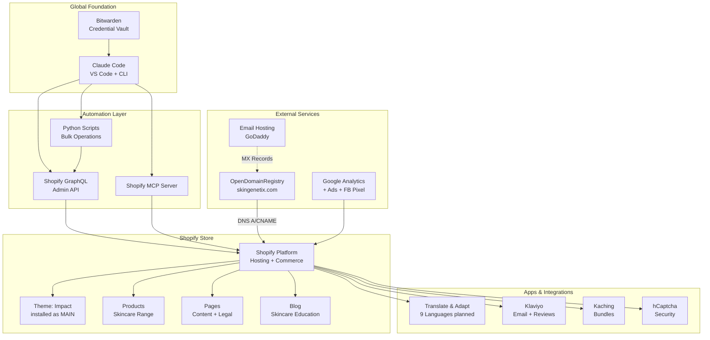

# Architecture — Skingenetix (CLIENT-003)

## System Diagram

```mermaid
graph TB
    subgraph "Global Foundation"
        CC[Claude Code<br/>VS Code + CLI]
        BW[Bitwarden<br/>Credential Vault]
    end

    subgraph "Automation Layer"
        GQLAPI[Shopify GraphQL<br/>Admin API]
        MCP[Shopify MCP Server]
        SCRIPTS[Python Scripts<br/>Bulk Operations]
    end

    subgraph "Shopify Store"
        SHOP[Shopify Platform<br/>Hosting + Commerce]
        THEME[Theme: Impact<br/>installed as MAIN]
        PRODS[Products<br/>Skincare Range]
        PAGES[Pages<br/>Content + Legal]
        BLOG[Blog<br/>Skincare Education]
    end

    subgraph "Apps & Integrations"
        LANG[Translate &amp; Adapt<br/>9 Languages planned]
        KLAV[Klaviyo<br/>Email + Reviews]
        KACH[Kaching<br/>Bundles]
        HCAP[hCaptcha<br/>Security]
    end

    subgraph "External Services"
        DOM[OpenDomainRegistry<br/>skingenetix.com]
        EMAIL[Email Hosting<br/>GoDaddy]
        GA[Google Analytics<br/>+ Ads + FB Pixel]
    end

    CC --> GQLAPI
    CC --> MCP
    CC --> SCRIPTS
    BW --> CC
    GQLAPI --> SHOP
    MCP --> SHOP
    SCRIPTS --> GQLAPI
    SHOP --> THEME
    SHOP --> PRODS
    SHOP --> PAGES
    SHOP --> BLOG
    SHOP --> LANG
    SHOP --> KLAV
    SHOP --> KACH
    SHOP --> HCAP
    DOM -->|DNS A/CNAME| SHOP
    EMAIL -.->|MX Records| DOM
    GA --> SHOP
```

## Components

| Component              | What It Is                                                                                                                                                                                                                                           | Where It Lives                                | Status                                                                              |
| ---------------------- | ---------------------------------------------------------------------------------------------------------------------------------------------------------------------------------------------------------------------------------------------------- | --------------------------------------------- | ----------------------------------------------------------------------------------- |
| Shopify Store          | E-commerce platform + hosting                                                                                                                                                                                                                        | pnb00c-aq.myshopify.com (www.skingenetix.com) | ✅ Live                                                                             |
| Theme                  | Shopify 2.0 theme: Impact                                                                                                                                                                                                                            | Shopify                                       | ✅ Installed (MAIN)                                                                 |
| Domain                 | Store domain name                                                                                                                                                                                                                                    | OpenDomainRegistry.net                        | ✅ Live on www.skingenetix.com                                                      |
| Email                  | Email hosting for store domain                                                                                                                                                                                                                       | GoDaddy (TBD)                                 | 🔜 To configure                                                                     |
| GraphQL Admin API      | Programmatic store management                                                                                                                                                                                                                        | Shopify                                       | ✅ Active (Client Credentials, auto-refresh)                                        |
| Products               | 9 active skincare products (serums + creams), all EUR 49,95                                                                                                                                                                                          | Shopify                                       | ✅ Live (0 inventory - not selling yet)                                             |
| Translate & Adapt      | Translation (9 languages planned)                                                                                                                                                                                                                    | Shopify native                                | ✅ Installed (only EN locale published). ⚠️ Langify is NOT installed — see ADR-002a |
| Klaviyo                | Email marketing + reviews                                                                                                                                                                                                                            | Shopify App Store                             | 🔜 To install                                                                       |
| Kaching Bundles        | Product bundles                                                                                                                                                                                                                                      | Shopify App Store                             | 🔜 To install                                                                       |
| hCaptcha               | Form security                                                                                                                                                                                                                                        | Shopify App Store                             | 🔜 To install                                                                       |
| Google Analytics       | Traffic analytics                                                                                                                                                                                                                                    | Google                                        | 🔜 To connect                                                                       |
| Google Ads             | Ad conversion tracking                                                                                                                                                                                                                               | Google                                        | 🔜 To connect                                                                       |
| Facebook Pixel         | Social ad tracking                                                                                                                                                                                                                                   | Meta                                          | 🔜 To connect                                                                       |
| Bitwarden              | Credential storage                                                                                                                                                                                                                                   | Local + cloud                                 | ✅ Active                                                                           |
| Claude Code            | Store builder + manager                                                                                                                                                                                                                              | Local                                         | ✅ Active                                                                           |
| Brand layout overrides | `custom-html` section in `sections/footer-group.json` holding a `<style>` + `<script>` block: link-block row fill, review-slider grid, injected carousel arrows, review CTA styling, **main-menu image tiles**                                       | Shopify theme (Impact)                        | ✅ Live site-wide                                                                   |
| Main-menu image tiles  | `mega_menu` blocks in `sections/header-group.json` (one per top-level item bar Reviews) + the tile CSS in `brand_layout_css`. Every dropdown except Shop shows square photo tiles instead of a text column. Managed by `scripts/menu-image-tiles.py` | Shopify theme (Impact)                        | ✅ Live                                                                             |

## Connections

| From               | To                | How                                                  | Status       | Purpose                                                                |
| ------------------ | ----------------- | ---------------------------------------------------- | ------------ | ---------------------------------------------------------------------- |
| Claude Code        | Shopify           | GraphQL Admin API (Client Credentials, auto-refresh) | ✅ Active    | Store management                                                       |
| Business Dashboard | Shopify           | REST Admin API (Client Credentials)                  | ✅ Active    | Sales/forecast reporting (Fly.io)                                      |
| Domain             | Shopify           | DNS A/CNAME records                                  | ✅ Active    | Domain routing                                                         |
| Domain             | Email Host        | MX records                                           | 🔜 Pending   | Email delivery                                                         |
| Shopify            | Translate & Adapt | Shopify native                                       | ✅ Installed | Translations (theme/template text is natively translatable — ADR-002a) |
| Shopify            | Klaviyo           | Shopify App OAuth                                    | 🔜 Pending   | Email marketing                                                        |
| Shopify            | GA4               | Measurement ID                                       | 🔜 Pending   | Analytics                                                              |

## Authentication

| Service            | Auth Method                     | Status                               | Storage        |
| ------------------ | ------------------------------- | ------------------------------------ | -------------- |
| Shopify Admin API  | Client ID + Secret (custom app) | ✅ Received — pending Bitwarden save | Bitwarden      |
| OpenDomainRegistry | Username/password               | ✅ Active                            | Bitwarden      |
| GoDaddy            | Username/password               | ✅ Active                            | Bitwarden      |
| Google Analytics   | OAuth                           | 🔜 Pending                           | Google account |
| Klaviyo            | API key                         | 🔜 Pending                           | Bitwarden      |
| Google Gemini      | API key                         | ⚠️ Not in this project's `.env`      | See note below |

### ⚠️ The Gemini key is not in this project (found 2026-08-20)

The photography pipeline's Gemini calls — image generation on `nbp_pro` / `nbp_flash`, and
every QA vision judgement — read their key from the environment, but
`skingenetix-website/.env` **contains no Gemini key of any name**. The working key is
`GOOGLE_AI_API_KEY` in the _sister brand's_ file,
`~/Claude Code/Projects/hairgenetix/.env`.

The two consumers disagree about the name, which is what makes this bite quietly:

| Consumer                  | Reads                                  | Behaviour when unset                        |
| ------------------------- | -------------------------------------- | ------------------------------------------- |
| `qa.py` (vision judging)  | `GEMINI_API_KEY` → `GOOGLE_AI_API_KEY` | Every judgement returns a bare `HTTP 400`   |
| `backends.py` (image gen) | `GEMINI_API_KEY` only                  | Backend fails with `GEMINI_API_KEY not set` |

A QA pass run with only this project's `.env` sourced returned **177 errors in seconds** and
looked like a quota problem. It was not: `HTTP 400` was `API_KEY_INVALID`, because the
retry wrapper records `HTTP {code}` and discards the response body. Until the key is added
here from Bitwarden, anything touching Gemini must source **both** files and export
`GEMINI_API_KEY="${GEMINI_API_KEY:-$GOOGLE_AI_API_KEY}"` — the queued top-ups included,
since generation accepts only the first name.

## Accounts

| Service            | URL                       | Account Holder     | Purpose           |
| ------------------ | ------------------------- | ------------------ | ----------------- |
| Shopify            | skingenetix.myshopify.com | Malcolm Smith      | Store platform    |
| OpenDomainRegistry | opendomainregistry.net    | Malcolm Smith      | Domain registrar  |
| GoDaddy            | godaddy.com               | Malcolm Smith      | Email hosting     |
| Google Analytics   | analytics.google.com      | Malcolm Smith      | Traffic analytics |
| Bitwarden          | bitwarden.com             | msmithnl@gmail.com | Credential vault  |

## Change Log

| Date       | What Changed                                                                                                                                                                                                                                                                                                                                                                                                                                                                                                                                                                                                                                                                                                                                                                                                                                                                                                                                                                                                                                                                                                                                                                                                                                                                                                                                                                                                                                                                                                                                                                                                                                                                                                                                                                                                                                                                                                                                                                                                                                                                                                                                                                                                                                                                                                                                                                                                                                                                                                                                                                                                                                                                                                                                                                                                                                                                                                                                                                                                                                                                                                                                                                                                                                                                                                                                                                                                                                                                                                                                                                     | Who                                                                                                                                                                                                                                                                                                                                                                                                                                                                                                 |
| ---------- | -------------------------------------------------------------------------------------------------------------------------------------------------------------------------------------------------------------------------------------------------------------------------------------------------------------------------------------------------------------------------------------------------------------------------------------------------------------------------------------------------------------------------------------------------------------------------------------------------------------------------------------------------------------------------------------------------------------------------------------------------------------------------------------------------------------------------------------------------------------------------------------------------------------------------------------------------------------------------------------------------------------------------------------------------------------------------------------------------------------------------------------------------------------------------------------------------------------------------------------------------------------------------------------------------------------------------------------------------------------------------------------------------------------------------------------------------------------------------------------------------------------------------------------------------------------------------------------------------------------------------------------------------------------------------------------------------------------------------------------------------------------------------------------------------------------------------------------------------------------------------------------------------------------------------------------------------------------------------------------------------------------------------------------------------------------------------------------------------------------------------------------------------------------------------------------------------------------------------------------------------------------------------------------------------------------------------------------------------------------------------------------------------------------------------------------------------------------------------------------------------------------------------------------------------------------------------------------------------------------------------------------------------------------------------------------------------------------------------------------------------------------------------------------------------------------------------------------------------------------------------------------------------------------------------------------------------------------------------------------------------------------------------------------------------------------------------------------------------------------------------------------------------------------------------------------------------------------------------------------------------------------------------------------------------------------------------------------------------------------------------------------------------------------------------------------------------------------------------------------------------------------------------------------------------------------------------------- | --------------------------------------------------------------------------------------------------------------------------------------------------------------------------------------------------------------------------------------------------------------------------------------------------------------------------------------------------------------------------------------------------------------------------------------------------------------------------------------------------- | ----------- |
| 2026-08-31 | **New Joselyn H review added to the head of the Glutathione carousel — and a bulk-publish landmine found and defused.** Malcolm supplied the copy; it is used verbatim, capitalised "SO" included, because that is how a customer wrote it and flattening it into house style would make it read like marketing. The photograph was checked against the claim first: the copy says dull, uneven skin looking refreshed with old acne marks fading, and Joselyn-H's before frame is exactly that, with those marks **softened but still visible** in the after and the raised mole on her temple unchanged. The alt says softened rather than gone. ⚠️ **`product-reviews-publish.py` had become destructive and nobody would have known.** It upserts all 99 cards from `configs/product-reviews.json` and rewrites every product's list in allocation order — and that config still named Jennifer T, Lucia M and Martine M, whose entries now display Casandra C, Trudie T and Stephanie G, and knew nothing of the manual Bri E / Stephanie G position swap. Running it to add one card would have reverted the whole day silently. **The config has been reconciled to production** rather than merely avoided: the three changed authors, their `person` and `filename` fields, and the new Joselyn card are now in it, with a note recording that the **handles deliberately did not change** (`review-brightening-lucia-m` displays Trudie T, and so on — translations key off the handle) and that the live order is no longer the file's allocation order. **New `scripts/add-review-card.py`** does the narrow job instead: upsert one `customer_review` by handle, insert it into one product's list at a chosen position, back up that list first. Never delete-and-recreate — recreating an entry drops every locale, which is what cost the sister brand its German mega-menu in March. Verified live: 10 cards, Joselyn H at position 0 with the full copy and her own alt. Plan: `configs/banners/review-add-joselyn-h.json`. | Claude Code |
| 2026-08-31 | **Glutathione carousel: Bri E and Stephanie G traded places (positions 6 and 7), and a new `scripts/swap-review-order.py` to do it.** `product-reviews-reorder.py` already existed but is the wrong tool for this — it lays out a whole carousel algorithmically, costing adjacency so similar-looking women are not neighbours, so re-running it to move two cards would have moved every other card as a side effect. The new script writes the same `custom.customer_reviews` list with exactly two positions exchanged, backs the previous order up first and restores from that file. ⚠️ **Ask by handle, not by name.** A metaobject handle is fixed at creation and does not follow the author, so after the day's swaps `review-brightening-martine-m` displays "Stephanie G" and `review-brightening-jennifer-t` displays "Casandra C". The handle is deliberately stable because translations key off it — renaming one would orphan every locale. The script prints the displayed author beside each handle in its dry run so the pairing can be checked by eye before writing. ⚠️ **The storefront served a stale order after the write.** The first live read still showed the old positions while the API already held the new ones; a fresh cache-busted load showed it correctly. Verify a metafield reorder against the API first and treat one stale page read as cache, not as failure — this is the same 5-to-30-minute storefront caching the production-safety rule warns about. Verified live: 6 Stephanie G, 7 Bri E, each with its own photograph. | Claude Code |
| 2026-08-31 | **Glutathione carousel, third swap: Jennifer T → Casandra C.** Same tool and same checks as the Trudie/Stephanie pair earlier the same day. The review text stays and fits: Jennifer's card is "Finally something for my dull skin" — *"My skin always looks tired no matter how much I sleep… Now my face just looks fresher"* — and Casandra-C's before frame is flat and dull with dense freckling across the cheek against a fresher, more even after. **Confirmed the entry is attached to one product only** by walking every product's `custom.customer_reviews` list before writing, so the swap could not surface on a page nobody was looking at. **`Casandra-C.png` was not in the Drive folder when it was listed an hour earlier** for the previous swap — it had just synced. That folder changes underneath you; re-list it rather than trusting an earlier reading. ⚠️ **Worth knowing about this particular pair:** the two halves are not lit alike — the before is on a cool grey wall, the after on a warm beige one, and the after is noticeably warmer, so some of the apparent evenness is white balance rather than skin. Flagged to Malcolm rather than fixed; the alt is worded not to lean on it, and it names what persists (her freckles and forehead lines are unchanged) rather than only what improves. Square 1:1 at 2048px so it passed the 3000px cap untouched; PNG→JPEG left to the uploader; filename is Casandra's, not Jennifer's, since Shopify suffixes rather than replaces. Verified live: "Casandra C" present, "Jennifer T" gone, correct file and alt served. Plan: `configs/banners/review-image-swap-casandra.json`. | Claude Code |
| 2026-08-31 | **Glutathione before/after carousel: Lucia M → Trudie T and Martine M → Stephanie G, photograph and name together.** Reviews here are `customer_review` **metaobjects**, not template content, which is why grepping the theme for a customer name finds nothing. **`swap-review-image.py` was extended to carry `new_author`.** It previously wrote only the `image` field, and the photograph *is* the person — changing one without the other leaves a card attributing someone's face to someone else's name. The backup now records the previous author too, so `--restore` puts both halves back; older backups with no `fields` block still restore the picture alone, which is exactly what they captured. **The review text stays, and it fits the new photographs better than the old ones.** This looked like re-attributing one person's words to another, so both pairs were opened and looked at before anything was written. Martine's card is titled "My freckles haven't disappeared, and that's fine" and Stephanie-G is heavily freckled with her freckles plainly still there in the after frame; Lucia's card is "Nice for sensitive skin", about expecting stinging or redness, and Trudie-T's before frame is flushed across the cheeks and nose with that redness settled after. The swap corrects a mismatch rather than creating one. **Alt text was rewritten, not carried over.** The old alt described the old pictures — "melasma across both cheeks clearing", "sun-damage pigment on the cheek evening out" — and neither is what these show. On a page in this category the alt is a claim like any other, so it now describes only what is in each frame, including that Stephanie's freckles are **unchanged**. Both masters are square 1:1, the section's contract (one file, split at 50%). Trudie-T is 2048px and passed through; Stephanie-G is 4096px and was capped to 3000. PNG→JPEG conversion was left to `upload-theme-images.py` rather than pre-converted, so there is one conversion in one place. Filenames are named for the person in them and **do not reuse the old names** — Shopify suffixes rather than replaces on a collision, so `...-lucia-m.jpg` would have kept serving the old picture. Verified live: "Trudie T" and "Stephanie G" present, "Lucia M" and "Martine M" gone, both new filenames and both new alt strings served. Plan: `configs/banners/review-image-swap-trudie-stephanie.json`. | Claude Code |
| 2026-08-31 | **Homepage review carousel: three of the six model photographs replaced from a new face-application wave.** Malcolm's picks from `cream-application-faces-r3` — `review_2` PDRN takes the PINK cream frame (nbp_pro), `review_4` Glutathione the LIGHT BLUE (nbp_flash), `review_6` Acetyl the CLEAR serum (nbp_flash). Plan `configs/banners/homepage-review-carousel-r3-publish.json`; brief built by `scripts/build-cream-application-faces-r3.py`, a sibling of the round-2 builder rather than an edit of it, because casting narrows to 100% White European 35-40 and two substances are new. **The transparent serum needed its own swatch paragraph** — round 2's asserts an OPAQUE substance 'satin rather than glossy', the exact opposite of a clear serum, and every engine's default for 'serum' is milky white. Transparency is therefore briefed as something CHECKABLE in the render — her pores visible THROUGH the fluid — rather than as the adjective, which an engine satisfies with a translucent white. All five engines returned genuinely clear serum. ⚠️ **The smoke test caught two round-2 faults returning, and BOTH WERE INVISIBLE ON THE CONTACT SHEET** — a 640px tile passed all ten images and only the native-pixel cheek crop showed them: swatches oversized (two competing yardsticks were given, 'no wider than a fingertip' AND 'one tenth of the cheek', and engines took the looser; now the yardstick is her own FINGERNAIL, in frame beside the swatch), and fingertips hovering with a gap (adjacency is not contact; the fix requires OVERLAP so the swatch is partly HIDDEN by the fingertip). ⚠️ **A crop-scale error nearly mis-called the retest**: a fixed 760px crop across 2048px and 4096px masters shows half the facial area on the 4096 engines and made their swatches look twice too large. Judge against a landmark INSIDE the frame, never a fixed pixel box across mixed native sizes. **Uploaded under NEW filenames, not the `-v4` names** — Shopify suffixes rather than replaces, so re-using a name keeps the OLD image being served; the three old files are untouched and only the block `image` settings were repointed (shopify.md rule 7, translations key off the URL). The new names also drop the `-2026-v4` revision words that `check_seo_name()` correctly flags as carrying no search value. 4096px PNGs at ~9.4MB each went to 3000px progressive JPEG q95 4:4:4 at ~2.2MB. Verified live: 6 items, 6 images, **all six decode** (forced past the scroller's lazy-loading, since 3 of 6 undecoded is normal there and would otherwise read as a fault), old filenames return 0 hits, CDN serves WebP at 88-98KB. ⚠️ **Open — colour-to-product mismatch on `review_4`**: the light blue is the Copper Peptide NIGHT cream and that slide sells the Glutathione serum, which is untinted. `review_2` is defensible (both pink); `review_6` is exact. Undo: `python3 scripts/patch-template.py --restore backups/index-20260831-111943.json --template templates/index.json` |
| 2026-08-31 | **Peptide Standard band copy: em dash removed and the contrast repointed.** Was: "…at the concentrations shown to work in published research **—** not a token inclusion added for the ingredient list." Now: "…at the concentrations shown to work in published research**, not on** token inclusions added for the ingredient list." **The fix is the preposition, not the comma.** Swapping the dash straight for a comma would have left the contrast hanging off the wrong noun — "…in published research, not a token inclusion" reads as though the *research* were the token inclusion. Repeating "on" ("built **on** peptides… not **on** token inclusions") pins the contrast back to what is actually being contrasted, and a plain comma is then correct unaided: no dash, no colon, no sentence fragment. "Inclusion" also went plural to agree with "peptides", which the original never did. The alternative considered was two sentences ending in a fragment ("Never a token inclusion added for the ingredient list."), echoing the hero slider cadence shipped earlier the same day; rejected because the brief asked for punctuation and a deliberate fragment is a style choice instead. The whole `templates/index.json` was scanned rather than just this block — this was the only em dash left on the homepage, and `document.body.innerText` now contains none. The line is 8 characters longer and this paragraph is the one pinned to 780px by `peptide_band_title_width`, so the wrap was re-checked: still two lines, 739px and 423px. Plan: `configs/banners/homepage-peptide-band-copy.json`. | Claude Code |
| 2026-08-31 | **Homepage hero slider: subtitles now break at the sentence, slide 2's title fits one line, and the em dashes are gone.** **` ` was asked for and cannot work here.** Both fields are escaped on output — the subheading renders `{{ block.settings.subheading | escape }}` and the title goes through the `styled-text` snippet, which also ends in `| escape` — so a literal ` ` prints on the page as `&lt;br&gt;`. Two different mechanisms were used instead. **Subtitles: a measured max-width in a trailing custom-html section, desktop only.** Widths measured on the live page in the real 15px/700 Muli. Slide 1: sentences of 411px and 153px, whole line 568px against a 560px box — which is exactly why it broke one word from the end and orphaned "amounts."; capped at 430. Slide 2: sentences of 313px and 309px sat on one 720px line; capped at 340. Slide 3: sentences of 417px and 429px, and sentence one plus "For" is 444px, so the cap must sit in a **14px window** between 429 and 444 — 436 chosen, and this is the one number to re-measure if the theme font ever changes. Below 700px nothing applies: these wrap to three or four lines in a 350px column where a forced break only fights the wrap. Scoped by each slide's **button link**, not nth-child — the slides are not the only children of the carousel element, so positional selectors are wrong here. **Slide 2's title: two approaches failed before the right one.** A U+00A0 between "Made" and "Visible." was verified present in the DOM at the correct index and the browser broke the line at it anyway; `overflow-wrap: normal` did not restore it. Capping the title width was worse — every value from 420px to 560px produced **three** lines. What worked was the opposite direction: the title is 794px and the box was 720px, so raising `content_max_width` to **820** puts it on one line, smoother than any two-line break. The block setting is the lever, not CSS — the `.place-self` container carries `content_max_width`, so a `.prose` override beneath it does nothing. ⚠️ **A slideshow trap that produced three contradictory readings:** an **inactive** slide in this fade carousel reports believable but wrong geometry. Rect-based line counts said 2 lines while `height / line-height` said 3, and the screenshot proved the 3. Every measurement of a slideshow must wait for `.is-selected` first. **Em dashes removed** from slides 1 and 3, the only two that had them; each became a full stop and a new sentence, which is also what gives the subtitles a natural break — the two asks solved each other. Hyphens inside compounds ("High-purity", "salmon-derived", "revitalised-looking") are spelling, not punctuation, and were left, as was the "-looking" claim hedge. Verified at 390px: no overflow, subheading `max-width` computes to `none`. Plan: `configs/banners/homepage-hero-line-breaks.json`. | Claude Code |
| 2026-08-31 | **Bundle imagery: a 3-up and 6-up V, composited from the Drive masters rather than generated.** Malcolm asked for "buy 3" and "buy 6" bundle shots on every product page, prototyped on the first serum and the first cream. **Composited, and that is a deliberate exception to BRAND-003.** "Every image to every supplier" is right for scenes, but a bundle is the same product drawn six times with the units side by side, where any difference between them is instantly visible — six units is six independent chances to garble a label, and this project has already paid for that with PDRN→PORN and GHK-CU→GHB-CU. Compositing makes the units identical by construction, carries the real 2026 artwork, and turns the geometry into a parameter instead of a wish in a prompt, which is what makes it a template for the other seven products. A bundle in a *scene* is a separate brief and should still fan out to every supplier. **Neither master would give up a clean product layer.** Both were built by retouching a photograph already on white, so the product is entangled with the ground: the serum's `Layer 10` is a full-canvas opaque layer holding bottle, sweep AND floor reflection, and the cream's silver lid lives in a layer that is the lid plus a white slab painted in to cover the lid of the superseded jar still sitting hidden below it. The cut is therefore made from pixels, and three traps decided how. (a) **A flat threshold reads the gradient as product** — the serum's ground runs 228 at the crown to 247 mid-frame, so one background colour is wrong by 19 levels before any product is involved, and thr18 reported the bottle as 1868px wide against a true 537. Modelled per row off the outer 100 columns instead. (b) **A threshold that survives (a) still drills holes through white bulbs and silver lids.** Fixed not by a cleverer threshold but by defining background as the pale region CONNECTED TO THE FRAME BORDER — a highlight enclosed by product is unreachable and stays opaque by construction. (c) **The lit flank of the dropper bulb is genuinely indistinguishable from the ground** — key from the left, so the bulb's left side measures 249-255 against a ground of 237-253, a separation of 1 to 8 levels, and it came out sliced down a straight vertical line. No threshold can find that edge and the span fill cannot mend it either, because a column through the missing flank has no product pixel to span between. Solved by symmetry: the bottle is a solid of revolution shot dead-on, so the OUTLINE is symmetric about its axis (x=1016.5, measured, and the collar agrees) even though the shading is not. Only the mask is mirrored, never the pixels. ⚠️ **Thresholds were picked off a plateau, not by eye** — each product was swept 8→28 and the bbox compared against a hand-measured silhouette; both show a wide band where the bbox does not move, and that invariance under tripling is what makes the cut trustworthy. **A symmetric V around one front unit holds 1 + 2A units — 3, 5 or 7, never 6**, so the two counts cannot use the same figure. Malcolm chose the chevron: two units at the front, arms receding. **The geometry solves for fit rather than being set.** Sizing units first put four of six jars off-canvas — a jar is 1.2x wider than tall and the chevron's outer pair stands 2.5 steps out, which at a 0.74 step is 3635px of arrangement in a 2048px frame; harmless for a bottle, so the fault showed on only one of the two templates. The group is now laid out at unit width 1, measured, and scaled to the frame. **Malcolm 2026-08-31: stagger more vertically than horizontally.** Both figures came off a rendered four-point sweep, not reasoning. The binding constraint is that rise buys depth ONLY WHILE THE UNITS STILL OVERLAP — past that the rear pair floats clear and reads as *higher*, not *further back* (seen at jar rise 0.42, where the outer pair cleared its neighbours entirely). Bottles 0.46/0.24, jars 0.28/0.90; the same instruction lands on very different numbers because a bottle is 2.5x taller than wide and can spend far more rise before hitting that wall. Rise is also compressed per step by the same factor the units are, since equal ground-plane steps do not project to equal steps up the frame. **Malcolm 2026-08-31, second pass: both front units fully in view and level.** They were level already — same depth, same size, same baseline, confirmed by measurement rather than argued — but they were NOT fully in view: the pair sat half a step from centre, and a step is 0.46 of a unit width for a bottle and 0.37 for a jar, so they overlapped by more than half and the left one hid behind the right. **The cause was one number doing two jobs**, and widening the step to separate them would have thrown the arms apart at the same time. The front pair now has its own `front_gap`, centre-to-centre in unit widths: 1.06 bottle, 1.04 jar, giving +30px and +25px of daylight. The same fault turned out to be present in a second place — `step_ratio` also drove the 3-up's spread, so retuning the six-up's arms silently restacked the cream three-up — so the apex layouts got their own `apex_step` too. **And a third time, found the same way.** Malcolm, 2026-08-31: spread the 3-up's second row and leave a small space between the two jars. That pair's separation was also a multiple of the arm step and so could not be set - it measured +3.5% of a unit width on the bottle, a hair of daylight, and MINUS 15% on the jar, where the two rear jars overlapped each other behind the front one. `rear_gap` is centre-to-centre as a multiple of the rear units' OWN width, so the figure reads directly as the daylight between them and does not drift when the depth scale changes; at 1.16 that is +137px on the cream. The serum went to 1.80 (+426px) over two further passes: the 3-up is the one image where width is not the binding constraint - 62% filled against 83% of the height - so its bottles do not shrink when that row spreads (602px at every value tried) and the spacing is free. Its limit is a different one: past a `rear_gap` of about 2.1 the front bottle stops overlapping the rear pair altogether and the trio stops reading as a group, so that, not the frame, is what bounds this number. `apex_step` now only spaces rows BEYOND the second, which a 5-up or 7-up would use. Worth noting the pattern: three separate tuning knobs were all riding on `step_ratio`, and each one only became visible after the one before it was freed. Widening the group costs unit size, which dropped the cream six-up to 44% height; recovered to 61% by trading lateral spread for rise (0.37/0.64 → 0.28/0.90). 70% is reachable at 0.24/1.02 and was rejected: it leaves the rear pair overlapping the front by about a tenth of a jar, which is the floating-clear failure above. Verified: nothing clipped at any edge, front pair daylight and foot level checked numerically, and labels read at 100% on the rearmost unit and again at 700px render size. Scripts: `scripts/extract-product-sprite.py`, `scripts/build-bundle-shot.py`. **Nothing published** — output in `assets/ai-generated/2026-08-31-bundle-prototype/`. | Claude Code |
| 2026-08-31 | **Homepage hero: the brand line moved to slide 1, and slide 3 became a real PDRN slide.** Malcolm asked for slide 3's text on slide 1 and new copy for slide 3. Slide 1 had been opening the site with a single-product line ("Copper Peptides, Clinically Dosed." / 2% GHK-Cu) while the brand-level statement sat third, where most visitors never reach it. The copper-peptide line is retired rather than relocated — slide 1 still shows the copper bottle and still links to it, so the flagship keeps its frame and its CTA. **The new PDRN copy is grounded in the product, not invented:** pulled from the live `pdrn-renewal-serum` description — "Polynucleotides, Precisely Dosed." / "1% PDRN (Sodium DNA), salmon-derived — for a firmer, smoother, more revitalised-looking complexion." The claim clause is the store's own approved wording verbatim; the **"-looking" hedge is load-bearing** in this YMYL category and must not be tightened into a result claim. The bottle in that slide's photograph reads "1% (10,000 PPM) PDRN", so headline and label now agree. **The move needed one width change.** In slide 1's 460px box the moved headline broke to three lines with the break falling mid-sentence ("Premium / Peptides. Visible / Results."). Measured rather than guessed: "Premium Peptides." is 505px at the 60px display size and the full line is 914px, so any box between those breaks it at the full stop — and slide 3's 560 sits inside that window, which is why the line always read well where it used to live. Slide 1 widened 460 → 560, so the text moved with the box it was written for. **Mobile checked for the trap this project already owns:** the theme sets `overflow-wrap: anywhere` on these headings, which is what once broke "Brightening" into "Brightenin / g". "Polynucleotides," measures 292px against a 350px box at 40px, so it clears; all three headlines sit on two lines at 390px with no overflow. ⚠️ Left alone and flagged: slide 3 is now PDRN-specific while its button still reads "Shop the Range" → `/collections/all`. Retargeting a homepage CTA is a separate decision. Plan: `configs/banners/homepage-hero-slide-copy.json`.                                                                                                                                                                                                                                                                                                                                                                                                                                                                                                                                                                                                                                                                                                                                                                                                                                                                                                                                                                                                                                                                                                                                                                                                                                                                                                                                                              | Claude Code                                                                                                                                                                                                                                                                                                                                                                                                                                                                                         |
| 2026-08-31 | **/pages/shipping-returns: alternating section grounds, the delivery table centred — and a concurrent session silently reverted the banner height.** **The alternation fixed a spacing bug, which was the bigger half.** Measured first: every content section reported `--section-background-hash: 0` and, apart from the first, `padding-top: 0px`. The theme's section-spacing-collapsing keys off sibling adjacency on that hash, so identical backgrounds collapse the gap between two sections to one section's padding — a large part of why the page read as one undifferentiated run. Alternating the grounds changes the hash and the theme restores 80px top padding on all seven by itself. Colour was the visible half; spacing was the broken half. **White on Bone, not a deeper grey** — both rendered full-page and compared. Bone `#F0F0F0` is the page ground, so the alternate is lighter or darker; `#E4E4E4` was tried and brings the specification-table's own grey chart panel to nearly the value of the section behind it, so the table stops reading as an object. Ladder is now promises `#FFF` / zones `#F0F0F0` / table `#FFF` / ordering `#F0F0F0` / returns `#FFF` / damaged `#F0F0F0` / faq `#FFF`, between the graphite hero and CTA. Every value set explicitly — an unset background and an explicit `#F0F0F0` are the same colour but not necessarily the same hash. **`text_position` on specification-table is layout, not alignment:** `center` swaps `section-stack--horizontal` for `section-stack--center`, putting the heading above the table instead of in a column beside it. At `start` the title and note sat left with the table pinned right and a tall gap beneath — the same fault the FAQ had. ⚠️ **The banner-height fix published two hours earlier had been silently reverted.** A concurrent session published the parcel photograph to this hero and rewrote the whole `hero_css` block with its own right-pin and mobile scrim, dropping the height rules with it; the banner was back at 440px. This is the documented "publisher drops the fix on every republish" trap, now seen block-level rather than section-level. Re-applied by **appending** to their block so their two fixes survive. The number also had to change, because the hero is no longer empty: the fixed 280/300/340 ladder was chosen when there was no image to crop. It is now the same ratio rule as contact, `max(280px, calc(100vw / 4.42))` — 342px at 1512 with 0.0% crop. Worth noting the old 440px box was discarding **22% of the image width**, the side carrying the carton, her hands and the driver, so shortening the banner is what put them in frame. Mobile stays 375px: a 0.944:1 crop in a 1.040:1 box, already 9% cropped, which is what the scrim is for.                                                                                                                                                                                                                                                                                                                                                                                                                                                                                                                                                                                                                                                                                                                                                             | Claude Code                                                                                                                                                                                                                                                                                                                                                                                                                                                                                         |
| 2026-08-31 | **Header banners shortened on /pages/contact and /pages/shipping-returns — and the two pages needed different methods.** The theme's `content-over-media--sm` ladder is 375 / 400 / 440px across `(pointer:fine)`, `min-width:700px` and `min-width:1400px`, exposed as `--content-over-media-height`, so both fixes override that variable in a `liquid` block scoped by `{{ section.id }}` (ADR-006) rather than touching the theme. **shipping-returns is the easy case** — the hero carries no image, just flat #1A1A1A at overlay 100, so there is no subject to crop. Measured first: at 390px a 375px box held 109px of type with **133px of dead space above and below**. New ladder 280 / 300 / 340, leaving 86px at mobile and a measured 109/109 either side at 1512. **contact could not take a fixed reduction.** This master has no headroom: at the existing 440px box and 1920 viewport the crown of the clinician's head already sits ON the top edge. A fixed 360px makes the box 5.33:1 against a 4.43:1 master, so `cover` takes **17% off the image height** — rendered and looked at, and her head is visibly clipped. The height is therefore driven by the master's own ratio, `max(280px, calc(100vw / 4.43))`, which matches box to picture at every desktop width: crop falls to **0.1–0.2%** and the banner is still markedly shorter — **341px at 1512, down from 440** — while 1920 resolves to 433px. A side effect worth having: the old box cropped ~22% of the image width at 1512, so the full photograph is now visible for the first time. **Mobile on contact was deliberately left at 375px.** Below 700px a different master is served — a face crop at 0.944:1 inside a 1.040:1 box, already cropped 9% vertically with her head against the top edge, which is why that hero carries a mobile top scrim. Shortening it clips her. Appended to the contact hero's existing `hero_css` block rather than replacing it, so the desktop right-pin and the mobile scrim both survive. Both blocks hide their own wrapper with `.prose > div:has(> style){display:none}` — a visible liquid-block wrapper takes a gap in the text stack and pushes the heading off centre. Plans: `configs/banners/page-contact-banner-height.json`, `configs/banners/page-shipping-returns-banner-height.json`.                                                                                                                                                                                                                                                                                                                                                                                                                                                                                                                                                                                                                                                                                                                                                                                                                                                                                                                                                                                                                                                                                                                                                                                                                                             | Claude Code                                                                                                                                                                                                                                                                                                                                                                                                                                                                                         |
| 2026-08-31 | **/pages/shipping-returns rebuilt on stock sections — and two of its faults were bugs, not layout taste.** **(a) The best-organised content on the page was switched off:** the `shipping_overview` multi-column — three Shipping Zones cards with free/paid, transit time and carrier — carried `"disabled": true` and had never rendered. **(b) The closing CTA was invisible:** `cta` set a #ffffff heading and a white button, a block designed for a dark ground, but the section had no `background`, so white type sat on the Bone #F0F0F0 page. **(c) `Returns &amp; Refunds` rendered literally** — a `text` setting is escaped on output, so an ampersand written as an entity double-escapes; the hero one line above uses a plain `&` and was always fine, which is the proof. Richtext settings are unaffected because their HTML is emitted raw. **The page also said everything twice** — three rich-text walls (1239/650/328px) restated all ten FAQ answers. Prose is cut to what the structured sections do not carry; the FAQ keeps the Q&A form because it feeds the JSON-LD in `faq_schema`. Fifteen policy facts were inventoried first and every one survives. **New order:** hero → `promises` (NEW text-with-icons, 4-icon strip) → `shipping_overview` (re-enabled) → `delivery_table` (NEW specification-table; the eight country/carrier/day rows were a table pretending to be a bullet list — `max_rows` 8 so none hide behind the default 5-row "View all") → `shipping_details` and `returns_policy` (rich-text walls → four-card multi-columns) → `damaged_orders` (kept as prose, centred at medium width) → `faq` (`text_position` start → center, which killed the empty column beside the accordion) → `cta` on #1A1A1A. Stock sections only, no custom Liquid. Plan: `configs/banners/page-shipping-returns-restructure.json`. **Two traps hit on the way.** A 422 on push named the cause once the response body was read rather than the exception: `specification-table`'s `value` is a _richtext_ setting, so a bare string is rejected — "All top level nodes must be '
'…". And the first full-page screenshot showed three section titles as blank; they measured `opacity: 0` in the DOM because they carry `reveal-on-scroll` and a full-page capture never scrolls them into view. Nothing was wrong — scrolling the page first before capturing is now the way to screenshot this theme. **Verified:** card titles 24px on one line (h3 rendered 36px and wrapped "What can't be returned", so cards are h5 / zones h4), section titles 48px, no literal entity anywhere in the rendered text, and no horizontal overflow at 1512 or 390.                                                                                                                                                                                                                                                                                                                                                                                                                                                                                                                                                                                                                                                                                                                                                                                                                                                                                     | Claude Code                                                                                                                                                                                                                                                                                                                                                                                                                                                                                         |
| 2026-08-30 | **Homepage "THE PEPTIDE STANDARD" heading was breaking to three lines; it now sits on one.** Same fault as the collection banner titles fixed earlier the same day — the heading was starved, not oversized. Measured on the live page rather than guessed: "Clinically studied actives. Never trace amounts." needs **1001px** in Fraunces at 48px, and the `place-self` div holding the section's blocks caps its children at **780px**. The parent grid column is 1416px at a 1512 viewport, so there was room to widen without touching grid placement. A new trailing `custom-html` section `peptide_band_title_width` (plan: `configs/banners/homepage-peptide-band-title-width.json`) raises that div to **1040px**. **The body copy is pinned back to 780px** by a second rule — widening the whole column stretched the paragraph to a 1040px measure, unreadable, and pushed its first line into the helix. **1040 and no more, because the picture decides it:** luminance sampled across the band in the heading rows stays under 32 mean out to x=1050, and the bright helix core does not begin until x=1128, so the line finishes on dark ground. Verified on a clean reload at five widths — 1920, 1512, 1280 and 1024 all one line (the heading size is fluid: 48/48/40/40px), and 390 unchanged at three lines with no horizontal overflow. **Scoped by content signature, not section id:** `.shopify-section--image-with-text-overlay:has(a[href$="/pages/the-science"])` is the only such section on the page and survives both a theme duplication and a locale prefix — unlike the neighbouring `concern_tile_scrim`, which hardcodes `template--26275134079361__skin_concerns`. Confirmed to match exactly one element, with `brand_story_band` still capped at 780px afterwards. Appended last per ADR-006; both trailing style sections measured 0px high with no padding collapse on `brand_story_band`.                                                                                                                                                                                                                                                                                                                                                                                                                                                                                                                                                                                                                                                                                                                                                                                                                                                                                                                                                                                                                                                                                                                                                                                                                                                                                                                                                                                                                                                                                                                                                                                                                                              | Claude Code                                                                                                                                                                                                                                                                                                                                                                                                                                                                                         |
| 2026-08-30 | **Banner titles checked on mobile, centred vertically, and the GHK-Cu hyphen fixed.** Tested every collection banner at **nine widths, 360px to 1920px**: no mid-word break and no horizontal overflow at any of them. The widening from earlier sits inside a `min-width: 700px` media query, so phones were never affected — verified rather than assumed. **Vertical centring:** the banners were not centred and were not even consistent. On mobile **eight were bottom-aligned** (`place-self-end-center`) and two were top-aligned; on desktop one (acetyl) was top-aligned while the rest were middle. All ten are now `place-self-center` on mobile and middle-aligned on desktop, horizontal alignment untouched. **"Copper Peptide (GHK-Cu)" was breaking into "(GHK- / Cu)" and CSS could not stop it.** `word-break: keep-all` — no effect. `line-break: strict` — no effect. `white-space: nowrap` — one line but 949px, overflowing the 780px column. A hyphen is a wrap opportunity under UAX #14 and no CSS property suppresses it. **The fix was the character**: the collection title now uses a **non-breaking hyphen (U+2011)**, which renders identically and cannot break. Two clean lines with "(GHK-Cu)" intact. Note this changed the collection TITLE, not just the banner — the handle is unchanged, and the glyph is visually identical. ⚠️ Consequence worth watching: moving mobile text from bottom to middle puts the type over the product on a few banners (creams-moisturizers, acetyl, skin-repair-renewal). It stays readable on the theme's overlay scrim, but if any one reads badly it can go back to bottom-centre per template                                                                                                                                                                                                                                                                                                                                                                                                                                                                                                                                                                                                                                                                                                                                                                                                                                                                                                                                                                                                                                                                                                                                                                                                                                                                                                                                                                                                                                                                                                                                                                                                                                                                                                                                                                                                                                                                                                        | Claude Code                                                                                                                                                                                                                                                                                                                                                                                                                                                                                         |
| 2026-08-30 | **Collection banner titles were being starved on a laptop; "Brightening" was breaking mid-word into "Brightenin / g".** Each collection template carries a `banner_text_width` custom-html rule, `.collection-banner .v-stack { max-width: clamp(320px, 26vw, 620px) }`. The ceiling is the width the banner was designed around, but the middle term is in **vw** — 26vw only reaches 620px at a viewport of ~2385px. **These were tuned on a 5K monitor**, so on a 1506px laptop the vw term dominates and the box collapses to 392px, narrower than the word "Brightening" (420px at the 80px display size). The theme sets `overflow-wrap: anywhere` on banner headings, so instead of overflowing it splits the word. Same fault on Creams & Moisturizers, where "Moisturizers" is 442px in a 422px box. Fix: keep each banner's designed ceiling where it is big enough, raise it where the title needs more, and set the vw term so the ceiling is reached at ~1440px instead of only on a 5K display. **The theme also caps the text COLUMN at 780px**, so on two banners the parent had to be released as well — a v-stack clamp above 780 does nothing on its own. **Eight of ten titles now sit on one line, and no title breaks mid-word.** Two are deliberately left: `skin-repair-renewal` stays at two lines because a one-line title runs across the jar and the model's face (rendered and looked at, not assumed); `copper-peptide` renders on **three** lines and always has — at every width from 560px to 780px — because `split-lines` treats the hyphen in "(GHK-Cu)" as a break. That is a text problem, not a width one: releasing the column to 960px puts it on one line but still renders "GHK- Cu" with a gap. It needs a non-breaking hyphen in the collection title, which is a content change. ⚠️ Method note: the first line-count metric — counting distinct `top` values of a Range's client rects — **reported 1 line for headings that visibly render on 2**. This theme wraps headings in a `<split-lines>` custom element. Count lines from `height / line-height` and confirm against a screenshot; the range method is unusable here. `image-with-text-overlay` (every page hero) has **no width setting at all**, only `full_width`, so page heroes cannot be tuned the same way                                                                                                                                                                                                                                                                                                                                                                                                                                                                                                                                                                                                                                                                                                                                                                                                                                                                                                                                                                                                                                                                                                                                                                                                                                                       | Claude Code                                                                                                                                                                                                                                                                                                                                                                                                                                                                                         |
| 2026-08-31 | **`/pages/copper-peptide-research` hero title pulled onto one line — it was missing by ONE pixel.** 'Copper Peptide GHK-Cu' needs **661px** in Fraunces at 60px (the size the `.h1` takes from the 1400px breakpoint up) and this template's own `hero_banner_css` capped the text column at `clamp(320px, 46vw, 660px)`, so at 1440 the clamp landed on its 660px ceiling. ⚠️ **Raising only the ceiling would not have fixed it**: at 1440 the `46vw` term is 662px, so the column would have cleared the title by 1.4px and any font-rendering difference would put it back on two lines. Now `clamp(320px, 50vw, 720px)`, which has headroom at every width from the breakpoint up while the column still ends at half the viewport, clear of the right-pinned subject. Verified 1 line at 1920/1440/1400/1280, 2 at 390 (correct), subtitle unchanged, no horizontal overflow. **All five research pages were measured at the same time and the other four are deliberately untouched:** acetyl needs 576px and glutathione 317px against 780px columns (already fine); **PDRN needs 884px and Matrixyl 1543px**, and 1543px on a 1440 viewport is wider than the screen, so no column width makes those one line — they need a shorter title or a smaller heading size, which is a content decision, not a CSS one                                                                                                                                                                                                                                                                                                                                                                                                                                                                                                                                                                                                                                                                                                                                                                                                                                                                                                                                                                                                                                                                                                                                                                                                                                                                                                                                                                                                                                                                                                                                                                                                                                                                                                                                                                                                                                                                                                                                                                                                                                                                                                                                                                                                                                                         | Claude Code                                                                                                                                                                                                                                                                                                                                                                                                                                                                                         |
| 2026-08-31 | **Homepage: the 'Formulated With' logo bar hidden, and the concerns heading pulled onto one line.** `formulated_with` (a `logo-list` on `templates/index.json`) set `disabled: true` via `scripts/toggle-section.py` — the same flag the theme editor's hide control writes, so every block and setting survives and `--enable` restores it untouched. Verified live: gone from the DOM, neighbours flush with no collapsed padding. Separately, **'Targeted Solutions for Every Skin' was breaking to two lines by 13px** — measured, not guessed: the heading needs **713px** in Fraunces at 48px and `<section-header>` carries `grid-template-columns: 700px`. ⚠️ The TRACK is the constraint, not the heading: `.prose` reports `max-width: none` and `width: 700px` because it is filling a 700px grid column, so a max-width on the heading would have changed nothing. Widening the track to `min(780px, 100%)` was confirmed by live experiment before any CSS was written (h2 box 106px → 53px). 780 rather than 715 leaves room for a longer translation, and nothing is set `nowrap`, so a long locale wraps tidily instead of overflowing. Non-heading children reset to 700px because 780px of 16px text is past a readable measure. Rule added to the **existing** `concern_tile_scrim` block, which already styles this section, rather than a second custom-html. Verified 1 line at 1440 and 1280, 2 lines at 390 (correct — forcing one would overflow), no horizontal overflow at any width                                                                                                                                                                                                                                                                                                                                                                                                                                                                                                                                                                                                                                                                                                                                                                                                                                                                                                                                                                                                                                                                                                                                                                                                                                                                                                                                                                                                                                                                                                                                                                                                                                                                                                                                                                                                                                                                                                                                                                                                                                                                  | Claude Code                                                                                                                                                                                                                                                                                                                                                                                                                                                                                         |
| 2026-08-31 | ⚠️ **The research-tile marker comment was printing itself on every page of the store, and had been since it went up.** `/* === SGX RESEARCH RELATED TILES START ===` rendered as visible grey text in a 24px-tall div at the foot of every page, because `brand_layout_css` lives in `footer-group`. **Cause: the markers were CSS comments, but that block opens with `<style>` rather than being wrapped in one, so the START marker sat at the TOP LEVEL of the html setting as a bare text node.** Its siblings in the same setting use CSS comments and are fine — which is precisely what made it easy to miss: their markers happen to land INSIDE a `<style>` body, where a CSS comment is a comment. **Whether `/* */` is inert depends entirely on where it lands, so a marker must not depend on that.** Now HTML comments, inert in both positions, and `upsert()` strips either generation with the legacy pass first and unconditional, so installing over the old block replaces it rather than appending a second copy and stranding the visible one. Found by measuring the live DOM after an unrelated change — a section reporting height 24 with a text node whose parent was a DIV at `display:block` — and confirmed with a second signal before acting per [[innertext-lies-on-this-theme]]: walked for a painted text node, then screenshotted it. Verified after: css section height **0** on both the homepage and a research page, no painted text nodes, and the feature still works (4/4 tiles wrapped on `/pages/pdrn-research`)                                                                                                                                                                                                                                                                                                                                                                                                                                                                                                                                                                                                                                                                                                                                                                                                                                                                                                                                                                                                                                                                                                                                                                                                                                                                                                                                                                                                                                                                                                                                                                                                                                                                                                                                                                                                                                                                                                                                                                                                                   | Claude Code                                                                                                                                                                                                                                                                                                                                                                                                                                                                                         |
| 2026-08-31 | **`/pages/shipping-returns` got its header banner — the last page on the site without one.** Malcolm chose `SHIPPING-GRAPHITE-D-threshold-wider-nbp_pro_01`: a doorway handover in the graphite register with the hallway kept and underexposed, the key motivated by the open door. Extended 1407px leftward to the house **3000x678 (4.425:1)** by a new `shipping` entry in `extend-banner-canvas.py`. ⚠️ **`edge_trim: 5` was needed here and not on contact** — without it the join stepped **6.29 luma levels**, because the source's first columns carry a bright fringe (means rising 16.3 → 19.5 across x=1396-1400) which the edge profile averages in AND the join correction anchors to, so the fill was built to a tone the frame does not have. First time this project has hit that failure mode on a near-black edge. ⚠️ **A false alarm worth recording:** a 7× contrast stretch of the join band showed vertical striping across the fill. It is not real — at a mean of 10 any per-column variation amplifies enormously, and at true contrast and at the 440px band the theme renders, the extension is seamless. Judge at render size; do not invent a test harsher than delivery. Native QA before upload: carton blank on every face with its corrugated edge reading, driver back-of-head only with no cap and an unbranded shirt, all four hands with five fingers                                                                                                                                                                                                                                                                                                                                                                                                                                                                                                                                                                                                                                                                                                                                                                                                                                                                                                                                                                                                                                                                                                                                                                                                                                                                                                                                                                                                                                                                                                                                                                                                                                                                                                                                                                                                                                                                                                                                                                                                                                                                                                                                                                                      | Claude Code                                                                                                                                                                                                                                                                                                                                                                                                                                                                                         |
| 2026-08-31 | **`/pages/contact` got its header banner.** Malcolm chose `CONTACT-GRAPHITE-A-speaking-restyle-nbp_pro_02` — his round-1 pick relit into the graphite register with the consultation room kept behind her. Round 1 came back **high-key and off-brand**, and round 2's restyle prompt then caused its own fault by saying "replace the room with a seamless graphite studio sweep": the engines did exactly that, and a seamless sweep is a flat colour fill, not a photograph. The house style was never a flat fill — the-science is a graphite bench with visible texture, copper-peptide-research a dark lab with real depth. **Both pages: `overlay_opacity` 100 → 22** (it was 100 because the hero was a flat colour field with no photograph behind it; left there the image is invisible), text set left over the quiet zone, a **desktop right-pin** so the ~508px `cover` crop at 1440 comes off the extension rather than the subject, and a **mobile top scrim**. On contact the scrim was unavoidable: her head reaches the top edge, so every 780px window containing her face reads p95 144 / max 215 in its top 12%, and padding graphite above would mean inventing the crown of her head. Contrast is bought with a local scrim, never by raising the section overlay, which would dim her face to fix the heading. ⚠️ **A global grade cannot do the background** — `scripts/graphite-grade.py` was tried first on Malcolm's suggestion and darkening enough to drop a bright wall takes the FACES down past it, because the wall is brighter than skin and a curve has no notion of subject (measured at gamma 1.55 / 2.10 / 2.60). The engine relights; the curve scrims                                                                                                                                                                                                                                                                                                                                                                                                                                                                                                                                                                                                                                                                                                                                                                                                                                                                                                                                                                                                                                                                                                                                                                                                                                                                                                                                                                                                                                                                                                                                                                                                                                                                                                                                                                                                                                                                                   | Claude Code                                                                                                                                                                                                                                                                                                                                                                                                                                                                                         |
| 2026-08-30 | **Review-copy coverage measured against the live store, and §2 of the review plan corrected.** Counting the metaobjects rather than trusting the docs: **103 `customer_review` entries exist, 99 are attached** (9 on each of 11 products) and **91 carry real copy**. The remaining **8 are all on the Copper Peptide microneedling stamp set** and are publicly visible reading "PLACEHOLDER: review headline". The supply is **exhausted, not unrun** — `product-reviews-fill-copy.py --report` shows 98 texts transcribed, 12 held back for stating an age, 2 surplus, and both surplus texts name a serum so the `FORMAT_WORDS` filter correctly bars them from a device. Malcolm's call: leave them, the microneedling products are the next round. **Separately, the plan's §2 "honesty problem" was wrong and is now marked RESOLVED** — Malcolm confirmed the before/after cards are real verified customers; the 2026-08-29 text had inferred invented copy from Drive holding images but no matching text, when the text simply lived in another document. ⚠️ What that correction does **not** cover: **twelve setup-written testimonial quotes are still live and are not his customers** — four per product page (`customer_reviews`, "Sarah M. - Verified Customer") and eight on `/pages/reviews` (`testimonials`) — verified against all 99 real cards with **zero full-name matches**. Real testimony and March marketing copy now sit on one product page both claiming "Verified Customer". Nothing removed; awaiting instruction. Also found: **4 orphan metaobjects** unattached to any product (`heather-s` and `megan-a`, the deliberate duplicate-photograph detachments, plus `marie-r` and `fiona-c`)                                                                                                                                                                                                                                                                                                                                                                                                                                                                                                                                                                                                                                                                                                                                                                                                                                                                                                                                                                                                                                                                                                                                                                                                                                                                                                                                                                                                                                                                                                                                                                                                                                                                                                                                                                                                                                                 | Claude Code                                                                                                                                                                                                                                                                                                                                                                                                                                                                                         |
| 2026-08-30 | **"Explore More Research" card images became links, with the main-menu hover treatment.** The stock `multi-column` section renders its image as a **direct child** of `.multi-column__item` — only the "Read Research" text was ever a link — so no CSS could make the picture clickable. A script in the sitewide `brand_layout_css` block wraps each image in an anchor carrying that card's own `href`; the CSS then gives the wrapper the menu-tile behaviour, brand overlay `#1a1a1a` at 22% (the value the collection banners and science hero use) lifting to nothing on hover while the picture zooms 6% on the theme's own `.zoom-image` easing. No bottom scrim, unlike the menu tiles: the title and text sit _below_ the picture, so nothing needs local contrast. **Scoping is the part that mattered** — `brand_layout_css` renders on every page and the store has 18 `multi-column` sections, and scoping by a block count has broken five pages here before. The test is structural **and** content-based, neither alone: section id ending `__related` (the section _key_ is stable across themes; it is the numeric middle of a Shopify section id that goes stale) **AND** cards linking at a `*-research` page. Checked against all 48 templates and verified live: **4/4 wrapped on all five research pages, 0 on the five solution pages** (whose Related sections share the key but link to `/pages/<concern>`) and **0 on `/pages/the-science`** (same card style, key `ingredients_overview` — could be opted in later by adding its key). The wrapper is `aria-hidden` and `tabindex="-1"`: the heading beside it already links to the same place, so exposing it twice would only add screen-reader noise. Re-runs on `shopify:section:load` for the theme editor. `scripts/research-related-tiles.py` (`--dry-run`, `--remove`)                                                                                                                                                                                                                                                                                                                                                                                                                                                                                                                                                                                                                                                                                                                                                                                                                                                                                                                                                                                                                                                                                                                                                                                                                                                                                                                                                                                                                                                                                                                                                                                                                                                                                                                     | Claude Code                                                                                                                                                                                                                                                                                                                                                                                                                                                                                         |
| 2026-08-30 | **The product-page FAQ moved under the before/after block and took the research layout**, and the night cream's bathroom-shelf frame moved out of the gallery into its FAQ. `scripts/product-faq-layout.py`, `theme/sections/product-faq.liquid`, `configs/banners/product-faq-images.json`, `configs/banners/night-cream-faq-image.json`. Product template order is now `main → before_after → product_faq → featured_in → how_to_use → reasons_why → apps → customer_reviews → related-products`. Note `featured_in` (a `logo-list`) is in the order but **renders no DOM at all on product pages**                                                                                                                                                                                                                                                                                                                                                                                                                                                                                                                                                                                                                                                                                                                                                                                                                                                                                                                                                                                                                                                                                                                                                                                                                                                                                                                                                                                                                                                                                                                                                                                                                                                                                                                                                                                                                                                                                                                                                                                                                                                                                                                                                                                                                                                                                                                                                                                                                                                                                                                                                                                                                                                                                                                                                                                                                                                                                                                                                                            | Claude Code                                                                                                                                                                                                                                                                                                                                                                                                                                                                                         |
| 2026-08-29 | **Reviews hidden from the storefront menu but kept in Navigation.** First attempt removed the item from the Shopify `main-menu` outright; Malcolm asked for it back — visible in the admin, invisible on the site. Shopify menus have **no active/inactive flag**, so that state does not exist in the menu and has to be built in the theme: the item was restored from `backups/menu-main-menu-20260829-184313.json` and a marked block in the sitewide `brand_layout_css` custom-html section now hides it in both places it renders — the desktop header nav and the mobile drawer. Scoped by the item's own href with `$=` (so a locale-prefixed `/de/pages/reviews` still matches) and by the nav and drawer containers, deliberately **not** by the href alone: `/pages/reviews` is also the homepage review slider's own CTA and the sitewide slider CSS keys off `a[href$="/pages/reviews"]` inside `.media-with-text__item`, so a blanket rule would have taken the slider's button with it — verified live that all 6 slider CTAs are still visible. Accepted trade-off, stated once: a CSS-hidden link stays in the HTML so crawlers still see the href; `display:none` does remove it from the accessibility tree. Note the restore **recreated** the item, so its id changed (773908496769 → 804179378561); harmless, as the store publishes only `en` and the menu carries no translations. Verified live: 6 items in the DOM, 5 visible, on desktop and in the mobile drawer. Scripts `scripts/storefront-hide-menu-item.py` (`--unhide` reverses it) and `scripts/menu-item-hide.py`                                                                                                                                                                                                                                                                                                                                                                                                                                                                                                                                                                                                                                                                                                                                                                                                                                                                                                                                                                                                                                                                                                                                                                                                                                                                                                                                                                                                                                                                                                                                                                                                                                                                                                                                                                                                                                                                                                                                                                            | Claude Code                                                                                                                                                                                                                                                                                                                                                                                                                                                                                         |
| 2026-08-29 | **The 76 duplicate review files were deleted, on Malcolm's approval.** `scripts/delete-orphaned-review-duplicates.py` requires a file to pass **five** tests before it can be removed: the review-prefix name, a UUID suffix, **an unsuffixed file of the same base name still existing** (so deletion can only ever remove the copy, never the last one), no reference from any `customer_review` metaobject or product metafield, and no mention in any of the **212 theme assets** — templates, sections, snippets, config and locales all fetched and searched. That last test exists because a dead `shopify://shop_images/` reference renders **nothing at all**, with no broken icon and no error, so a missed reference would blank a card silently. All 76 passed, 0 were spared, and the list is recorded at `backups/deleted-review-duplicates-20260829.json` before anything was removed. Older suffixed files that predate the incident are deliberately out of scope — the review prefix excludes them. Verified after: store down from **730 image files to 654**, **zero** suffixed review files remain, all **101** metaobject image references still resolve (0 dead), and three product pages spot-checked live render **9 cards, 9 images decoded, 0 blank** each. ⚠️ Still orphaned and NOT touched: the 15 `skingenetix-before-after-peptide-skincare-*` files from the earlier `/pages/reviews` build, and the 12 `...-placeholder-rv-*` brand tiles — both sets are unreferenced now that the reviews page mirrors the product allocation                                                                                                                                                                                                                                                                                                                                                                                                                                                                                                                                                                                                                                                                                                                                                                                                                                                                                                                                                                                                                                                                                                                                                                                                                                                                                                                                                                                                                                                                                                                                                                                                                                                                                                                                                                                                                                                                                                                                                                                                                | Claude Code                                                                                                                                                                                                                                                                                                                                                                                                                                                                                         |
| 2026-08-29 | **Product review carousels rebalanced to exactly nine per product, with Malcolm's 25 new photographs placed by what the photograph shows.** The spread was 9/8/8/7/7/7/7/7/5/4 — Glutathione had 5 and the Copper Day Gel-Cream 4. Drop the two duplicate photographs, add the 25 new, and it comes to **99 = 9 x 11 exactly**; no product needed padding and none had to be thinned. **Placement is by the dominant visible change, not by the Drive folder**, because the folders are a rough concern grouping and not a product mapping — several "Firming" images are really tone or texture stories (Isabella E to the day cream) and two "Wrinkles" images are redness (Josephine R to PDRN). Every card carries a `_seen` note recording what was actually observed. **Two drops, both duplicate photographs rather than weak ones:** a content hash over all 102 Drive files finds three photographs filed under two customer names each, and two pairs were BOTH live — `General/Romy-S == Wrinkles/Heather-S` and `General/Selma-D == Wrinkles/Megan-A`, which put one woman on the site as two customers. Heather-S and Megan-A dropped; their metaobjects are **detached, not deleted**, because an entry carries its translations and delete-and-recreate drops every locale (the sister brand's German mega-menu incident). **One move:** Dana-T from the Matrixyl Firming Serum to Glutathione — her visible change is tone evenness on deeper skin, not firmness. The rest of the original allocation was left alone; re-shuffling 76 cards from thumbnails would more likely make it worse. ⚠️ **MISTAKE, and it is on the store: re-running `upload-theme-images.py` over the plan created 76 duplicate image files.** The 76 existing `images` entries in `configs/product-reviews.json` carried **no `uploaded_handle`** — the uploader's skip test — so it re-uploaded every one, and Shopify **suffixes rather than replaces** on a name collision. 193 `skingenetix-review-before-after-*` files now exist where 101 are wanted. No correctness impact: `resolve_files()` matches the exact basename, so all 99 cards bound to the originals and nothing renders the duplicates. But ~150MB of orphans sit in Files. **Check `uploaded_handle` coverage before running the uploader over an existing plan.** Verified live: 11 products x 9 reviews = 99, no review on two products, exactly the two intended orphans, and `/pages/reviews` still mirrors the allocation with 0 inconsistencies                                                                                                                                                                                                                                                                                                                                                                                                                                                                                                                                                                                                                                                                                                                                                                                                                                                                                                                                                                                                                                                           | Claude Code                                                                                                                                                                                                                                                                                                                                                                                                                                                                                         |
| 2026-08-29 | **Jade C. removed from the reviews before/after carousel on Malcolm's instruction — 15 cards to 14.** The remaining block ids are **deliberately not renumbered**: a block id is what Translate & Adapt keys a translation to, so resequencing after a removal orphans every key on every card below it, and a gap in the sequence costs nothing. Her uploaded file is left in Shopify Files, unused — store data is not deleted without being asked, and she is also removed from `SELECTED` in `prepare-customer-review-images.py` so a re-run does not bring her back. ⚠️ Hers was the only card for the **Copper Peptide Day Gel-Cream**, so that product is now unrepresented in the carousel; thirteen unused photographs remain in the Drive folder if a replacement is wanted. Verified live at 1440 and 390: 14 cards, ratio 1.000 on every one, every label inside its picture, 14/14 photographs decoded, 14/14 thumbnails and links, 0 stars and 0 verified badges. CSV regenerated at 14 rows                                                                                                                                                                                                                                                                                                                                                                                                                                                                                                                                                                                                                                                                                                                                                                                                                                                                                                                                                                                                                                                                                                                                                                                                                                                                                                                                                                                                                                                                                                                                                                                                                                                                                                                                                                                                                                                                                                                                                                                                                                                                                                                                                                                                                                                                                                                                                                                                                                                                                                                                                                       | Claude Code                                                                                                                                                                                                                                                                                                                                                                                                                                                                                         |
| 2026-08-29 | **The reviews carousel now carries Malcolm's real customer before/after photographs — all fifteen cards, no placeholder artwork left.** Source is his Drive folder `Skingenetix/Images/Reviews /General` (the parent folder genuinely has a trailing space, which is why the path as given did not resolve). Twenty-eight available, fifteen selected for a spread of skin tone, age and framing. They satisfy the contract the previous set failed: **1:1 natively on all 28**, **both halves the same person** (the old set was two different people per pair), **no text burnt into the pixels**, and 2048–4096px against the old 560px cap. Re-encoded PNG→JPEG on the way in, because the CDN inherits losslessness from a lossless source — a PNG master ships ~3.7x the bytes to WebP clients and ~35x to everyone else. Two checks worth keeping: a content-hash across all four `Reviews` subfolders found **two photographs filed under two different customer names** (`General/Romy-S` == `Wrinkles/Heather-S`, `General/Selma-D` == `Wrinkles/Megan-A`) — neither is in use, but if the other folders are drawn on later, one person would appear as two customers. And three images tripped an automated "halves too similar" threshold; looked at full size **all three show a real change**, so the threshold was wrong, not the photographs. **No card claims a star rating or a verified badge, and none carries a written review.** The photograph and the name came from Malcolm; the rating and the words did not. Labels read plainly "Before"/"After" with no duration, because the folder records the customer, not how long she used anything. ⚠️ **Caught in passing: `matrixyl-3000-hyaluronic-acid-collagen-serum` has been renamed to `matrixyl-3000-firming-serum`,** and several other product titles gained their percentage ("Copper Peptide (GHK-Cu) **2%** Renewal Serum"). The reviews card was holding the old handle as text and rendered **no product line at all** — silently, exactly like a dead image reference. Swept every template, section, snippet and config on the live theme for the stale handle: no other occurrence. This is the argument for the `product` picker over a hardcoded link — the picker made the rename visible instead of shipping a 404. ⚠️ Open: the `General` folder carries **no product attribution**, so the product on each card is scaffolding, not fact; `docs/reviews-content-to-supply.csv` (regenerated) has a column for the correction alongside rating, title and review text                                                                                                                                                                                                                                                                                                                                                                                                                                                                                                                                                                                                                                                                                                                                                                                                                                                                                                                                                                                                                | Claude Code                                                                                                                                                                                                                                                                                                                                                                                                                                                                                         |
| 2026-08-27 | **`/pages/skin-repair-renewal` routine step 3 swapped to Malcolm's pick, slot G from `skingenetix-discover-tile-options.png`.** The slot was not guessed: the sheet cell was cropped (5x3 grid, row 2 col 2) and matched by downsampled pixel distance against every copper dropper/hand file in Shopify Files — the winner scored **21.2 against a next-best of 162.1**, an 8x gap, then confirmed side by side against the crop and against the outgoing image before anything was pushed. The file already existed in Files with correct alt text, so it is **referenced, not re-uploaded** — a re-upload is suffixed rather than replaced and would have left a duplicate serving the old bytes. It is **2048x2048 square**, which matters because a `multi-column` item renders **300x300 with `object-fit: fill`** and stretches a non-square master rather than cropping it. Label checked at full size before publishing, because this store has shipped **GHB-CU** renders and a competitor-branded bottle: helix mark correct, wordmark correct, `2% GHK-CU                                                                                                                                                                                                                                                                                                                                                                                                                                                                                                                                                                                                                                                                                                                                                                                                                                                                                                                                                                                                                                                                                                                                                                                                                                                                                                                                                                                                                                                                                                                                                                                                                                                                                                                                                                                                                                                                                                                                                                                                                                                                                                                                                                                                                                                                                                                                                                                                                                                                                                            | 30ML`correct. Verified live:`routine.step3`serving the new file, decoded, 360x360 into a 300x300 box, alt text carried through, and the other three steps untouched. Plan`configs/banners/skin-repair-routine-step3-copper-pipette.json`; undo `python3 scripts/patch-template.py --restore backups/page.skin-repair-renewal-20260827-174257.json --template templates/page.skin-repair-renewal.json`. Note for the set, not a fault: step 3 is now the only card of the four with no face in frame | Claude Code |
| 2026-08-27 | **The reviews carousel got prev/next circle buttons on its left and right edges, vertically centred.** Not a new control: it is the theme's own `floating-controls-container` pattern, which theme.css already positions at `top: calc(50% - 24px)` with `left`/`right: var(--spacing-5)` and **four `:lang()` variants that flip the sides for right-to-left locales** — worth having free with nine locales planned. The snippet's own pair underneath was switched off so one carousel does not carry two identical sets of arrows; the progress bar stays, because it is the only thing saying how far through fifteen cards you are and the only cue at all on mobile, where the edge buttons are hidden below 700px (a 74vw card would sit under them). Three silent-failure traps in that pattern, all now documented: the container must wrap **only** the track, or `top: 50%` centres against the track plus the progress bar and the buttons sit low; the buttons must be **direct siblings of the track, after it, with no wrapper**, because the reveal is `~` and the sides are `:first-of-type`/`:last-of-type`; and the theme reveals them **on hover only**, which is wrong here, so they are always on with `disabled` shown at 0.35 rather than hidden. ⚠️ **A memory entry was corrected, not just added:** it claimed `is=` customized built-ins are unsupported in Safari and told future sessions to write a plain click fallback. Out of date — Safari has supported them since 16.4 (March 2023). Tested against the live page in Playwright WebKit 26.4: both buttons reported `constructor.name` of `PrevButton`/`NextButton`, disabled state tracked scroll position, and a click scrolled 0 → 456px, identical to Chromium. No fallback was written. Verified live: 48x48 at 20px from each edge, **0px from the vertical middle of the card**, hidden at 390px and shown at 760px, and all fifteen-card invariants still hold after the markup change (ratio 1.000, labels inside, one card height, 15/15 images and links)                                                                                                                                                                                                                                                                                                                                                                                                                                                                                                                                                                                                                                                                                                                                                                                                                                                                                                                                                                                                                                                                                                                                                                                                                                                                                                                                                                                                                                                                                                                        | Claude Code                                                                                                                                                                                                                                                                                                                                                                                                                                                                                         |
| 2026-08-27 | **The reviews carousel went to 15 cards, labels moved to the top of the picture, and each card gained a product thumbnail.** The thumbnail is not a second image setting: the block now takes a real **`product` picker**, so the 44px thumbnail, the product name and the URL all resolve from the product record and stay correct if it is renamed or reshot — and the name is translated by Shopify's own product resource instead of needing a second copy of it in the section. `product_image` / `product_text` / `product_url` survive as overrides, because one card points at the serums collection, which a product picker cannot reach. Malcolm's third ask, "make the content section a carousel", needed **no work** — the section already was one; it simply had nothing to scroll to at three cards and does at fifteen. **Twelve slots ship empty**, one per product with three repeats on the hero serums, and empty means empty: **no name, no rating, no verified badge and no before/after labels.** A card must never claim a rating or a verified customer it does not have, and "AFTER 12 WEEKS" over a picture that does not exist asserts a result nobody has measured. Each carries only "Results coming soon", an honest line, and the product it is for. **The picture in those slots is brand artwork, not a photograph** — `scripts/build-review-ba-placeholders.py` draws a 1200x1200 diptych per slot in the concern colour from the homepage visual system with the peptide chain across it, and **not one pixel of type**, since baked words never translate. Repeating one of the three real pairs across twelve cards was rejected on the same reasoning: a before/after photograph on a review card reads as a _result_, and the same result on five cards is a claim nobody has measured. Card heights are now equalised with `align-items: stretch` — safe here **only** because `.rbac-card__media` carries a fixed `aspect-ratio: 1 / 1`, so the picture cannot grow with the card and the labels positioned against it cannot be pushed off; the sibling `research-before-after` needs `align-self: start` for exactly the opposite reason. Before the change the spread was 630-749px. Verified live at 1440 and 390: 15 cards, media ratio 1.000 on every one, every label inside its own picture, one card height, 15/15 images decoded with no SVG fallbacks, 15/15 thumbnails and links, stars and verified badges on 3 only, `is-scrollable` with 6816 against 1344 and real `PrevButton`/`NextButton` elements. `docs/reviews-content-to-supply.csv` is the 15 rows for Malcolm to fill; it is generated from the deploy script's own CARDS list so it cannot drift from what is live. ⚠️ Open unchanged: 12 of 15 photographs still to be produced, the 3 that exist are two different people per pair and cap at 560px, and the review copy is the page's own placeholder testimony                                                                                                                                                                                                                                                                                                                                                                                                                                                                                                                                                                                                                                           | Claude Code                                                                                                                                                                                                                                                                                                                                                                                                                                                                                         |
| 2026-08-27 | **Every main-menu dropdown except Shop is now a row of square photo tiles.** Before: Scientific Research and Discover were mega menus with a text column plus two promo images pinned right; Skin Solutions and Support were plain text dropdowns; Reviews is a childless link and stays one. The theme's own promo slots **cannot** carry this — they are hard-capped at three (`for i in (1..3)` in `mega-menu-horizontal.liquid` and `navigation-promo-block.liquid`, and `image_1..image_3` is all the header schema defines) — and Scientific Research needs five tiles, Skin Solutions four. Filling them would also mean deleting the sub-links from the Shopify menu, and those sub-links are what feeds the **mobile drawer** and the Translate & Adapt resources. So the sub-links themselves became the tiles: each `.mega-menu__nav > li > a` gets a square background image keyed off its own `href`, its title over a bottom scrim, and the now-empty promo column is hidden — unlimited tiles, **no Liquid touched**, menu data intact. Two new `mega_menu` blocks (`mega_menu_solutions`, `mega_menu_support`) turn the last two dropdowns into mega menus; Shop's block is untouched and still shows its three text columns and two promos. Scoped by **one signature href per menu** (`/pages/fine-lines-wrinkles`, `/pages/copper-peptide-research`, `/pages/our-philosophy`, `/pages/shipping-returns`) — not by a structural "no grandchildren" test, which would silently drop the tiles the day a grandchild is added, and not by a count, which has broken five pages on this store once already. `!important` on the custom properties is load-bearing: the snippet writes `--mega-menu-nav-column-max-width` and friends into an inline `<style>` keyed on `#mega-menu-<block-id>`, and an id outranks any class rule. Cropping is done by the **Shopify CDN** (`width=560&height=560&crop=center`), so the delivered pixels are the ones that were judged on the contact sheet. ⚠️ Three library files were found with their **generation brief printed into the photograph** and were excluded: `skingenetix-contact-banner.jpg` (which also shows an unbranded competitor-looking bottle), `skingenetix-homepage-tile-firming.jpg`, and `skingenetix-concern-brightening-glow.jpg` (marketing typography rather than a brief) — none is referenced by any live template, so nothing was broken, but they must not be used. Contact has **no purpose-made photograph**; it currently borrows the day-cream bathroom-vanity lifestyle shot. Verified live at 1150 / 1280 / 1400 / 1920: 15 tiles, one row each, dead-centre at every width, no horizontal overflow, tiles 178→232px; mobile drawer still a plain text list. Script `scripts/menu-image-tiles.py` (backs up both section groups and prints its own `--restore` before every push)                                                                                                                                                                                                                                                                                                                                                                                                                                                                                                                                                                                                                                                                                                      | Claude Code                                                                                                                                                                                                                                                                                                                                                                                                                                                                                         |
| 2026-08-27 | **`/pages/reviews` got a real before/after review carousel, replacing a picture grid that carried no reviews.** The page held the two halves of a review in two separate sections — a `multi-column` grid of four before/after tiles, and a `testimonials` list of eight text-only quotes — so no visitor ever saw a photograph and the words about it together. Malcolm's constraint was stock sections first, so every plausible Impact section was read on the live theme before anything was written: **none carries more than five of the six fields** a review slide needs (pair, name, verified badge, stars, title, body, product link). `testimonials` gets five and fails on the one that cannot be worked around — its image is an **avatar by design**, hardcoded to `sizes: 40px, 56px` with a srcset capping at 168w. So a new additive section `sections/reviews-before-after.liquid`, but the carousel itself is **not custom**: it is the theme's own `<scroll-carousel>` plus the theme's own `scrollbar` snippet, the same breakpoints as `testimonials`, and the theme's `rating-star` icon. Hairgenetix's equivalent loads Swiper 11 off a CDN; nothing external is loaded here. Deliberately **no block-count gate** — the scrollbar snippet's own `peer-not-scrollable:hidden` decides, because a count is a proxy for the target and this store shipped two production bugs from scoping on one in August. The image contract is Malcolm's: **one file, split at exactly 50%, square overall**, so each half is a portrait rectangle. ⚠️ Three faults found in the images that were live: **`skingenetix-ba-firmness-combined.jpg` has the AI image brief rendered into the photograph** (a white panel reading `image-container`, `body: display: flex…`, `alt "Close of skin with sagging"`) — it is excluded, which is why there are three cards not four; **all four pairs are two different people**; and BEFORE/AFTER were **burnt into the pixels**, which cannot be translated for the nine planned locales. `scripts/build-review-ba-squares.py` rebuilt three 1:1 masters by cropping the bars off, but they cap at 560px and are placeholders. Two build lessons: the whitespace-stripping Liquid tags **ate the space** before the product link (`ReviewingAcetyl Hexapeptide-8…`) and `innerText` cannot verify the fix — it reported the fault as still present after the margin was applied, so the gap is measured as `a.left - prefix.right` off the live DOM; and a **CSS comment containing Liquid's stripping delimiters 422s the upload**, because Liquid parses the file before the browser sees it. Verified live at 1440 and 390: media 432×432 and 289×289, ratio exactly 1.000, every label inside its picture, all six fields on all three cards, controls correctly hidden on desktop and shown on mobile. Docs `docs/reviews-before-after-carousel.md`; plan `configs/banners/reviews-before-after-carousel.json`; undo `python3 scripts/reviews-add-before-after-carousel.py --restore backups/page.reviews-20260827-155643.json`. ⚠️ Open: the review copy is the page's own placeholder testimony re-attached to the matching photograph — nothing invented, none of it real — and those three reviews now appear **twice** on the page, once here and once in `testimonials` below. The standard answer for the review corpus is **Klaviyo Reviews**, which Hairgenetix already runs (4.8 / 1,613 reviews) and which is already on the Skingenetix account with only the onsite script installed, not the reviews block | Claude Code                                                                                                                                                                                                                                                                                                                                                                                                                                                                                         |
| 2026-08-27 | **Related Skin Solutions rebuilt, and a Matrixyl pack shot generated to finish it.** The section was half broken and half wrong: two cards pointed at the same deleted files as the research pages, and the two that _did_ render carried the **retired label** - plain wordmark, no helix, blank grey box - beside cards showing current branded cartons. All four now use current-label bottle-and-carton pack shots, one per concern, each a different carton colour (silver / teal / gold / blue). Three fixes came with it: the **Collagen & Skin Plumping card was missing from all four sibling pages** and was added; `column_size` was `3`, so the fourth card wrapped onto its own line - `4` puts them in one row (it is a **divisor**, `12 / column_size`, so the number is items-per-row and reads backwards); and the section printed Impact's schema default live - _"Organize content into multiple columns to share useful information..."_ - because `content` was **absent** rather than empty. An absent setting is not an empty one, and a `.get(key, '')` while auditing hides exactly that. Matrixyl had no clean carton shot in the library at all (its only one reads **"PLRMPING"**, a generation fault - the dieline artwork is correct), so one was generated: 24 candidates over two runs, $1.22, four suppliers. First run 2/8 passed; the second, with the carton's dense body copy pushed onto the narrow side panel as deliberately unreadable texture, passed **7/16** - the failures had all been in small type, so the fix was to give the engines less legible fine print to get wrong. Layout was **measured off the live Glutathione hero** and written into the brief as frame fractions (carton 0.23-0.60 across, bottle 0.51-0.79, bottle base 2% lower, bottle covering the right quarter of the box face) rather than described in adjectives. Malcolm chose B6 (nbp_pro, box right). **Seedream went 0 for 6** on this product across both runs, and the most stubborn fault was the **helix drawn as a ladder** - spelling perfect, mark wrong - on 4 of 16 even with an explicit negative. Template `serum_bottle_packshot_layouts` v1.0; plans `configs/solution-related/*.json`. ⚠️ Open: gpt-image never ran - the skill classifies it `LOW_TEXT_FIDELITY` and bars it from `sharp` routes, which contradicts this project's own record of it rendering MATRIXYL 3000 PRO COLLAGEN correctly first attempt                                                                                                                                                                                                                                                                                                                                                                                                                                                                                                                                                                                                                                                                                                                                                                                                                                                                                                                                                                                                                                                                                                                     | Claude Code                                                                                                                                                                                                                                                                                                                                                                                                                                                                                         |
| 2026-08-27 | **"Explore More Research" was showing blank cards on every research page — 12 of its 20 cards had no image.** Three of the five referenced files did not exist: `skingenetix-copper-peptide-serum-main.jpg`, and the UUID-suffixed `...pdrn-cellular-repair-serum-bottle_3ebebb1c….jpg` / `...glutathione-brightening-serum-bottle_b6ab3743….jpg`. The suffixes are the tell — Shopify **suffixes rather than replaces** on a filename collision, so those were duplicate uploads that were later tidied away while the templates kept pointing at them. A dead `shopify://shop_images/` reference renders **nothing at all**, not a broken-image icon, so the row just went ragged and no error surfaced anywhere. Malcolm's call was to reuse the per-ingredient research images already established on `/pages/the-science`, which is also the only complete, coherent, correctly-branded set available: fibroblast-collagen-matrix (copper), skin-cell-microscopy (acetyl), collagen-matrix-structure (matrixyl), polynucleotide-DNA-helix (PDRN), antioxidant-skin-cell (glutathione). All five are square, which matters because the multi-column card renders **300×300 with `object-fit: fill`** — it stretches rather than crops, so a non-square master would be visibly distorted. Alt text came free; it is already written on those files. The two rejected alternatives are worth recording: the old 1024px "bottle" files are **not usable** — the PDRN one is an unbranded stock bottle and the glutathione one is **QUINER-branded, a competitor** (see the `ghb-cu-and-a-competitor-bottle-live` memory). Verified live on all five pages: 4 images / 4 cards each, 20 of 20. Plans: `configs/research-related/*.json`. ⚠️ Open: the same two dead files still blank **8 cards across the five Skin Solutions pages** in their `Related Skin Solutions` section — a different taxonomy (concerns, not ingredients), so it needs its own image decision                                                                                                                                                                                                                                                                                                                                                                                                                                                                                                                                                                                                                                                                                                                                                                                                                                                                                                                                                                                                                                                                                                                                                                                                                                                                                                                                                                                                                                                                                                                                                                                                         | Claude Code                                                                                                                                                                                                                                                                                                                                                                                                                                                                                         |
| 2026-08-25 | **The Skin Solutions pages stopped being carousels.** All five — brightening-glow, collagen-skin-plumping, fine-lines-wrinkles, firming-skin-density, skin-repair-renewal — were showing **one of six content blocks**, the rest behind a horizontal scroll (`scrollWidth` 8184 vs `clientWidth` 1344), with prev/next arrows nobody asked for. Nothing on those templates caused it: the homepage reviews slider is built in the sitewide `footer-group` `custom-html` block and was scoped by **block count** — CSS turned any `media-with-text` with a sixth child into a scroll-snapping track, and the JS injected arrows on the same test. `footer-group` renders on every page, and six sections on this store have six or more blocks: the reviews slider, and the `content` section of every Skin Solutions page. Second bug from that one number in two days — `fix-stray-slider-arrows.json` had made the two halves _agree_ at six that morning, which is why this one was still live. Both halves now test for the markup unique to the slider, `a[href$="/pages/reviews"]` (`$=` so a Langify locale prefix still matches); verified against all 57 templates — 22 `media-with-text` sections, that link in exactly one. Section ids were unusable (they render as `shopify-section-template--<theme id>__<key>` and go stale) and `custom-html` rejects Liquid, so content is the only stable discriminator from a sitewide block. Verified live on all five pages: row flow, no horizontal scroll, 0 arrows, six blocks stacked and alternating; homepage slider untouched. Plan: `configs/banners/solution-pages-remove-content-carousel.json`                                                                                                                                                                                                                                                                                                                                                                                                                                                                                                                                                                                                                                                                                                                                                                                                                                                                                                                                                                                                                                                                                                                                                                                                                                                                                                                                                                                                                                                                                                                                                                                                                                                                                                                                                                                                                                                                                                                  | Claude Code                                                                                                                                                                                                                                                                                                                                                                                                                                                                                         |
| 2026-08-21 | **Homepage rebuilt against a five-brand premium benchmark (BRAND-001).** Live captures of Augustinus Bader, Dr. Barbara Sturm, La Mer, La Prairie and Tatcha, plus a full audit of the theme's 239 image slots via new `scripts/audit-theme-images.py` + `image-slot-inventory.py`. Finding: the store was **not** missing images — 236 of 239 slots were filled and every file returned HTTP 200 — but the hero and all four concern tiles were **botanical flat-lays on a peptide brand**, and the page had **zero full-width bands** where Bader runs five. Direction adopted: "clinical luminism", reusing the agreed product-photography scene colours so banners and packshots are one system; the **peptide chain** is now the brand's signature device. Live: 3-slide hero (model → laboratory glass → Matrixyl), human-register concern tiles, peptide-chain science visual, a new full-bleed **Peptide Standard** band, a **6-slide Tatcha-style review slider** with injected native prev/next arrows and a per-slide "See All Customer Reviews" CTA, material-register find-a-serum tiles, and a new **brand band** above the footer. Layout fault fixed site-wide: the theme sizes link-block rows by items-per-row, so a 4-block row at `large` left a 274px dead column — corrected via an additive `custom-html` section in `footer-group`, which also repaired `page.ingredients` untouched. **Removed** a "Hear From Our Customers" section on the fallback product template holding three invented video testimonials that all pointed at a **Hairgenetix hair-growth advert**. New tooling: `generate-banners.py`, `upload-theme-images.py` (Files API), `patch-template.py` (backs up + prints its own `--restore` before every push), `banner-contact-sheet.py`. ⚠️ Open: the six homepage review quotes are **invented placeholders** on a store with no orders, now the most prominent section on the page                                                                                                                                                                                                                                                                                                                                                                                                                                                                                                                                                                                                                                                                                                                                                                                                                                                                                                                                                                                                                                                                                                                                                                                                                                                                                                                                                                                                                                                                                                                                                                                                                                               | Claude Code                                                                                                                                                                                                                                                                                                                                                                                                                                                                                         |
| 2026-08-24 | **Skin-art banner library and the first two collection banners (BRAND-004).** A reusable library of banner frames — one wave per product, eleven poses, four suppliers, **402 images across nine products, ~$25** — generated by new `scripts/build-banner-library-config.py`, so a banner's text can sit wherever a given frame leaves room. Product position is stated as a **measured fraction of frame width** after a body-part anchor put the bottle over the headline in four of five suppliers. Four brief faults were found and fixed, all with one root cause — the brief _named_ a thing without _describing_ it, so each supplier filled the gap: small print asked to be "too small to read" was set as near-legible garbage until given a physical cause (outside the depth of field); serum bottles came back milky because **not one of the five serum specs describes the liquid**, only the glass; the DNA-helix mark drifted to ribbons until described as dots and dashes; and PDRN rendered as **PORN** until spelled letter by letter — which still fails on the PDRN cream, whose jar sets the label large enough to be drawn as a word. Two collection banners published (`matrixyl-3000`, `glutathione`), and the real blocker there was **not the images**: `templates/collection.json` had `enable_parallax: true`, which the theme's own schema says _"crops images"_, so no supplied aspect ratio survived, plus a 50% overlay flattening every picture. Parallax off and overlay 25 fixed all five collection pages at once — after three attempts and ~$0.50 spent reworking the asset instead of reading the section settings. Supplier limits measured: Seedream caps at 4096 but honours arbitrary ratios, gpt-image **hard-refuses beyond 3:1**, and NBP silently snaps to its nearest named ratio                                                                                                                                                                                                                                                                                                                                                                                                                                                                                                                                                                                                                                                                                                                                                                                                                                                                                                                                                                                                                                                                                                                                                                                                                                                                                                                                                                                                                                                                                                                                                                                                                                                                                                                                            | Claude Code                                                                                                                                                                                                                                                                                                                                                                                                                                                                                         |
| 2026-08-22 | **Every website image now fans out to every supplier (BRAND-003).** Malcolm's standing instruction: each image goes to all suppliers on their latest and most capable models so he compares and chooses. It was bought by a wasted evening — the entire homepage banner run went through **Seedream alone**, because `generate-banners.py` hardcodes two Seedream endpoints and has no routing. MATRIXYL failed in ~30 of 50 candidates across five rewritten briefs, spelled letter by letter with every misspelling negated by name, and was treated as a prompting problem for hours; the same brief sent to **gpt-image rendered it correctly first attempt, both candidates**, then broke PDRN which Seedream always got right. The final FAQ image needed **three engines** — Seedream for the composition and equal jar sizes, gpt-image for MATRIXYL, NBP Flash for PDRN. New `.claude/rules/website-imagery.md` (fan out; re-list the roster before every run because a stale model id **404s silently**; judge at 100% **and** at rendered size; per-supplier traps) and `scripts/generate-multi.py`, which speaks each supplier's own size dialect because none of them errors on a value it does not recognise — they substitute a default silently. Roster had already drifted: `chatgpt-image-latest`, `gpt-image-1.5` and `gemini-3.1-flash-lite-image` existed and were wired into nothing. Two "supplier refused" results turned out to be adapter bugs — FLUX.2's model id is bare, and Luma's key file carries comment lines, so reading it whole put an **em dash into the Authorization header**, which http.client encodes as latin-1. Also fixed a live rendering fault: a correct `PDRN` was reading as `PORN` on the page because the theme emitted `sizes="350px"` against a 700w srcset ceiling and the downscale thinned the D — resolved at runtime, not by regeneration. Barred from class A: FLUX.2 (invents brands) and now **Luma** (invented an `XXX` mark). Also added `scripts/build-banner-library-config.py`, generating an 11-pose skin-art banner wave per product from that product's own spec, with product placement stated as a **measured fraction of frame width** after a body-part anchor put the bottle over the headline in four of five suppliers                                                                                                                                                                                                                                                                                                                                                                                                                                                                                                                                                                                                                                                                                                                                                                                                                                                                                                                                                                                                                                                                                                                                                                                                                                                                             | Claude Code                                                                                                                                                                                                                                                                                                                                                                                                                                                                                         |
| 2026-08-21 | **Homepage FAQ and brand band restructured on stock theme sections (BRAND-002).** Malcolm's constraint was explicit — use standard sections and content modules before writing our own — so the theme's own section Liquid was read before anything was proposed. The FAQ needed no new section: the stock **FAQ** section already carries a `text_position` setting whose Left/Right values switch it to the theme's `section-stack--horizontal` two-column layout at ≥1150px. It was on **Centre**, the one value that stacks full width, which is why it ran ~1000px tall. Now ~530px: title centred above, 9 questions left, image right, one card. The heading always renders inside a column, so lifting it to a full-width first row cost 8 lines in the existing `custom-html` block — the stock-only alternative (a **Rich text** section above) leaves a visible seam, because `section-spacing-collapsing` **deliberately disables** collapsing for boxed sections above 700px. For the band, Tatcha's live markup was pulled rather than inferred: same theme family, full-bleed image, text in a translucent white card `max-width: 520px` / `background: rgb(255 255 255 / 0.8)`, one short serif sentence, filled button, no eyebrow, no body copy. Our `image-with-text-overlay` gives all of it from native settings **except the white card** — this Impact build exposes no content-background setting (the `slideshow` block's `background` is the loading backdrop behind the image, not a panel behind the text). Malcolm chose the all-stock version: centred, X-Small heading, filled button, no panel, and taller via the native Image size (`md` 560px → `lg` 720px). Previews were rendered locally by rewriting the live HTML to the proposed markup, so the comparison used the theme's real CSS and nothing was pushed until he chose. ⚠️ Open: both slots hold placeholder images — the FAQ one is already in use higher up the same page — with 7 briefs generated for selection                                                                                                                                                                                                                                                                                                                                                                                                                                                                                                                                                                                                                                                                                                                                                                                                                                                                                                                                                                                                                                                                                                                                                                                                                                                                                                                                                                                                                                                                                                                                                                 | Claude Code                                                                                                                                                                                                                                                                                                                                                                                                                                                                                         |
| 2026-08-21 | **2026 imagery live on every product that has artwork — 9 of 11 store products, 86 images**, from 8 two days earlier. Matrixyl serum + cream, Acetyl Hexapeptide-8 and the PDRN Renewal Serum generated and published; the Copper Peptide Renewal Serum published by selective **merge** rather than full replace, retiring only the 3 live images its new set superseded and keeping 4 that nothing covered. New `scripts/finals/shopify-merge-media.py` for that mode, and `prepare-marked-run-output.py` for marks made directly in a fan-out output folder (it recovers each image's engine from the run manifest, which the output filenames drop). **Alt text authored for all 66 live images** — 9 had none at all, 24 were thin keyword phrases — via idempotent `set-product-alt-text.py`. Four separate mark-handling bugs found and fixed across the finals scripts, all previously silent; 47 tests now. Artwork faults recorded for print: Matrixyl and Acetyl serum cartons read 50ML against 30ML bottles; both microneedling stamp sets still show **Hairgenetix** packaging. Corrected a wrong note that had blocked Acetyl from generation for two days                                                                                                                                                                                                                                                                                                                                                                                                                                                                                                                                                                                                                                                                                                                                                                                                                                                                                                                                                                                                                                                                                                                                                                                                                                                                                                                                                                                                                                                                                                                                                                                                                                                                                                                                                                                                                                                                                                                                                                                                                                                                                                                                                                                                                                                                                                                                                                                                        | Claude Code                                                                                                                                                                                                                                                                                                                                                                                                                                                                                         |
| 2026-08-20 | **Second product published** — 8 images onto the Glutathione serum, replacing all 6 that carried the retired label. Gallery order set by Malcolm (packaging hero, then hands-dropper). The uploader is now plan-driven (`scripts/finals/upload-plans/<handle>.json` holds GID, order and per-shot alt text) and refuses a selected file it cannot map to a planned shot instead of appending it with generic alt text. Two Copper Peptide runs finished (177 + 154 candidates) and were consolidated for browsing; the Night cream run started. Found and fixed a latent collector bug that would have duplicated every image Malcolm had marked on the next top-up re-run. Found that **no Gemini key exists in this project's `.env`** — see the Authentication note                                                                                                                                                                                                                                                                                                                                                                                                                                                                                                                                                                                                                                                                                                                                                                                                                                                                                                                                                                                                                                                                                                                                                                                                                                                                                                                                                                                                                                                                                                                                                                                                                                                                                                                                                                                                                                                                                                                                                                                                                                                                                                                                                                                                                                                                                                                                                                                                                                                                                                                                                                                                                                                                                                                                                                                                           | Claude Code                                                                                                                                                                                                                                                                                                                                                                                                                                                                                         |
| 2026-03-05 | Project created, initial architecture documented                                                                                                                                                                                                                                                                                                                                                                                                                                                                                                                                                                                                                                                                                                                                                                                                                                                                                                                                                                                                                                                                                                                                                                                                                                                                                                                                                                                                                                                                                                                                                                                                                                                                                                                                                                                                                                                                                                                                                                                                                                                                                                                                                                                                                                                                                                                                                                                                                                                                                                                                                                                                                                                                                                                                                                                                                                                                                                                                                                                                                                                                                                                                                                                                                                                                                                                                                                                                                                                                                                                                 | Claude Code                                                                                                                                                                                                                                                                                                                                                                                                                                                                                         |
| 2026-03-05 | Store created (skingenetix.myshopify.com), custom app API credentials received                                                                                                                                                                                                                                                                                                                                                                                                                                                                                                                                                                                                                                                                                                                                                                                                                                                                                                                                                                                                                                                                                                                                                                                                                                                                                                                                                                                                                                                                                                                                                                                                                                                                                                                                                                                                                                                                                                                                                                                                                                                                                                                                                                                                                                                                                                                                                                                                                                                                                                                                                                                                                                                                                                                                                                                                                                                                                                                                                                                                                                                                                                                                                                                                                                                                                                                                                                                                                                                                                                   | Malcolm + Claude                                                                                                                                                                                                                                                                                                                                                                                                                                                                                    |
| 2026-05-06 | State discovery: store far ahead of docs (Impact theme live, 5+ products, domain live). See handover-2026-05-06.md                                                                                                                                                                                                                                                                                                                                                                                                                                                                                                                                                                                                                                                                                                                                                                                                                                                                                                                                                                                                                                                                                                                                                                                                                                                                                                                                                                                                                                                                                                                                                                                                                                                                                                                                                                                                                                                                                                                                                                                                                                                                                                                                                                                                                                                                                                                                                                                                                                                                                                                                                                                                                                                                                                                                                                                                                                                                                                                                                                                                                                                                                                                                                                                                                                                                                                                                                                                                                                                               | Claude Code                                                                                                                                                                                                                                                                                                                                                                                                                                                                                         |
| 2026-05-18 | Product photography fan-outs: Glutathione (146/190, $5.69), Copper Peptide Advanced Repair (128/190, $6.18), Matrixyl 3000 Pro Collagen (157, $9.80). All 22-shot Max-tier, 5 backends. Awaiting human winner selection — see todo.md PHOTO-\* items                                                                                                                                                                                                                                                                                                                                                                                                                                                                                                                                                                                                                                                                                                                                                                                                                                                                                                                                                                                                                                                                                                                                                                                                                                                                                                                                                                                                                                                                                                                                                                                                                                                                                                                                                                                                                                                                                                                                                                                                                                                                                                                                                                                                                                                                                                                                                                                                                                                                                                                                                                                                                                                                                                                                                                                                                                                                                                                                                                                                                                                                                                                                                                                                                                                                                                                             | Claude Code                                                                                                                                                                                                                                                                                                                                                                                                                                                                                         |
| 2026-08-03 | All 9 products: HS-code 3304.99.5000 + country of origin CN set (US import). Shopify taxonomy categories set (5x Face Serums, 4x Face Moisturizers)                                                                                                                                                                                                                                                                                                                                                                                                                                                                                                                                                                                                                                                                                                                                                                                                                                                                                                                                                                                                                                                                                                                                                                                                                                                                                                                                                                                                                                                                                                                                                                                                                                                                                                                                                                                                                                                                                                                                                                                                                                                                                                                                                                                                                                                                                                                                                                                                                                                                                                                                                                                                                                                                                                                                                                                                                                                                                                                                                                                                                                                                                                                                                                                                                                                                                                                                                                                                                              | Claude Code                                                                                                                                                                                                                                                                                                                                                                                                                                                                                         |
| 2026-08-20 | **First images published from the rebuilt pipeline** — 8 onto the PDRN cream, replacing 5 that carried the retired label design. Shopify media replaced via staged upload + productCreateMedia, waiting for READY before deleting the old and then reordering. Six runs total, 1,300+ candidates, $63.56. Selection is Malcolm's by leading-underscore marking; alt text authored per shot rather than derived from filenames                                                                                                                                                                                                                                                                                                                                                                                                                                                                                                                                                                                                                                                                                                                                                                                                                                                                                                                                                                                                                                                                                                                                                                                                                                                                                                                                                                                                                                                                                                                                                                                                                                                                                                                                                                                                                                                                                                                                                                                                                                                                                                                                                                                                                                                                                                                                                                                                                                                                                                                                                                                                                                                                                                                                                                                                                                                                                                                                                                                                                                                                                                                                                    | Claude Code                                                                                                                                                                                                                                                                                                                                                                                                                                                                                         |
| 2026-08-20 | Product photography reached production: four runs, 680 candidates, $51.15, **140 images selected and prepared for upload** (21% selection rate against the audit's 0.2%). Three documented-but-missing pipeline stages were built — reference uploader, run review sheets, and the vision QA gate that SKILL.md had listed since v1 with no implementation. Cost-per-winner is computable for the first time and shows nbp_pro at $0.813 per chosen image against luma's $0.065, on a lower win rate. Nothing uploaded to the live store yet; every live product image still carries the retired label design                                                                                                                                                                                                                                                                                                                                                                                                                                                                                                                                                                                                                                                                                                                                                                                                                                                                                                                                                                                                                                                                                                                                                                                                                                                                                                                                                                                                                                                                                                                                                                                                                                                                                                                                                                                                                                                                                                                                                                                                                                                                                                                                                                                                                                                                                                                                                                                                                                                                                                                                                                                                                                                                                                                                                                                                                                                                                                                                                                    | Claude Code                                                                                                                                                                                                                                                                                                                                                                                                                                                                                         |
| 2026-08-19 | Photography pipeline rebuilt end to end in smith-os (`product-photography` v3.0): the fan-out orchestrator that produced all 25 previous runs never existed on disk and is now checked in with 59 tests, alongside reference prep, aspect/resolution enforcement, attribution-preserving SEO rename, web optimisation, a per-source cost ledger and a backend health check. Luma `uni-1` added as a sixth engine. All six engines verified working at ≥2048px — the 1024px output four of them had been producing was a parameter choice, not a model limit                                                                                                                                                                                                                                                                                                                                                                                                                                                                                                                                                                                                                                                                                                                                                                                                                                                                                                                                                                                                                                                                                                                                                                                                                                                                                                                                                                                                                                                                                                                                                                                                                                                                                                                                                                                                                                                                                                                                                                                                                                                                                                                                                                                                                                                                                                                                                                                                                                                                                                                                                                                                                                                                                                                                                                                                                                                                                                                                                                                                                      | Claude Code                                                                                                                                                                                                                                                                                                                                                                                                                                                                                         |
| 2026-08-19 | 2026 product redesign intake: 9 products (5 serums 30ml, 4 creams 50ml), reference sets built for all of them (36 crops) from new Drive artwork. Carton confirmed as one box with a coloured face and a matte-silk silver face. Three serum cartons and the Glutathione bottle carry artwork errors that need correcting before print                                                                                                                                                                                                                                                                                                                                                                                                                                                                                                                                                                                                                                                                                                                                                                                                                                                                                                                                                                                                                                                                                                                                                                                                                                                                                                                                                                                                                                                                                                                                                                                                                                                                                                                                                                                                                                                                                                                                                                                                                                                                                                                                                                                                                                                                                                                                                                                                                                                                                                                                                                                                                                                                                                                                                                                                                                                                                                                                                                                                                                                                                                                                                                                                                                            | Claude Code                                                                                                                                                                                                                                                                                                                                                                                                                                                                                         |
| 2026-08-19 | Product-photography audit: 25 runs / 4,077 images / $122.37 spend, of which **8 images reached the live store**. 6 of 9 May-18 runs were undocumented. Skill rebuilt to v3.0 (serum 43 shots, cream 37), Luma `uni-1` added as 6th backend, resolution + aspect-ratio enforcement rules added, skill symlinked so it is invocable for the first time. The fan-out orchestrator that produced all 25 runs does not exist on disk — none of them is reproducible                                                                                                                                                                                                                                                                                                                                                                                                                                                                                                                                                                                                                                                                                                                                                                                                                                                                                                                                                                                                                                                                                                                                                                                                                                                                                                                                                                                                                                                                                                                                                                                                                                                                                                                                                                                                                                                                                                                                                                                                                                                                                                                                                                                                                                                                                                                                                                                                                                                                                                                                                                                                                                                                                                                                                                                                                                                                                                                                                                                                                                                                                                                   | Claude Code                                                                                                                                                                                                                                                                                                                                                                                                                                                                                         |
| 2026-08-13 | Repo sync + asset-path repair: fast-forwarded 10 commits behind origin; repaired 47 asset dirs whose content sat in cloud-sync `" (1)"` twins while the documented bare-named dir was empty; removed 2 byte-identical duplicates; `assets/` gitignored and `scripts/` committed (P6-FU-4 closed)                                                                                                                                                                                                                                                                                                                                                                                                                                                                                                                                                                                                                                                                                                                                                                                                                                                                                                                                                                                                                                                                                                                                                                                                                                                                                                                                                                                                                                                                                                                                                                                                                                                                                                                                                                                                                                                                                                                                                                                                                                                                                                                                                                                                                                                                                                                                                                                                                                                                                                                                                                                                                                                                                                                                                                                                                                                                                                                                                                                                                                                                                                                                                                                                                                                                                 | Claude Code                                                                                                                                                                                                                                                                                                                                                                                                                                                                                         |
| 2026-08-03 | Business dashboard: fixed expired Skingenetix Shopify client secret (was stale in dashboard .env)                                                                                                                                                                                                                                                                                                                                                                                                                                                                                                                                                                                                                                                                                                                                                                                                                                                                                                                                                                                                                                                                                                                                                                                                                                                                                                                                                                                                                                                                                                                                                                                                                                                                                                                                                                                                                                                                                                                                                                                                                                                                                                                                                                                                                                                                                                                                                                                                                                                                                                                                                                                                                                                                                                                                                                                                                                                                                                                                                                                                                                                                                                                                                                                                                                                                                                                                                                                                                                                                                | Claude Code                                                                                                                                                                                                                                                                                                                                                                                                                                                                                         |
