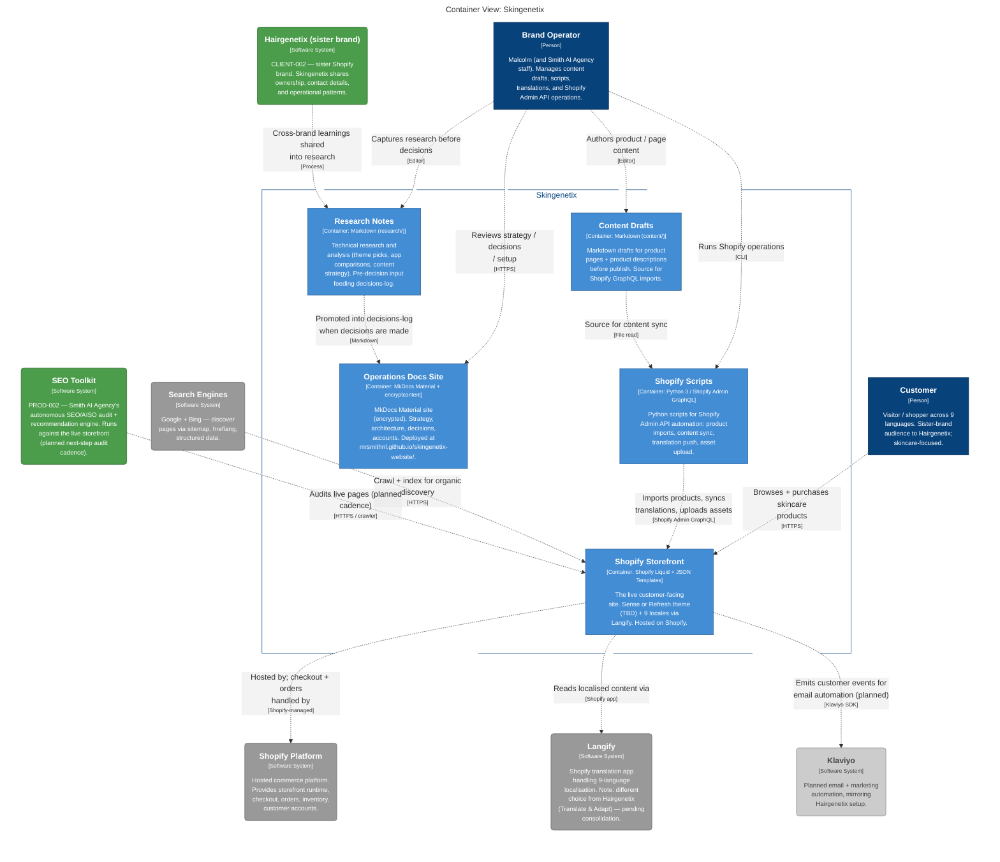

<!-- markdownlint-disable MD013 -->

# skingenetix-website — Container (auto-generated C4)

> **Auto-generated** by `smith-os/packages/forge/tools/architecture-artefacts/render_c4.py`.
> **Do not hand-edit.** Re-run the generator to refresh.
>
> - Generated: `2026-04-28 15:24 UTC`
> - View: `Container` (slug `containers`)
> - Nodes: 13
> - Subgraphs: 2
> - Edges: 14
>
> Source: [`workspace.dsl`](../../workspace.dsl). Phase 5 carry-forward A
> ([structurizr-plan.md](https://github.com/MrSmithNL/smith-ai-agency/blob/main/docs/ecosystem-reorganisation/structurizr-plan.md)).



## How to regenerate

```bash
python3 ~/Claude\ Code/Projects/smith-os/packages/forge/tools/architecture-artefacts/render_c4.py \
  ~/Claude\ Code/Projects/skingenetix-website
```
